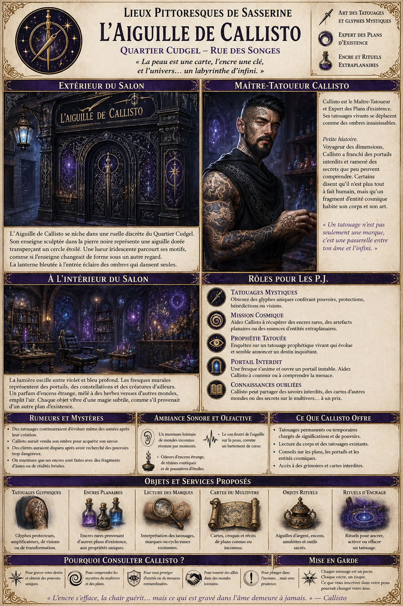
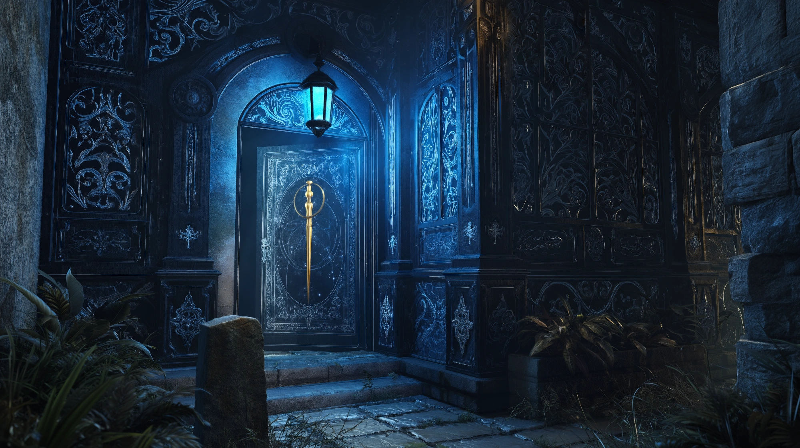
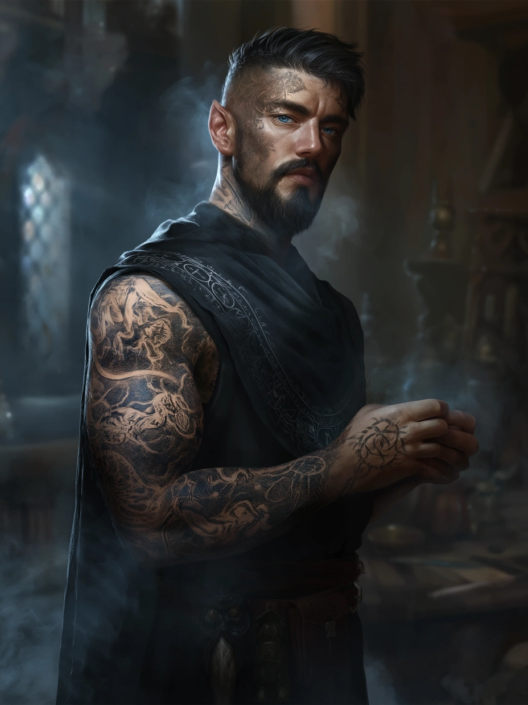

# Aiguille de Callisto

L’Aiguille de Callisto est bien plus qu’un simple salon de tatouage : c’est un pont entre les mondes, un lieu où le corps devient une carte et où chaque encre raconte une histoire qui dépasse le cadre du réel. Un endroit idéal pour ceux qui cherchent à inscrire leur destin dans la peau… ou à effleurer les mystères de l’univers.

### Extérieur du salon

{.center}

L’Aiguille de Callisto se dresse dans une ruelle calme du Quartier Noble, loin du tumulte des grandes artères. Son enseigne, sculptée dans une pierre sombre, représente une aiguille dorée transperçant un cercle étoilé. Une faible lueur iridescente semble parcourir les motifs gravés sur la devanture, donnant l’impression que l’enseigne change subtilement de forme lorsqu’on la regarde trop longtemps. Le bâtiment lui-même est modeste mais raffiné, avec une façade en bois d’ébène ornée de filigranes argentés. Une lanterne à la lumière bleutée éclaire l’entrée, projetant des ombres qui paraissent danser d’elles-mêmes.

### À l’intérieur

Dès que les joueurs franchissent la porte, ils ressentent une étrange sensation d’apesanteur, comme si la gravité elle-même hésitait sur leur poids. L’intérieur du salon est baigné dans une lumière tamisée et mouvante, oscillant entre le violet et le bleu profond, évoquant un ciel nocturne traversé par des courants magiques.

Les murs sont recouverts de motifs complexes, des fresques d’étoiles filantes, de portails cosmiques et de créatures appartenant à des plans d’existence lointains. Certaines de ces œuvres semblent bouger imperceptiblement, comme si elles étaient vivantes.

Un parfum d’encens étrange flotte dans l’air, mélange de résines inconnues et d’herbes venues d’autres mondes. Un grand fauteuil en cuir noir trône au centre de la pièce, où Callisto reçoit ses clients. Derrière lui, des étagères encombrées de livres anciens, de fioles contenant des substances aux couleurs irréelles et d’objets éthérés semblent vibrer sous un regard attentif.

#### Callisto, Maître-Tatoueur

{.float-right .img-150}

[Callisto](../pnj/callisto.md), Maître-Tatoueur et Expert des Plans, est un homme à l’apparence singulière : grand et élancé, vêtu d’une tunique sombre ornée de symboles ésotériques, il porte une peau parsemée de tatouages vivants, qui se déplacent lentement sur son corps comme des ombres insaisissables. Son visage est anguleux, et ses yeux, d’un bleu profond parsemé d’éclats d’argent, semblent refléter des mondes lointains. Il parle d’une voix calme et envoutante, son ton oscillant entre l’érudition et la rêverie. Il est à la fois tatoueur et érudit des plans d’existence, capable de graver sur la peau des glyphes qui confèrent des bénédictions, des protections et même des fragments de connaissance interdite. Callisto est réputé pour avoir voyagé à travers les dimensions. On raconte qu’il aurait un jour franchi un portail interdit et serait revenu avec une vision du multivers qui dépasse l’entendement des mortels. Certains disent qu’il n’est plus tout à fait humain, que son corps n’est qu’un réceptacle pour un fragment d’une entité cosmique.

### Petite histoire

Callisto ne parle jamais de son passé, mais les rumeurs courent. Certains prétendent qu’il était autrefois un mage prometteur, étudiant à la [Tour des Sorcières](../lieux/tour-des-sorcieres.md), avant de disparaître plusieurs années dans un plan inconnu. À son retour, il abandonna la magie traditionnelle pour se consacrer à l’art du tatouage, mais ceux qui connaissent les arcanes savent que ses encres ne sont pas ordinaires. Une légende urbaine affirme qu’un noble autrefois arrogant s’était présenté pour un tatouage destiné à lui conférer force et pouvoir. Mais après la séance, il disparut sans laisser de trace, ne laissant derrière lui qu’une ombre projetée sur le mur du salon, comme si son corps avait été absorbé par un autre plan. Callisto, interrogé sur l’incident, s’était contenté de sourire et de murmurer : *“Certains ne sont pas prêts à voir au-delà du voile.”*

### Rôle pour les joueurs

- ***Tatouages mystiques.*** Callisto pourrait proposer des tatouages conférant des pouvoirs uniques, liés aux plans d’existence.

- ***Mission cosmique.*** Il pourrait engager les joueurs pour récupérer une encre rare, un artefact planaire, ou un fragment d’essence d’une créature extraplanaire.

- ***Prophétie tatouée.*** Un client aurait reçu un tatouage prophétique qui évolue de manière inquiétante. Callisto pourrait demander aux joueurs d’enquêter sur sa signification.

- ***Portail interdit.*** Une nuit, l’une des fresques du salon s’anime, formant un véritable portail vers un autre plan. Callisto semble préoccupé… et pourrait avoir besoin de l’aide des joueurs pour contenir ce qui essaie d’en sortir.

### Ambiance

L’Aiguille de Callisto est un lieu où se mêlent l’art et le mysticisme. Chaque tatouage qu’il réalise est une porte ouverte vers l’inconnu, un fragment de pouvoir gravé dans la chair. Certains clients en ressortent renforcés, d’autres… changés à jamais.