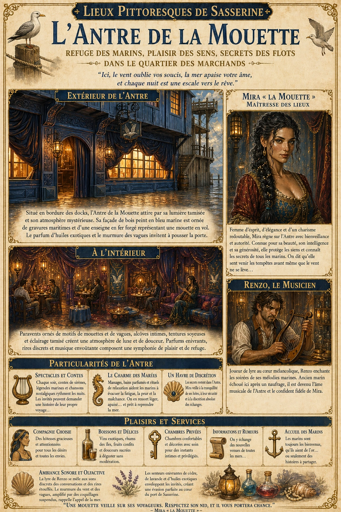
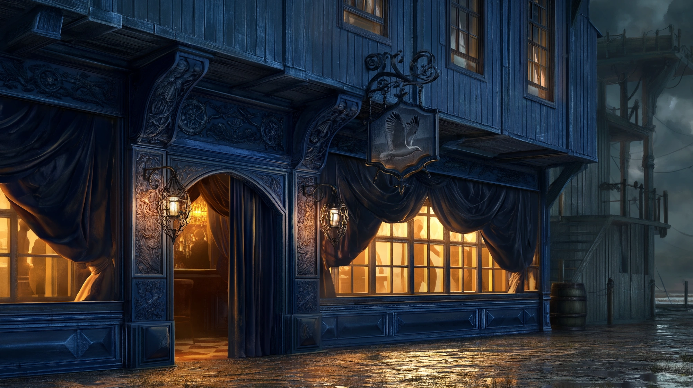

# L'Antre de la Mouette

{.center}

« L’Antre de la Mouette » est bien plus qu’un simple lieu de plaisir ; c’est un sanctuaire pour les âmes fatiguées, un refuge où les marins trouvent paix et réconfort entre deux voyages périlleux. Pour les joueurs, l’endroit peut offrir des rencontres intrigantes, des informations venues de toutes les mers et des secrets marins que seule Mira, la mystérieuse Mouette, détient.

### Extérieur

{.center}

Situé en bordure des docks, « L’Antre de la Mouette » est une maison close qui attire par sa lumière tamisée et son atmosphère mystérieuse. Sa façade de bois peint en bleu marine est ornée de gravures maritimes et d’une enseigne en fer forgé représentant une mouette en vol. Le murmure des vagues et le parfum d’huiles exotiques flottent jusqu’à l’entrée, incitant les curieux à s’aventurer au-delà de la porte.

Des rideaux en velours couvrent les fenêtres, donnant à la façade un air à la fois accueillant et secret. La lueur dorée des lanternes filtrant à travers les voilages crée un effet presque magique, contrastant avec l’austérité des docks environnants.

### À l’intérieur

En entrant, les visiteurs sont accueillis par une ambiance feutrée et élégante. Des paravents ornés de motifs de mouettes et de vagues créent des alcôves intimes le long des murs. Des tentures aux tons de bleu, de pourpre et d’or ornent les murs, et l’espace est empli de coussins moelleux, de canapés en velours, et de fauteuils accueillants. L’air est parfumé de senteurs enivrantes, mélange de cèdre et de lavande, ajoutant à l’impression d’évasion.

Le bruissement des robes de soie et le doux son de la musique jouent en fond sonore, accompagnés de rires discrets et de conversations murmurées. Dans chaque coin, des lanternes en forme de coquillage diffusent une lumière chaude et apaisante, créant une atmosphère de luxe et de confort, mais aussi de mystère.

#### Les personnages qui tiennent le lieu

{.float-right .img-150}

[Mira](../pnj/mira.md) « la Mouette », la maîtresse des lieux. Mira est une femme dans la quarantaine, au regard vif et au sourire mystérieux. Ses cheveux noirs, parsemés de mèches argentées, sont coiffés en une longue tresse ornée de petites perles nacrées, évoquant le scintillement de l’écume. Son allure élégante et gracieuse cache une poigne de fer, et son rire cristallin est célèbre dans tout le port. Mira est réputée pour sa générosité envers ceux qu’elle protège, mais aussi pour son sens aiguisé des affaires. Elle est aussi bien respectée qu’intimidante, capable de dénouer n’importe quel conflit d’un simple mot ou d’un regard. Les habitués disent qu’elle est aussi insaisissable qu’une mouette en mer : on peut penser la saisir, mais elle glisse entre les doigts. Son surnom lui vient d’une rumeur qui court parmi les marins : elle posséderait le don de pressentir les tempêtes, et on dit qu’elle ferme toujours la maison close la veille d’une tempête violente.

[Renzo](../pnj/renzo.md), le musicien. Renzo est un joueur de lyre aux doigts agiles et au visage marqué par le sel et le vent. Sa peau bronzée et son regard mélancolique racontent une vie passée en mer, mais il est devenu un élément incontournable de l’Antre. Ses mélodies douces et apaisantes créent une atmosphère enchanteresse, ajoutant au charme du lieu. Renzo est un ancien marin qui a échoué ici après un naufrage mystérieux et s’est juré de ne plus jamais retourner en mer. Il est l’ami et le confident de Mira, et il est prêt à se lever contre quiconque troublerait la paix de l’Antre.

### Particularités de l’Antre de la Mouette

- ***Des spectacles privés et des contes de marins*** : L’Antre de la Mouette est célèbre pour ses veillées de contes, où Renzo ou Mira racontent des histoires envoûtantes de sirènes et de monstres marins. Les invités sont invités à se plonger dans l’imaginaire marin tout en profitant de la compagnie des hôtes et hôtesses.

- ***Le Charme des Marées*** : Mira est réputée pour offrir des séances de relaxation ou de massage qui auraient des effets mystiques. Les marins disent que ces soins leur permettent de se purifier de la peur de l’océan et de se préparer à affronter à nouveau les flots avec sérénité.

### Ambiance sonore

La lyre de Renzo se mêle aux sons discrets des conversations et des rires étouffés. Le murmure du vent et des vagues est subtilement amplifié par des coquillages suspendus, rappelant constamment aux invités l’appel de la mer, même à l’intérieur de l’Antre.