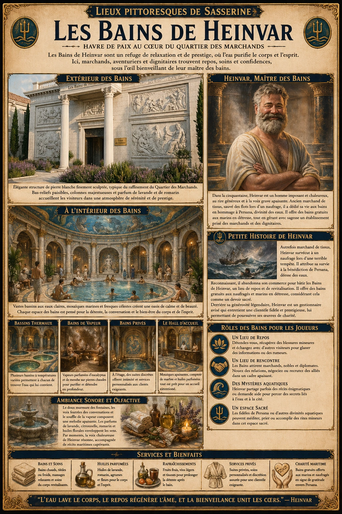
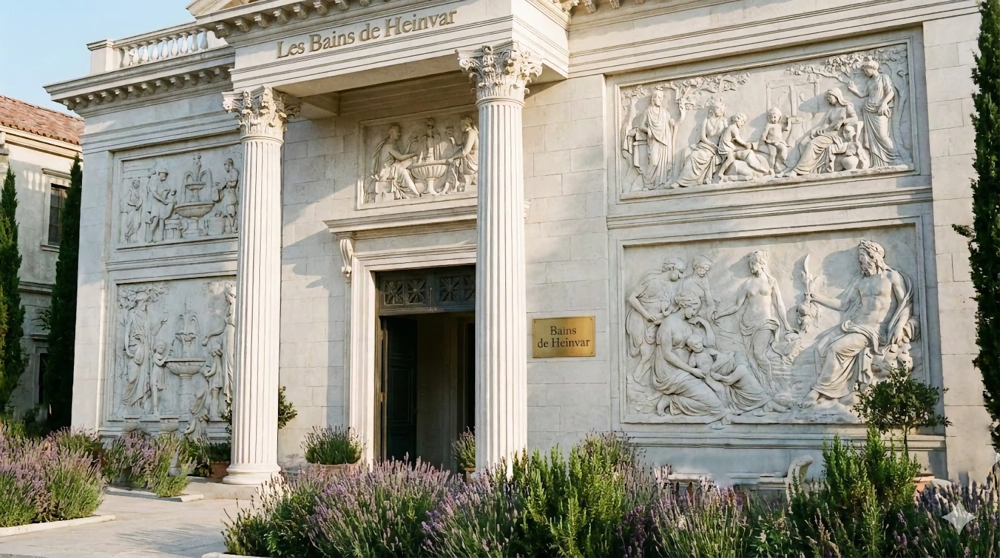
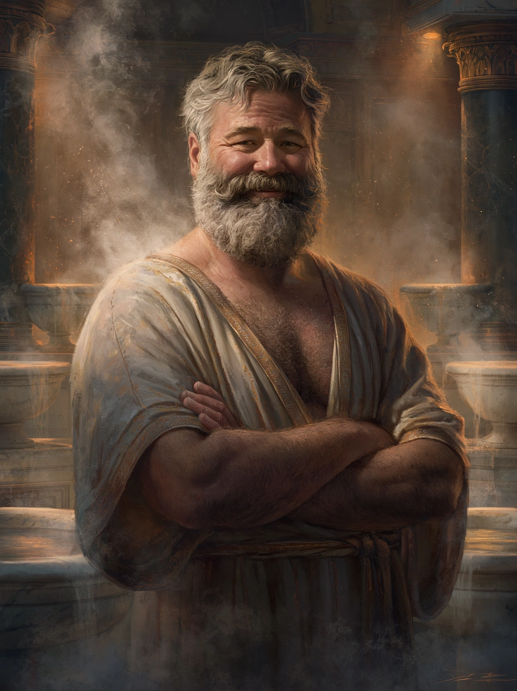

# Bains de Heinvar

{.center}

Les Bains de Heinvar sont un havre de paix au cœur du Quartier des Marchands, un lieu où la relaxation et le prestige se mêlent. Pour les joueurs, c’est une escale idéale pour recharger leurs forces, découvrir des intrigues cachées ou simplement savourer un moment de calme dans une ville en constante effervescence.

### Extérieur des bains

{.center}

Les Bains de Heinvar sont nichés dans une élégante structure de pierre blanche finement sculptée, typique du raffinement du Quartier des Marchands. De larges colonnes ornent l’entrée principale, et des bas-reliefs représentent des scènes paisibles : des marchands discutant près de fontaines, des familles partageant des moments de repos, et des divinités aquatiques veillant sur les eaux. Une enseigne discrète mais raffinée affiche “Bains de Heinvar” en lettres dorées, tandis que l’air est empli d’un parfum subtil de lavande et de romarin.

### À l’intérieur

En passant les lourdes portes de bois et de cuivre, les visiteurs sont immédiatement enveloppés par une chaleur réconfortante et une légère brume qui s’élève des bassins. L’entrée mène à un grand hall lumineux, où des mosaïques colorées couvrent le sol et les murs, représentant des scènes aquatiques apaisantes : vagues ondulantes, poissons élégants, et nymphes souriantes.

Un comptoir en marbre est tenu par un assistant poli qui remet des serviettes et des huiles parfumées. Des escaliers en colimaçon, finement décorés, mènent à des bains privés à l’étage pour ceux qui recherchent plus d’intimité.

La grande salle principale est dominée par un vaste bassin central entouré de colonnes. L’eau y est limpide, reflétant les fresques peintes sur le plafond, où des sirènes jouent avec des dauphins. Des bancs en pierre et des petites alcôves permettent aux visiteurs de se reposer ou de discuter. Des bassins secondaires, chacun à une température différente, sont accessibles via des arches ornées de motifs marins.

Une aile est réservée aux bains de vapeur, où des bancs de bois et des pierres chaudes créent une atmosphère relaxante. L’air y est imprégné de plantes médicinales comme l’eucalyptus et la menthe.

#### Heinvar, le maître des bains

{.float-right .img-150}

[Heinvar](../pnj/heinvar.md) est un homme dans la cinquantaine, à la stature imposante mais chaleureuse, avec une barbe soigneusement entretenue et des cheveux poivre et sel. Il est toujours vêtu d’une tunique légère et élégante, adaptée à l’humidité de son établissement. Ses yeux marron pétillent de bienveillance, mais aussi d’un sens aiguisé des affaires. Il a un rire chaleureux et une voix grave qui semble calmer les esprits dès qu’il parle.

### Petite histoire de Heinvar

Heinvar était autrefois marchand de tissus, voyageant de port en port pour vendre ses étoffes. Lors d’un périple, il fut pris dans une tempête et son navire fit naufrage. Il survécut en flottant des heures dans l’eau, sauvé par une étrange force qu’il attribue à une bénédiction divine de Persana, une divinité aquatique. Après cet événement, il abandonna sa carrière de marchand pour fonder les bains, un lieu dédié au repos et à la revitalisation, en hommage à l’eau qui lui avait sauvé la vie.

Il est connu pour offrir des bains gratuits aux naufragés ou aux marins en détresse, considérant cela comme un devoir sacré. Pourtant, derrière sa générosité, Heinvar reste un habile gestionnaire, maintenant une clientèle de marchands fortunés et de dignitaires, ce qui lui permet de subventionner ses élans de charité.

### Rôle des bains pour les joueurs

- ***Un lieu de repos.*** Les joueurs peuvent s’y détendre, guérir de leurs blessures mineures, ou simplement interagir avec d’autres visiteurs pour recueillir des informations ou des rumeurs.

- ***Un lieu de rencontre.*** Les Bains de Heinvar attirent des personnalités influentes du Quartier des Marchands, offrant aux joueurs une opportunité de nouer des relations ou de négocier des alliances.

- ***Des mystères aquatiques.*** Heinvar pourrait partager des récits énigmatiques sur son naufrage ou demander l’aide des joueurs pour enquêter sur un phénomène étrange lié à l’eau dans la cité.

- ***Un espace sacré.*** Les fidèles de Persana ou d’autres divinités liées à l’eau peuvent y trouver un lieu pour méditer ou accomplir des rites mineurs.

### Ambiance sonore et olfactive

Le bruit apaisant de l’eau qui coule des fontaines emplit l’air, mêlé au murmure discret des conversations et au souffle doux de la vapeur. Les senteurs de lavande, de citronnelle et d’huiles florales créent une atmosphère relaxante. Par moments, on entend la voix mélodieuse de Heinvar saluant ses clients ou leur racontant des anecdotes maritimes.