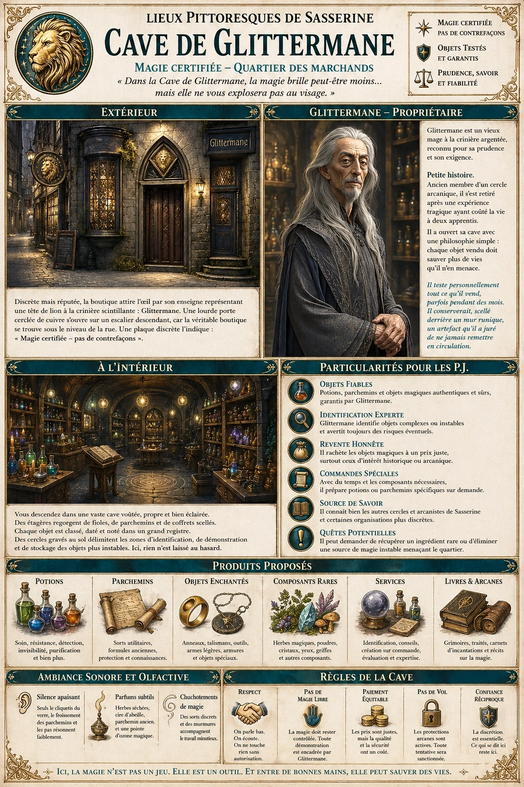
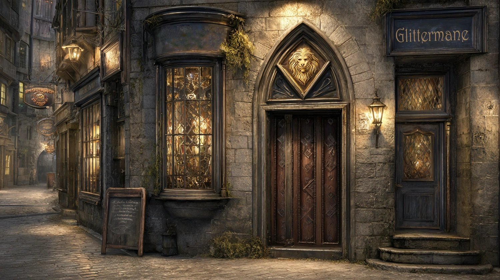
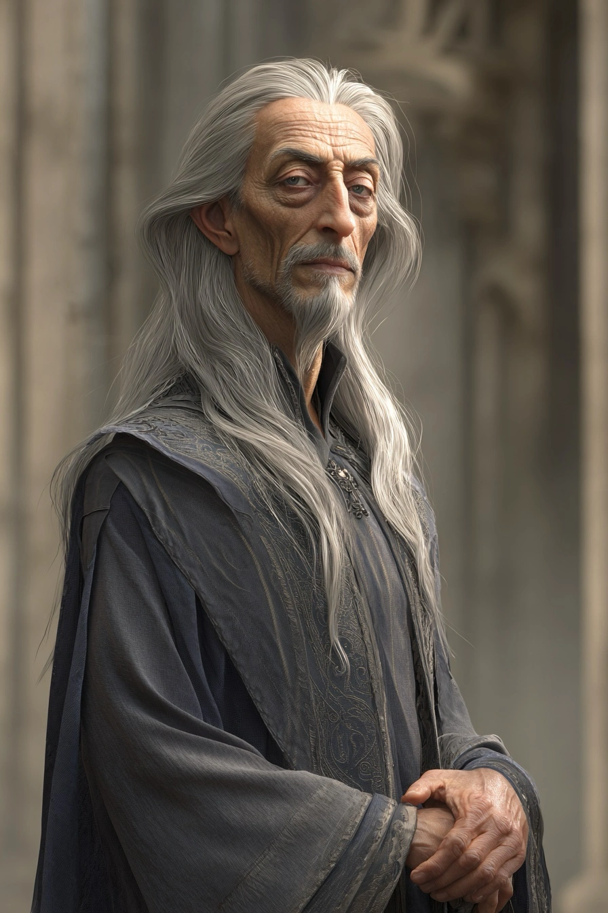

# Cave de Glittermane

{.center}

Discrète mais réputée, la Cave de Glittermane est l’une des adresses magiques les plus fiables du Quartier des Marchands. À mi-chemin entre l’échoppe d’arcaniste et la cave d’un alchimiste obsessionnel, on y trouve des potions sûres, des objets enchantés de qualité et, surtout, des conseils avisés. Les PJ y découvriront une magie pragmatique, tournée vers l’utilité et la survie, loin des extravagances tapageuses de certains mages.

### Extérieur

{.center}

*« Dans la Cave de Glittermane, la magie brille peut-être moins… mais elle ne vous explosera pas au visage. »*

La boutique donne sur une rue commerçante animée, mais sa façade tranche avec ses voisines. Les murs de pierre sombre sont percés d’une unique vitrine étroite, protégée par des barreaux décoratifs gravés de runes de protection. L’enseigne représente une tête de lion stylisée, à la crinière scintillante de minuscules éclats dorés : Glittermane.

Une lourde porte de bois cerclée de cuivre s’ouvre sur un escalier descendant - car la véritable boutique se trouve sous le niveau de la rue. Une plaque discrète indique simplement : « Magie certifiée - pas de contrefaçons ».

### Intérieur

En descendant les marches, les visiteurs pénètrent dans une vaste cave voûtée, propre, bien éclairée par des globes lumineux flottants. L’air y est frais et légèrement parfumé d’herbes, de cire et d’ozone magique.

Des étagères de pierre et de bois renforcé couvrent les murs, chargées de fioles soigneusement étiquetées, de parchemins rangés dans des tubes de cuir, et de coffrets verrouillés par des sceaux arcanes. Chaque objet est classé, daté, et noté dans un grand registre posé sur un pupitre central.

Plusieurs cercles gravés au sol délimitent des zones spécifiques : identification, démonstration contrôlée, et stockage des objets plus instables. Ici, rien n’est laissé au hasard.

#### Le propriétaire

{.float-right .img-150}

[Glittermane](../pnj/glittermane.md) est un vieux mage humanoïde à la crinière argentée - surnom qu’il doit à sa chevelure épaisse et brillante, portée longue et soigneusement entretenue. Grand, sec, vêtu de robes sobres aux broderies presque invisibles, il parle d’une voix calme et posée, sans jamais hausser le ton.

### Petite histoire

Ancien membre d’un cercle arcanique du Quartier Noble, Glittermane s’est retiré après qu’une expérience collective a mal tourné, coûtant la vie à deux apprentis. Refusant de continuer une magie qu’il jugeait devenue irresponsable, il a ouvert sa cave avec une philosophie simple : chaque objet vendu doit sauver plus de vies qu’il n’en menace.

Il teste personnellement tout ce qu’il vend, parfois pendant des mois. Les rumeurs prétendent qu’il conserve, scellé derrière un mur runique, un artefact qu’il a juré de ne jamais remettre en circulation.

### Particularités du lieu pour les PJ

- ***Objets fiables :*** Potions, parchemins et objets magiques sont garantis authentiques et sûrs - ce qui justifie des prix parfois légèrement supérieurs à ceux du marché noir.

- ***Identification experte :*** Glittermane peut identifier des objets complexes ou instables, et avertit toujours des risques éventuels.

- ***Revente honnête :*** Il rachète les objets magiques à un prix juste, surtout s’ils présentent un intérêt historique ou arcanique.

- ***Commandes spéciales :*** Sur demande (et avec patience), il peut faire préparer potions ou parchemins spécifiques.

- ***Source de savoir :*** Glittermane connaît bien les autres acteurs magiques de Sasserine - la Tour des Sorcières, la Loge du Sourcier, et certains cultes plus discrets.

- ***Quête potentielle :*** Il pourrait demander aux PJ de récupérer un ingrédient rare, ou d’éliminer une source de magie instable menaçant le quartier.

### Ambiance sonore et olfactive

Le lieu est étonnamment silencieux. On entend parfois le léger cliquetis du verre, le froissement d’un parchemin, ou le murmure d’un sort d’identification. L’odeur dominante est celle d’herbes séchées, de parchemin ancien et d’une pointe métallique rappelant la magie fraîchement canalisée.