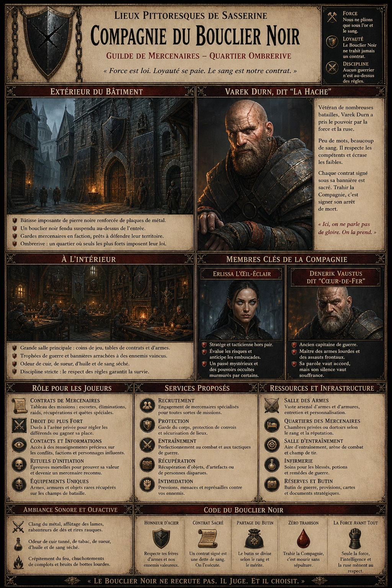
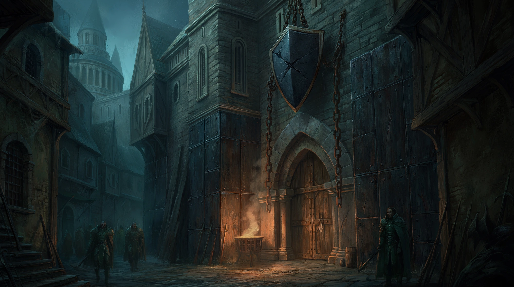
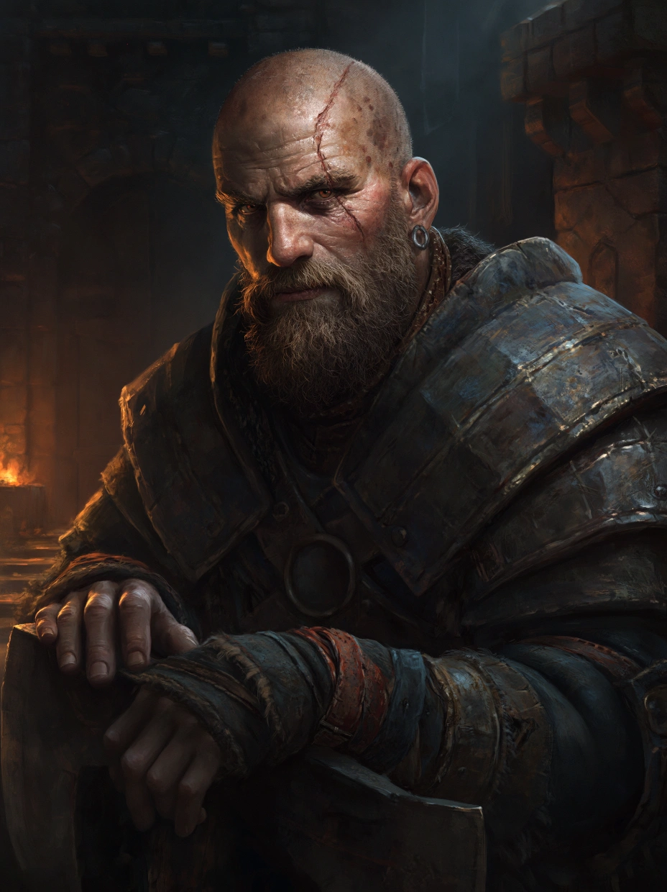

# Compagnie du Bouclier Noir

{.center}

La Compagnie du Bouclier Noir est une guilde de mercenaires impitoyables, établie au cœur d’Ombrerive, le quartier le plus dangereux de Sasserine. Ici, seuls les plus forts survivent et prospèrent. Les joueurs y trouveront des contrats lucratifs, des combattants aguerris prêts à vendre leurs services, ainsi que des informations précieuses sur les conflits en cours. Mais attention : toute faiblesse est exploitée, et seuls ceux qui respectent les règles du sang et de l’acier y sont tolérés.

### De l'extérieur

{.center}

Au cœur d’Ombrerive, là où les ombres s’étirent plus longtemps qu’ailleurs, se dresse le bâtiment de la Compagnie du Bouclier Noir. Contrairement aux bâtisses délabrées qui l’entourent, ce large bâtiment de pierre sombre semble bâti pour résister aux assauts du temps et des hommes. De larges plaques de métal noirci sont clouées aux murs, comme des cicatrices témoignant d’anciennes batailles. L’entrée est surmontée d’un bouclier noir fendu, suspendu par de lourdes chaînes rouillées. Devant la porte, un brasero fume en permanence, jetant une lueur inquiétante sur les visages des rares passants.

Les rues alentour sont désertes ou peuplées d’individus silencieux, qui baissent les yeux lorsqu’ils croisent ceux des mercenaires postés en faction. Ici, personne ne demande qui entre ou qui sort – mais tout le monde prend soin de ne pas regarder trop longtemps.

### À l'intérieur

Derrière les lourdes portes de bois renforcées de fer, l’air devient plus épais, chargé d’une odeur de cuir tanné, de sueur et d’huile d’armes. La grande salle, faiblement éclairée par des lanternes à huile, est remplie de longues tables où des mercenaires comptent leurs gains, jouent aux dés ou aiguisent leurs lames. Sur les murs, des trophées de guerre sont accrochés : casques cabossés, bannières déchirées, crânes d’ennemis abattus en combat.

Un imposant comptoir de chêne sert de bureau aux recruteurs. De vieux parchemins jaunis listent les contrats disponibles, avec des sommes qui attirent immédiatement le regard. L’ambiance est tendue mais disciplinée : ici, seuls ceux qui respectent le code du Bouclier Noir survivent.

#### Personnages notables

{.float-right .img-150}

La compagnie est dirigée par [Varek Durn](../pnj/varek-durn.md), dit “la Hache”, un vétéran au crâne rasé marqué d’une profonde balafre qui lui traverse le cuir chevelu jusqu’à la tempe. Il ne parle jamais sans nécessité, mais chaque mot qu’il prononce semble pesé comme s’il valait une vie. Autrefois mercenaire au service de plusieurs seigneurs de guerre, il a pris la tête du Bouclier Noir après avoir tué son ancien chef en duel – une pratique courante dans cette guilde où seule la force et l’intelligence garantissent le commandement.

À ses côtés se trouve [Erlissa](../pnj/erlissa.md) l’Oeil-Éclair, une stratège froide et méthodique, réputée pour sa capacité à prévoir les embuscades avant même qu’elles ne se forment. Sa présence est d’autant plus intimidante qu’un éclat d’argent semble briller dans son iris gauche, vestige d’un rituel dont elle refuse de parler.

[Denerik Vaustus](../pnj/denerik-vaustus.md), dit “Coeur-de-Fer”, un ancien capitaine de guerre devenu maître mercenaire. Grand et massif, il arbore une barbe grisonnante et un œil borgne qu’il couvre d’un cache en cuir gravé d’un œil transpercé d’un dard, souvenir d’un assassin qui n’a pas eu le temps d’achever son œuvre. Denerik parle peu, mais chaque mot qu’il prononce pèse comme un décret. On raconte qu’il peut trancher une gorge plus vite qu’il ne peut lever une chope de bière.

### Petite histoire

Une rumeur circule parmi les mercenaires sur l’origine de la balafre de Varek Durn. Certains racontent qu’il l’a reçue lors d’un combat contre un chevalier dragon qui l’aurait laissé pour mort sur un champ de bataille. Mais d’autres – ceux qui chuchotent après la troisième choppe de tord-boyaux – évoquent une histoire bien plus étrange : Varek aurait été le seul survivant d’un massacre sur une île oubliée, un endroit où ses compagnons auraient disparu un à un, happés par quelque chose qui rôdait dans l’ombre. Il serait revenu seul, les yeux plus sombres, le regard hanté, et la balafre encore fraîche sur son crâne. Depuis, il dort toujours une hache à la main, et personne ne l’a jamais vu ôter ses gants de cuir noirci.

### Rôle pour les joueurs

- ***Contrats de mercenaires.*** Les PJ peuvent consulter un tableau où sont affichés divers contrats, allant de simples escortes à des assassinats politiques risqués.

- ***Droit du plus fort.*** Toute altercation peut être réglée par un duel à l’arène privée de la Compagnie. Ici, l’honneur se gagne dans le sang.

- ***Contacts et informations.*** De nombreux mercenaires ont servi dans différentes armées ou auprès de factions secrètes, ce qui fait de ce lieu une mine d’informations pour qui sait poser les bonnes questions… et payer le bon prix.

- ***Rituels d’initiation.*** Pour être reconnu comme membre du Bouclier Noir, il faut réussir une épreuve mortelle, dont la nature varie selon le jugement de Varek.

- ***Objets et équipements uniques.*** Certains vétérans revendent du matériel récupéré sur le champ de bataille, parfois enchanté ou issu de cultures étrangères.

### Ambiance sonore et olfactive

Le bruit du métal qui s’entrechoque domine, ponctué par le raclement des lames sur les pierres d’affût et les grognements des mercenaires discutant à voix basse. Parfois, un rire grave éclate, suivi du fracas d’une chope jetée sur une table. L’odeur de cuir vieilli, de tabac et de sang séché imprègne les lieux, mêlée à celle plus discrète mais omniprésente de la fumée d’huile de lampe.