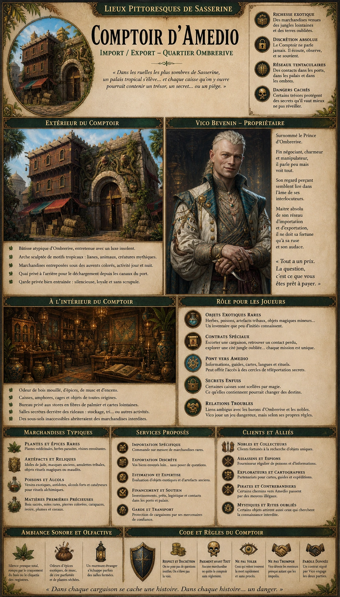
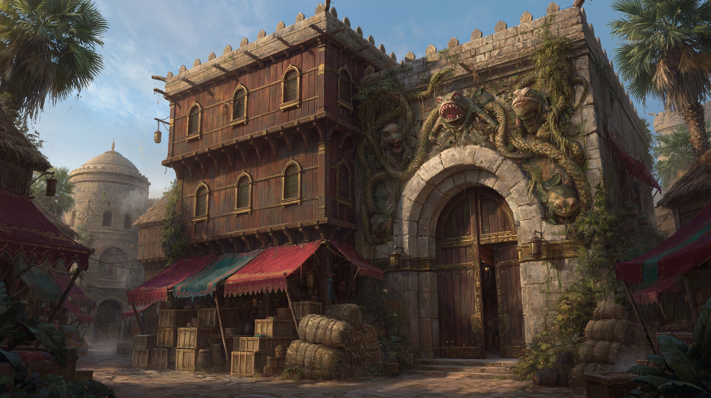
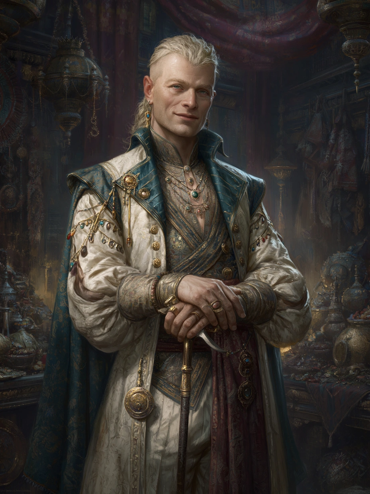

# Comptoir d'Amedio

{.center}

Au cœur d’Ombrerive, là où nul ne s’attendrait à trouver autre chose que crasse et misère, se dresse le Comptoir d’Amedio, l’un des pôles commerciaux les plus rentables de Sasserine. Vico Bevenin, son propriétaire, est à la tête d’une véritable fortune grâce à l’importation de denrées, plantes, artefacts et richesses exotiques provenant de la jungle d’Amedio. Mais au lieu de vivre parmi les élites du Quartier Noble, il a élu domicile dans le quartier le plus sombre de la ville. Les joueurs y trouveront un réseau de commerce tentaculaire, des cargaisons aux contenus étranges, et un homme aussi énigmatique que fascinant.

### Extérieur

{.center}

*“Dans les ruelles les plus sombres de Sasserine, un palais tropical s’élève… et chaque caisse qu’on y ouvre pourrait contenir un trésor, un secret… ou un piège.”*

Le Comptoir d’Amedio occupe une large bâtisse à deux niveaux, à l’écart des artères les plus mal famées d’Ombrerive. Sa façade d’un bois sombre verni est impeccablement entretenue, tranchant avec la décrépitude des bâtiments voisins. D’énormes caisses et ballots empilés sous des auvents colorés témoignent d’une activité constante, jour et nuit.

Une arche en pierre décorée de motifs végétaux stylisés — lianes, singes grimaçants, grenouilles géantes — surplombe la porte principale. À l’arrière, un petit quai privé permet le déchargement discret de marchandises directement depuis les canaux du port.

Les habitants du quartier, même les plus hardis, évitent de rôder autour du comptoir : les gardes privés de Vico, vêtus de tuniques sombres et armés de lames fines et bien entretenues, veillent avec une vigilance silencieuse.

### Intérieur

À l’intérieur, le comptoir est une véritable caverne d’Ali Baba tropicale : des caisses étiquetées en langues étrangères, des bocaux contenant des substances aux couleurs étranges, des statues de jade, des tapisseries indigènes, des encensoirs sculptés, et même des cages (vides… ou pas). L’odeur de bois mouillé, de cire, d’épices et de musc flotte partout.

Un bureau principal, à la lumière filtrée par des stores en fibre de palmier, abrite des cartes, des livres de comptes, et de luxueuses correspondances cachetées. D’épais rideaux cachent parfois des salles secondaires — zones de tri, de stockage… ou d’autres activités moins officielles.

#### Vico Bevenin, le Prince d’Ombrerive

{.float-right .img-150}

[Vico Bevenin](../pnj/vico-bevenin.md) est un homme dans la fleur de l’âge, aux traits fins, toujours impeccablement vêtu, à mi-chemin entre le marchand exotique et le diplomate. Sa voix est douce, polie, toujours calme, comme un murmure glissé dans l’oreille. Il arbore des bijoux élégants mais discrets, et une canne sculptée, qui cache probablement une lame. Mais ce qui frappe le plus chez lui, c’est son regard : brillant, perçant, comme s’il voyait toujours deux ou trois coups à l’avance — ou à l’intérieur de ceux à qui il parle.

### Petite histoire

Vico serait né à Sasserine, mais il a passé une grande partie de sa jeunesse dans les jungles d’Amedio, auprès d’une tribu isolée qu’il refuse de nommer. Il y aurait été sauvé d’un naufrage, ou peut-être capturé — selon qui raconte l’histoire. Ce séjour l’aurait profondément marqué. À son retour, il a commencé à bâtir son empire commercial, s’appuyant sur des contacts qu’aucun autre marchand n’a jamais pu égaler. Quant à son choix de rester à Ombrerive malgré sa richesse, les rumeurs vont bon train : certains pensent qu’il y dirige secrètement un culte, d’autres qu’il préfère être à portée de certaines marchandises qu’il ne veut pas voir passer par les douanes officielles. D’autres encore disent qu’il a peur de ce que le luxe ferait de lui… ou de ce qu’il ferait du luxe.

### Rôle pour les joueurs

- ***Objets exotiques rares.*** Herbes médicinales rares, poisons, artefacts tribaux, objets magiques mineurs… Vico possède un inventaire que peu osent afficher.

- ***Contrats spéciaux.*** Vico peut engager les PJ pour escorter des cargaisons, explorer un site oublié en pleine jungle, ou retrouver un contact disparu à Amedio.

- ***Accès à un autre monde.*** Le comptoir est une passerelle vers l’Amedio — informations géographiques, culturelles, linguistiques… voire accès à un cercle de téléportation réservé.

- ***Secret enfoui.*** Certains objets entreposés au fond du comptoir semblent… surveillés. Vico ne laisse personne approcher certaines caisses. Une aura magique inquiétante flotte dans les sous-sols.

- ***Relations troubles.*** Vico entretient des liens cordiaux avec les barons d’Ombrerive, mais il n’est pas leur homme. Il joue un jeu dangereux, mais maîtrise parfaitement les règles.

### Ambiance sonore et olfactive

À l’intérieur du comptoir, le silence règne presque, uniquement brisé par le craquement du bois, le cliquetis des registres ou le frottement des bottes sur le parquet ciré. De temps à autre, un soupir ou un murmure en langue étrangère s’échappe d’une salle close. L’air est saturé d’épices, de cire parfumée, de plantes séchées et de résines amères.