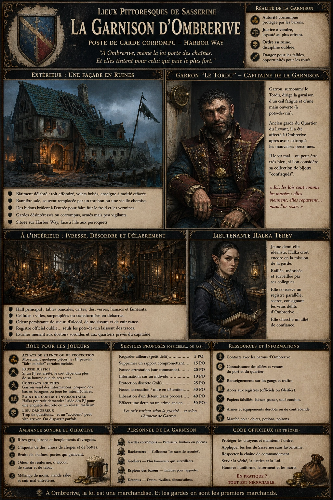
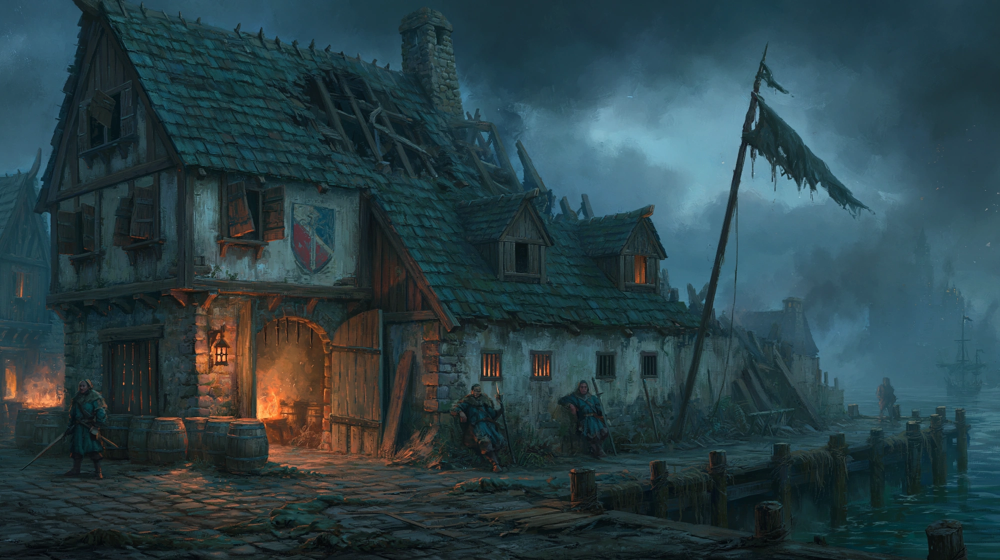
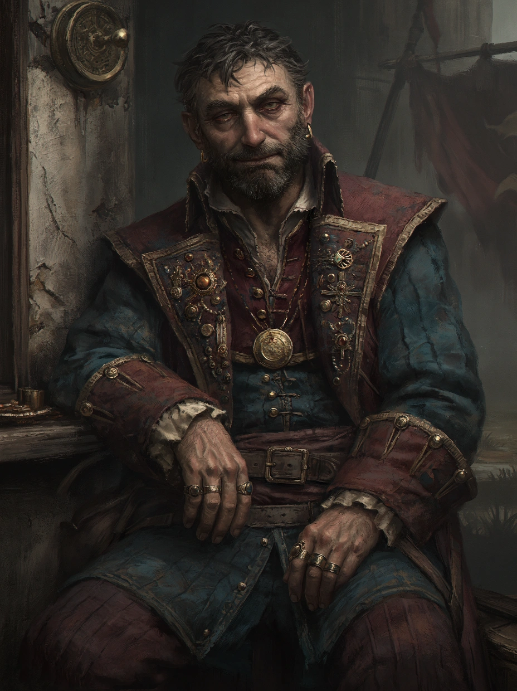

# Garnison d'Ombrerive

{.center}

La Garnison d’Ombrerive est un poste de garde en ruine, symbole écaillé d’un ordre illusoire. Véritable nid de corruption, elle ne protège que les intérêts de ceux qui paient — et surtout ceux des barons d’Ombrerive. Les joueurs y trouveront une autorité pourrie de l’intérieur, des agents prêts à vendre leur insigne pour une pièce d’or, et peut-être, au cœur de la décrépitude, une ou deux âmes perdues qui croient encore en la justice.

### Extérieur

{.center}

*“À Ombrerive, même la loi porte des chaînes. Et elles tintent pour celui qui paie le plus fort.”*

La garnison se dresse sur Harbor Way, face à l'île aux perroquets. Le bâtiment, autrefois bâti en pierre et en bois de qualité, s’est effondré sur lui-même au fil des années. Une moitié du toit est effondrée, les volets sont brisés ou absents, et l’enseigne représentant le blason de la garde de Sasserine a été grossièrement repeinte… à moitié.

Un mât branlant flotte une bannière sale, aux couleurs passées, parfois remplacée par un torchon ou une vieille chemise. Des bidons brûlent à l’entrée pour faire fuir le froid ou la vermine. Deux ou trois gardes bâillent en surveillant l’extérieur, adossés à un mur, armés mais désintéressés.

### Intérieur

L’intérieur de la garnison ressemble plus à une taverne de bas étage qu’à un poste militaire. Le hall principal est envahi par des tables bancales couvertes de cartes graisseuses, de dés, et de verres vides. Des hamacs sont suspendus un peu partout, certains à moitié déchirés. Les cellules, au fond du couloir, sont soit vides, soit pleines de détenus “en attente de rançon”, soit utilisées comme débarras.

Une forte odeur de sueur, de vin tourné et de moisissure flotte dans l’air. Le registre de la garde prend la poussière sur un bureau abandonné. Les seuls papiers en circulation sont des dettes de jeu, des promesses de pots-de-vin, ou des notes griffonnées entre gardes corrompus. Un escalier craque sous le poids de casques accrochés en vrac et mène à des quartiers privés transformés en dortoirs sordides.

#### Personnages notables

{.float-right .img-150}

Le Capitaine [Garron](../pnp/garron.md), surnommé le Tordu à cause de sa posture voûtée et de son humour acide, dirige la garnison d’un œil fatigué et d’une main ouverte (à pots-de-vin). Ancien garde du Quartier du Levant, il a été réaffecté à Ombrerive après avoir extorqué les mauvaises personnes. Il le vit mal… ou peut-être très bien, si l’on considère sa collection de bijoux “confisqués”.

La Lieutenant [Halka Terev](../pnj/halka-terev.md). Jeune demi-elfe arrivée récemment, Halka est raillée par ses collègues pour son idéalisme tenace. Elle croit encore à la mission de la garde, mais elle est isolée, méprisée et surveillée de près. Elle conserve un registre parallèle, secret, consignant les vrais délits d’Ombrerive… dans l’espoir qu’un jour, quelqu’un écoutera.

### Petite histoire

Garron aurait autrefois mené une arrestation exemplaire qui lui valut une médaille — qu’il a revendue trois jours plus tard pour acheter une bouteille de brandy importé. Depuis, il jure qu’“le vrai crime, c’est de bosser honnêtement dans un quartier qui n’écoute que l’or.”

### Rôle pour les joueurs

- ***Achats de silence ou de protection.*** Moyennant quelques pièces, les PJ peuvent “faire oublier” certains méfaits. À condition de graisser la bonne patte.

- ***Fausse justice.*** Si un PJ est arrêté, le sort dépendra plus de sa bourse que de ses actes. Une fausse confession ou une rançon peuvent être exigées.

- ***Contrats louches.*** Garron peut vendre des informations, proposer des basses besognes ou jouer les intermédiaires pour les barons locaux.

- ***Point de contact involontaire.*** Halka pourrait demander l’aide des PJ s’ils paraissent dignes de confiance — pour une enquête discrète ou la mise au jour d’un réseau mafieux.

- ***Lieu dangereux.*** Trop de questions dans la garnison, et un “accident” peut vite arriver. On disparaît parfois entre deux cellules.

### Ambiance sonore et olfactive

Rires gras, jurons lancés dans le vide, bruit de dés jetés sur les tables. On entend parfois les cliquetis d’une armure… ou plutôt, d’une bouteille qu’on cogne contre une botte. L’odeur de renfermé, d’alcool bon marché, de sueur et de cuir mal entretenu règne dans les pièces. Un mélange de moisi, de tabac et de viande salée qui colle à la gorge.