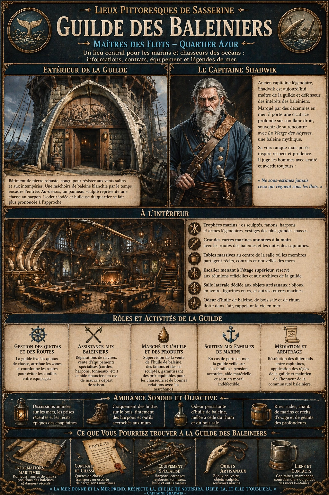
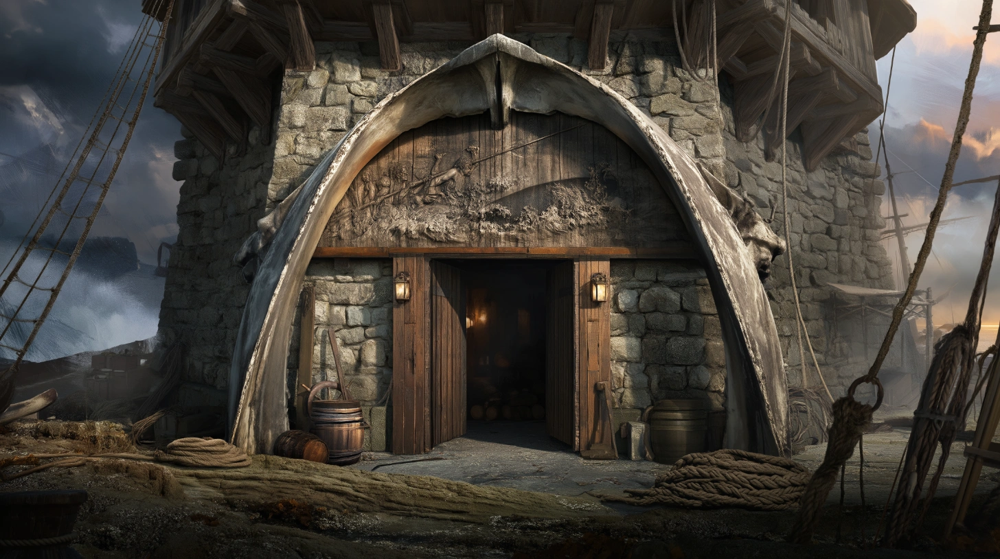
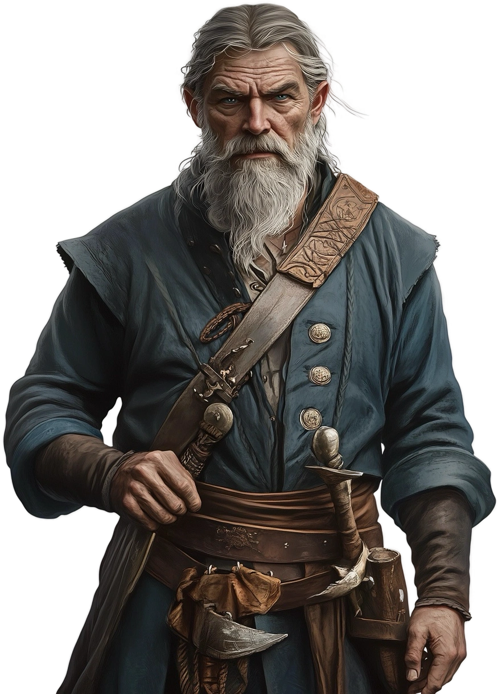

# Guilde des Baleiniers

{.center}

La Guilde des Baleiniers est un lieu central pour les joueurs qui s’intéressent à la mer et à ses périls. Que ce soit pour obtenir des informations sur les routes maritimes, négocier un passage sur un navire baleinier, ou simplement écouter les récits captivants du capitaine Shadwik, cet endroit offre une immersion totale dans le monde rude et fascinant des chasseurs des océans.

### Extérieur de la guilde

{.center}

La Guilde des Baleiniers est un grand bâtiment en pierre brute, solidement construit pour résister aux vents salins et aux intempéries, typiques des ports où les navires baleiniers accostent. Une gigantesque mâchoire de baleine, blanchie par le temps, encadre l’entrée principale, offrant une vision imposante à ceux qui s’en approchent. Au-dessus de la porte, un panneau sculpté représente une scène de chasse au harpon, avec des hommes affrontant une baleine titanesque sur une mer agitée. L’odeur iodée et légèrement huileuse du quartier se fait plus prononcée à mesure qu’on s’approche.

### À l’intérieur

En entrant, les visiteurs découvrent une vaste salle aux murs tapissés de trophées marins : des os de baleines sculptés en motifs complexes, des fanons transformés en œuvres d’art, et même un immense harpon suspendu au-dessus de la cheminée centrale, un vestige légendaire d’une chasse particulièrement périlleuse. Le sol est fait de larges planches de bois sombre, poli par des années de passage de bottes marines.

De grandes cartes marines couvrent une partie des murs, annotées à la main avec les routes des baleines et des notes laissées par les capitaines. Des lanternes en cuivre diffusent une lumière chaude, rappelant celle des cabines de navires. Une odeur mêlant l’huile de baleine, le bois salé et un soupçon de rhum flotte dans l’air.

Des tables massives occupent le centre de la pièce principale, où les membres de la guilde se rassemblent pour discuter de leurs affaires ou partager des récits de mer. Un escalier robuste mène à un étage supérieur réservé aux réunions officielles et aux archives de la guilde. Une petite salle latérale est consacrée à la vente d’objets artisanaux fabriqués à partir de matériaux issus des baleines, comme des bijoux en ivoire ou des figurines en os.

#### Le Maître de la Guilde

{.float-right .img-150}

Le [capitaine Shadwik](../pnj/capitaine-shadwik.md) est un homme trapu, à la silhouette solide comme un roc malgré son âge avancé. Ses épaules larges et ses mains noueuses témoignent de décennies passées à manier le harpon et à diriger des équipages dans les eaux dangereuses. Ses cheveux gris coupés court et sa barbe épaisse sont souvent éclaboussés de sel ou d’huile de baleine, comme s’il venait tout juste de quitter un navire. Ses yeux d’un bleu perçant semblent lire à travers les hommes comme s’il jaugeait leur valeur sur le pont d’un bateau.

Shadwik a fait fortune en tant que capitaine de L’Écumeur des Profondeurs, un baleinier légendaire qui a rapporté plus de prises qu’aucun autre navire de la région. Aujourd’hui trop âgé pour prendre la mer, il consacre son temps à représenter les intérêts des baleiniers auprès des autorités de la cité et des habitants, négociant les quotas de chasse et arbitrant les conflits entre capitaines. Sa voix rauque mais posée est respectée, et rares sont ceux qui osent contester ses décisions.

### Une petite histoire

La légende raconte que Shadwik a survécu à une attaque d’une baleine légendaire surnommée La Vierge des Abysses. Lors d’une chasse, son navire a été brisé en deux par le cétacé monstrueux. Seul sur une planche de bois, Shadwik aurait dérivé pendant une semaine avant d’être secouru. Il porte encore une profonde cicatrice sur son flanc droit, souvenir de cette rencontre. Depuis, il ne chasse plus lui-même, convaincu que cette baleine était une incarnation divine venue le mettre à l’épreuve. Il parle parfois d’elle avec un mélange de respect et de crainte, avertissant les jeunes baleiniers de ne pas sous-estimer la mer et ses créatures.

### Rôles et activités de la Guilde

- ***Gestion des quotas et des routes de chasse.*** La guilde fixe les règles pour les expéditions baleinières, attribuant des quotas de chasse à chaque capitaine et coordonnant les routes pour éviter les conflits entre équipages.

- ***Assistance aux baleiniers.*** La guilde offre des services pour ses membres, comme des réparations de navires, la vente d’équipements spécialisés (cordes, harpons, tonneaux pour l’huile), et même une aide financière en cas de mauvais départ de saison.

- ***Marché de l’huile et des produits baleiniers.*** La Guilde supervise la vente de l’huile de baleine, des fanons, et des os sculptés, garantissant des prix équitables pour les chasseurs tout en maintenant une bonne relation avec les marchands locaux.

- ***Soutien aux familles de marins.*** En cas de perte en mer, la guilde veille sur les familles des membres disparus, leur versant une pension et leur fournissant un soutien moral et matériel.

### Ambiance sonore et olfactive

Dans la grande salle, des discussions animées sur les mers, les prises récentes et les récits épiques emplissent l’air. Le craquement des bottes sur le bois et le tintement des harpons accrochés aux murs ajoutent à l’atmosphère. Une douce odeur d’huile de baleine, mélangée à celle du rhum, imprègne le lieu, rappelant la vie en mer.

