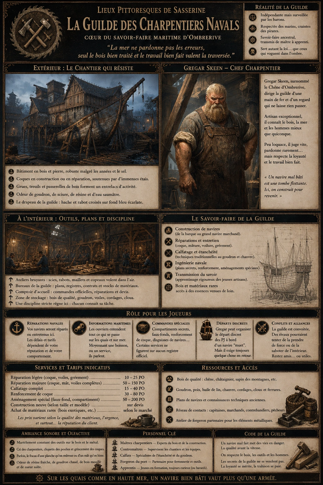
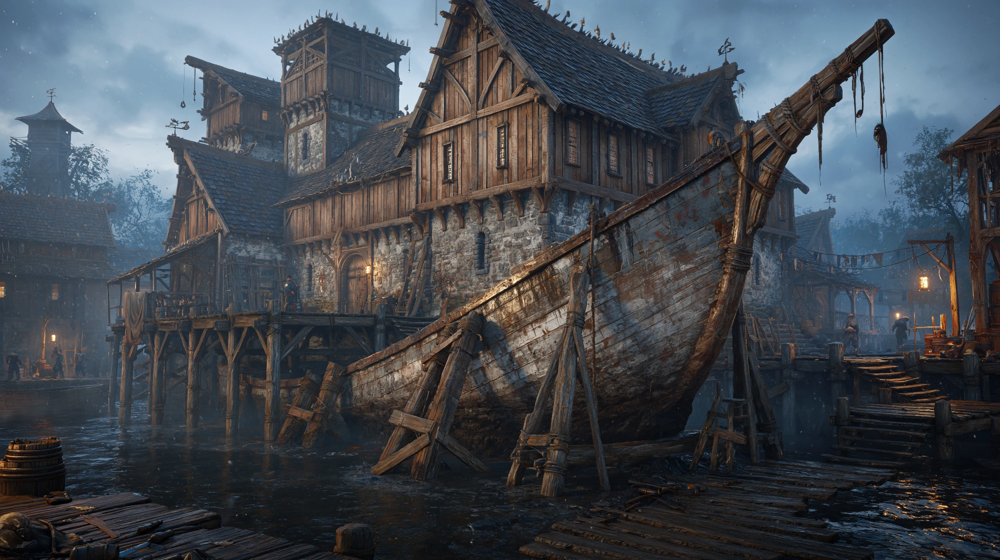
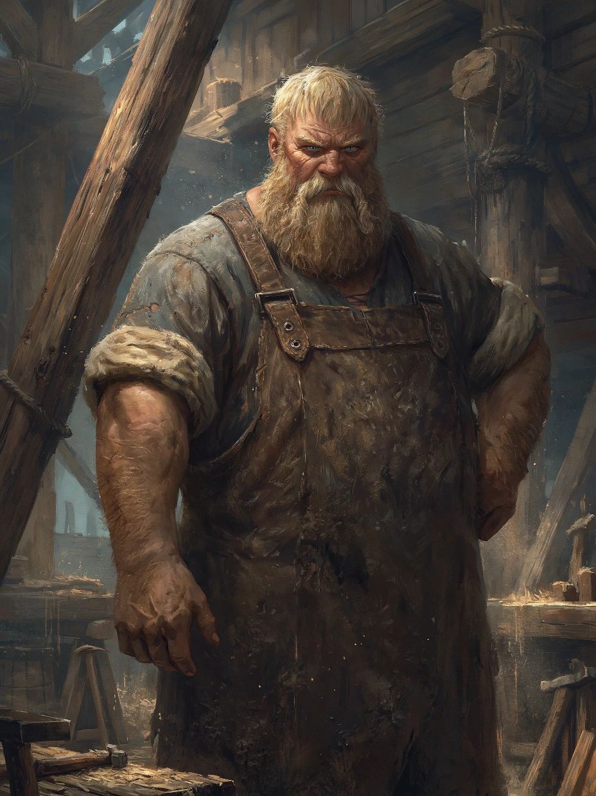

# Guilde des Charpentiers Navals

{.center}

Enclavée sur les berges d’Ombrerive, la Guilde des Charpentiers navals est un des rares établissements du quartier à tenir bon face à la décrépitude et aux intimidations. Dirigée d’une main ferme par Gregar Skeen, elle est le cœur battant d’un savoir-faire ancestral, où se construit — ou se rafistole — tout ce qui flotte, de la barque du pêcheur au pont d’un contrebandier. Les PJ y trouveront des artisans fiers, des secrets de calfat, et une porte d’entrée dans le monde du transport maritime… ou du commerce illicite.

### Extérieur

{.center}

*“Dans un quartier où tout pourrit, il reste un homme debout… et des navires qui tiennent la mer.”*

La guilde occupe un large bâtiment en bois et pierre, sur Harbor Way à l'est du quartier d’Ombrerive. L’odeur de goudron chaud, de sciure et d’eau saumâtre flotte dans l’air. Des coques de navires en construction ou en réparation émergent à moitié des eaux noires, soutenues par d’immenses étais de bois rugueux.

Des cris d’ouvriers, le bruit sec des marteaux, et les ordres aboyés se mêlent à la rumeur du quartier. Des escaliers de corde, des grues rudimentaires et des passerelles branlantes dessinent un véritable entrelacs d’activités. Malgré les signes d’usure, tout ici est entretenu avec fierté : la guilde ne brille pas… mais elle tient debout.

### Intérieur

L’intérieur du bâtiment principal est divisé entre les bureaux — sobres et remplis de plans de navires, de listes de matériaux, et d’outils rangés au cordeau — et les ateliers, bruyants, poussiéreux et vibrants d’activité. Des lamelles de lumière filtrent à travers des lucarnes, découpant la sciure en suspens comme des particules d’or.

Un comptoir d’accueil, marqué de coups d’herminette, est occupé par un apprenti mal réveillé ou un vieux contremaître à la barbe jaune de goudron. On y gère les commandes, les réparations, et — discrètement — les navires qui n’apparaissent sur aucun registre officiel.

#### Gregar Skeen, le Chêne d’Ombrerive

{.float-right .img-150}

[Gregar Skeen](../pnj/gregar-skeenv.md) est un homme massif au dos voûté par le travail, aux mains tordues et pleines de cals, et aux yeux perçants comme des clous frais. Toujours vêtu d’un tablier de cuir et d’une chemise roulée jusqu’aux coudes, il parle peu, mais chaque mot est solide.

### Petite histoire

Issu d’une lignée de charpentiers installée à Ombrerive depuis trois générations, Gregar a vu ses frères et cousins partir, se faire ruiner ou corrompre. Lui seul est resté. On raconte qu’il a brisé la mâchoire d’un lieutenant de la Flotte Écarlate venu exiger un “droit de regard”, puis offert de lui rafistoler son canot… à la dérive. Depuis, il a passé un accord tacite avec les barons du coin : tant que ses bateaux naviguent, ses chantiers sont intouchables. Mais il garde, dans une armoire fermée à clé, un petit marteau en fer noir… au cas où il faudrait rediscuter du pacte.

### Rôle pour les joueurs

- ***Réparations navales.*** Si les PJ ont un bateau, c’est ici qu’il faudra le réparer ou l’armer. Les délais et les prix dépendent de leur réputation… et de leur comportement.

- ***Rumeurs maritimes.*** Les ouvriers de la guilde entendent tout ce qui se passe sur les quais. Moyennant une bouteille ou un service, ils parlent.

- ***Commandes spéciales.*** Faux-fonds, compartiments secrets, renforcement de coque… certains services n’apparaissent jamais sur la facture.

- ***Protection discrète.*** Gregar peut aider les PJ à quitter le port discrètement, en les faisant embarquer à bord d’un navire “muet”… mais il exige toujours quelque chose en retour.

- ***Conflits de territoire.*** Une autre faction pourrait chercher à prendre le contrôle de la guilde. Les PJ peuvent être mêlés à la défense — ou à la trahison — de Gregar.

### Ambiance sonore et olfactive

Le martèlement constant des outils, les ordres hurlés sur les échafaudages, les râles des scies et le grincement des poulies composent une musique chaotique, rythmée comme le ressac. L’air sent la résine, le bois frais, l’huile de lin, la sueur, et parfois, plus discrètement, l’alcool caché dans les tonneaux.