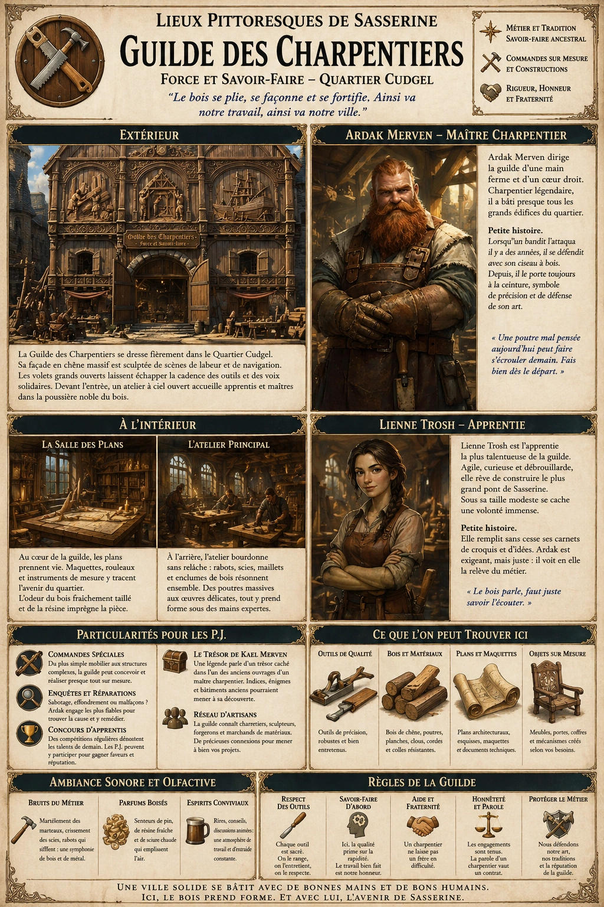
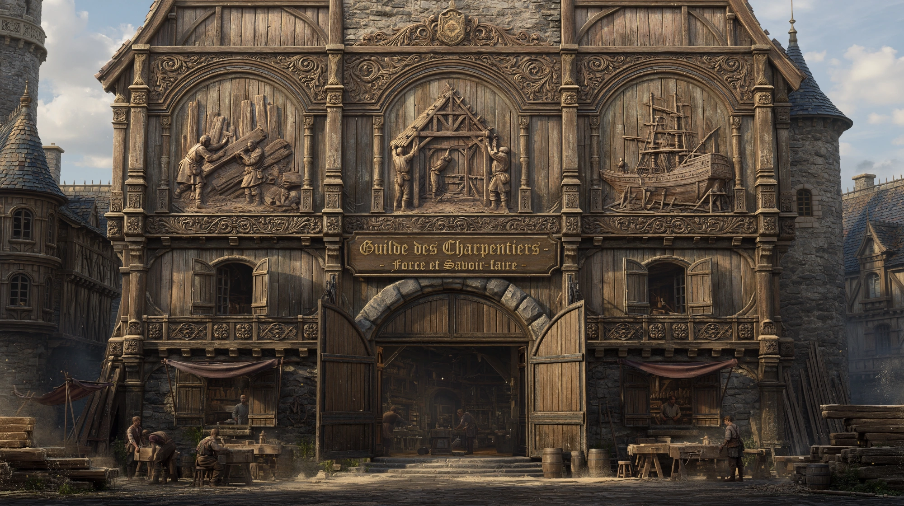
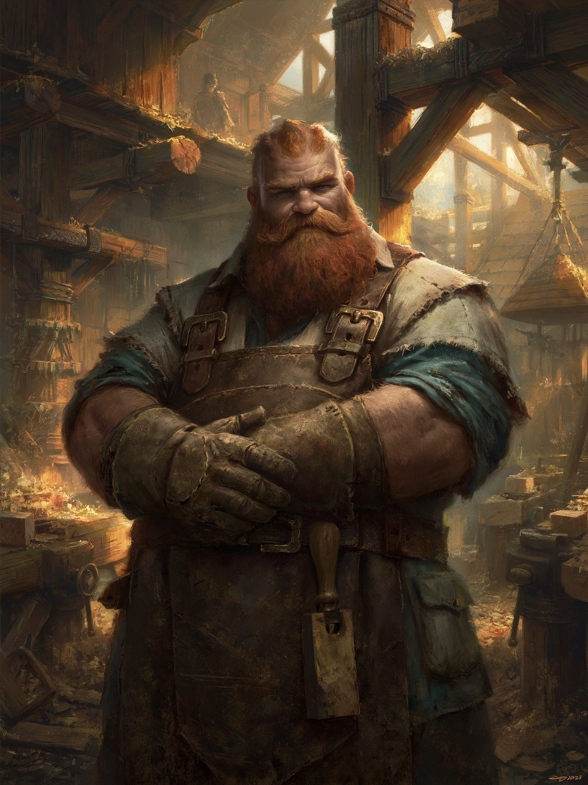

# Guilde des Charpentiers

{.center}

La Guilde des Charpentiers n’est pas seulement un lieu de travail, c’est un symbole de résilience et de savoir-faire pour le Quartier Cudgel. Pour les joueurs, c’est une opportunité de plonger dans l’univers des artisans et de découvrir qu’un simple morceau de bois peut être à l’origine d’intrigues fascinantes et de relations humaines profondes.

### Extérieur de la Guilde

{.center}

La Guilde des Charpentiers est un bâtiment imposant mais chaleureux, construit entièrement en bois de chêne massif, un véritable hommage au métier qu’elle représente. Sa façade est ornée de bas-reliefs sculptés représentant des scènes de construction et de navigation : des ouvriers taillant des poutres, des charpentiers hissant un toit, et des navires en pleine construction.

Au-dessus de l’entrée, une enseigne en bois finement gravée affiche : « Guilde des Charpentiers - Force et Savoir-faire ». Les volets des fenêtres sont toujours ouverts, laissant filtrer les bruits de marteaux, de scies et de discussions animées entre artisans.

Devant le bâtiment, un espace extérieur est aménagé en atelier à ciel ouvert. On y voit des apprentis s’affairer sur des pièces de bois, encadrés par des maîtres charpentiers qui corrigent leur posture ou leur technique.

### À l’intérieur

L’intérieur de la guilde est organisé en deux sections principales.

***La Salle des Plans.*** Une grande pièce dominée par une immense table centrale où sont étalés des plans architecturaux et des maquettes en bois. Les murs sont recouverts d’étagères contenant des outils de mesure, des rouleaux de parchemins, et des livres sur l’art de la charpenterie. L’odeur du bois fraîchement taillé et de la résine emplit l’air.

***L’Atelier Principal.*** À l’arrière, un vaste atelier est éclairé par de larges fenêtres. On y entend le bruit constant des outils en action : rabots, scies et marteaux. Les établis sont encombrés de projets en cours, allant de poutres massives pour les bâtiments du Quartier Cudgel à des détails décoratifs destinés aux demeures les plus élégantes de Sasserine.

#### Personnages : Maître Charpentier Ardak et l’apprentie Lienne

{.float-right .img-150}

Maître [Ardak Merven](../pnj/ardak-merven.md), chef de la guilde, est un homme trapu et musclé, à la barbe rousse fournie et aux mains calleuses. Sa voix grave et autoritaire impose le respect, mais son rire tonitruant réchauffe le cœur de ses apprentis. Ardak a travaillé sur presque tous les bâtiments du Quartier Cudgel, et ses talents sont reconnus bien au-delà de Sasserine. Il porte toujours un ciseau à bois à la ceinture, un outil qui lui a sauvé la vie lorsqu’il a été attaqué par un bandit il y a des années. Aujourd’hui, ce ciseau est devenu son symbole, représentant la précision et la défense de son métier.

[Lienne Trosh](../pnj/lienne-trosh.md), une jeune femme mince à la chevelure brune toujours attachée en tresse, est l’apprentie la plus prometteuse de la guilde. Bien qu’elle soit souvent sous-estimée en raison de sa petite stature, elle compense par une agilité et une créativité remarquables. Lienne rêve de construire un jour le plus grand pont de Sasserine, un projet qu’elle dessine sans relâche dans ses carnets. Elle considère Ardak comme une figure paternelle, même si elle se plaint souvent de son exigence.

### Petite histoire de la guilde

La Guilde des Charpentiers joue un rôle clé dans la sécurité et la prospérité du Quartier Cudgel. Fondée il y a plusieurs générations, elle a participé à la construction du célèbre [Phare de Cudgel](../lieux/phare-de-cudgel.md) et de nombreuses demeures nobles. Pendant une période difficile où des pirates attaquaient la ville, la guilde a également fabriqué des palissades défensives et des armes improvisées, renforçant son rôle de protectrice de la communauté.

Une légende locale raconte que l’un des premiers maîtres charpentiers, Kael Merven, aurait caché un trésor dans les fondations de l’un des bâtiments qu’il a construits, mais personne ne sait lequel. Les membres de la guilde plaisantent souvent à ce sujet, bien que certains apprentis fouillent discrètement les structures anciennes en quête d’indices.

### Rôle pour les joueurs

- ***Commande spéciale.*** Les joueurs pourraient avoir besoin de la guilde pour fabriquer un objet ou une structure spéciale (un pont, une trappe secrète, un bélier).

- ***Enquête.*** Si un bâtiment s’effondre ou si un acte de sabotage menace le Quartier Cudgel, Ardak pourrait engager les joueurs pour découvrir la vérité.

- ***Concours.*** La guilde organise parfois des compétitions entre apprentis pour créer les sculptures ou structures les plus impressionnantes. Les joueurs pourraient y participer pour obtenir des faveurs.

- ***Rumeurs du trésor.*** L’histoire du trésor caché dans une construction ancienne pourrait devenir une quête annexe intrigante.

### Ambiance sonore et olfactive

Le martèlement des marteaux, le crissement des scies et le bruissement du papier où des plans sont tracés forment une symphonie artisanale. L’odeur apaisante du bois travaillé, mélangée à celle de la sciure et de la résine, enveloppe les lieux.