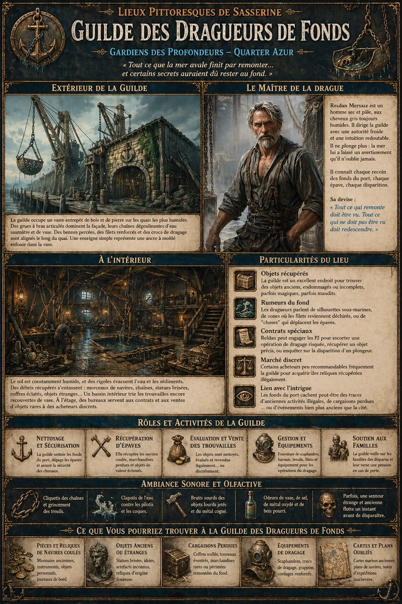
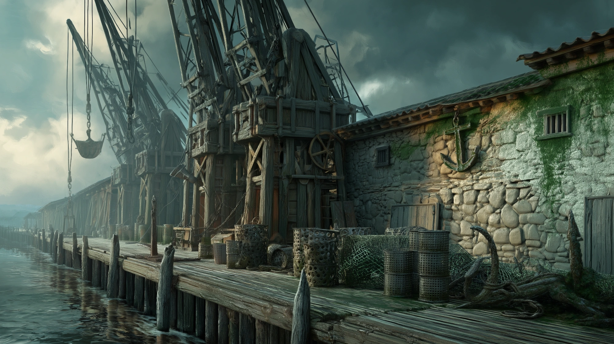

# Guilde des Dragueurs de Fonds

{.center}

Installée sur les quais les plus humides du Quartier Azur, la Guilde des Dragueurs de fonds est un lieu à la réputation ambiguë, à mi-chemin entre entreprise maritime indispensable et repaire de charognards des profondeurs. Officiellement, ses membres nettoient les fonds du port, récupèrent des épaves et sécurisent les chenaux. Officieusement, ils remontent aussi ce que la mer préférerait garder pour elle. Les PJ y trouveront des travailleurs endurcis, des objets oubliés, et parfois des vérités dérangeantes sur ce qui repose sous les eaux de Sasserine.

### Extérieur de la guilde

{.center}

*« Tout ce que la mer avale finit par remonter… et certains secrets auraient dû rester au fond. »*

La guilde occupe un vaste entrepôt de bois et de pierre. De lourdes grues à bras articulés dominent la façade, leurs chaînes dégoulinantes d’eau saumâtre et de vase. Des bennes percées, des filets renforcés de mailles métalliques et d’étranges crocs de dragage sont alignés le long du quai.

Le bâtiment est maculé de traces verdâtres et blanchâtres, laissées par les remontées répétées de sédiments marins. Des planches grincent sous les pas, et l’eau clapote contre les pilotis dans un bruit régulier, presque hypnotique. Une enseigne simple, sculptée dans un bois gonflé d’humidité, représente une ancre à moitié enfouie dans la vase.

### À l'intérieur

À l’intérieur, la guilde est vaste, froide et fonctionnelle. Le sol est constamment humide, malgré les rigoles creusées pour évacuer l’eau. Des tas de débris récupérés s’accumulent dans des zones délimitées : morceaux de coques, chaînes rouillées, statues brisées, coffres éclatés, ancres antiques. Certains objets sont clairement banals… d’autres attirent immédiatement l’œil par leur ancienneté ou leur étrangeté.

Un grand bassin intérieur, relié directement au port par une grille immergée, permet de trier les trouvailles encore couvertes de vase. Des tables de travail accueillent des artisans qui nettoient, réparent ou évaluent les objets récupérés. À l’étage, des bureaux vitrés servent à l’administration, à la négociation de contrats, et à la vente discrète de certaines trouvailles aux acheteurs “spécialisés”.

#### Le Maître de la Drague, Reldan Mersale

{.float-right .img-150}

[Reldan Mersale](../pnj/reldan-mersale.md) est un homme sec, au teint pâle et aux cheveux gris toujours humides, comme s’il sortait en permanence de l’eau. Il boite légèrement, conséquence d’un accident de plongée dont il refuse de parler en détail. Sa voix est rauque, usée par des années à crier des ordres au-dessus du fracas des chaînes et du ressac.

### Une petite histoire

Reldan était autrefois plongeur lui-même. Lors d’une opération nocturne, il serait resté trop longtemps sous l’eau, accroché à quelque chose qui ne figurait sur aucune carte. Il en serait remonté seul, à moitié fou, tenant un objet qu’il a aussitôt fait sceller et descendre au fond du port. Depuis ce jour, il ne plonge plus jamais. Il dirige la guilde depuis la surface, avec une obsession presque superstitieuse : “Tout ce qui remonte doit être vu. Tout ce qui ne doit pas être vu doit redescendre.”

Les dragueurs le respectent, non par affection, mais parce qu’il sait reconnaître le danger avant qu’il ne frappe.

### Particularités de la guilde

- ***Objets récupérés :*** La guilde est un excellent endroit pour trouver des objets anciens, endommagés ou incomplets, parfois magiques, parfois maudits.
- ***Rumeurs du fond :*** Les dragueurs parlent de silhouettes aperçues sous l’eau, de zones où les filets reviennent déchirés, ou de “choses” qui déplacent les épaves.
- ***Contrats spéciaux :*** Reldan peut engager les PJ pour escorter une opération de dragage risquée, récupérer un objet précis au fond du port, ou enquêter sur la disparition d’un plongeur.
- ***Marché discret :*** Certains acheteurs peu recommandables fréquentent la guilde pour acquérir des reliques récupérées illégalement.
- ***Lien avec l’intrigue :*** Les fonds du port cachent peut-être des traces d’anciennes activités illégales, de cargaisons perdues… ou d’événements bien plus anciens que la cité elle-même.

### Ambiance sonore et olfactive

Le cliquetis incessant des chaînes, le grincement des treuils, les cris courts des ouvriers, et le bruit sourd des objets lourds qu’on déverse sur le sol composent une cacophonie industrielle. L’air est saturé d’odeurs de vase, de sel, de métal oxydé et de bois pourri. Par moments, une senteur plus étrange - ancienne, presque organique - flotte brièvement avant de disparaître.
