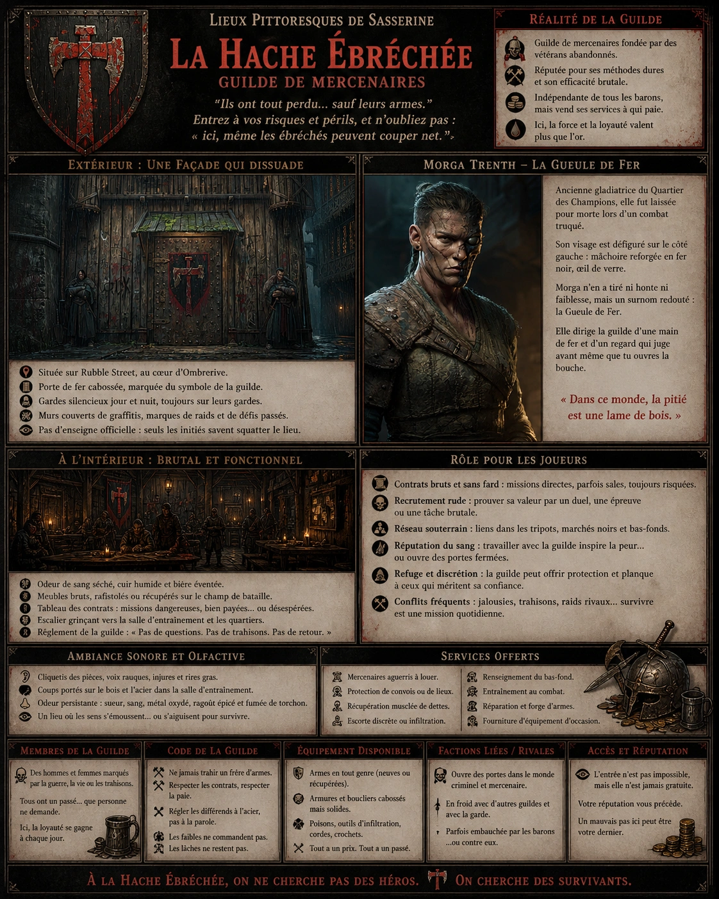
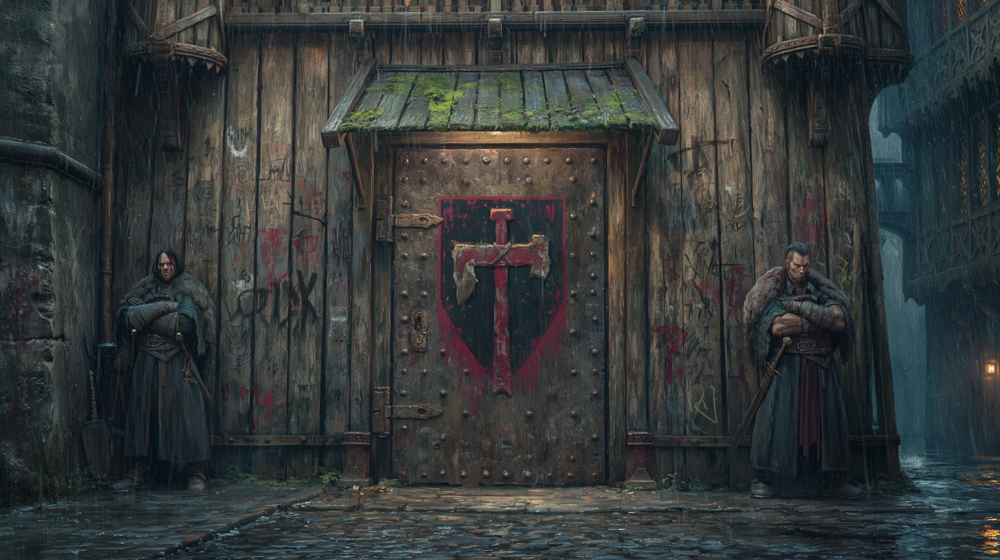
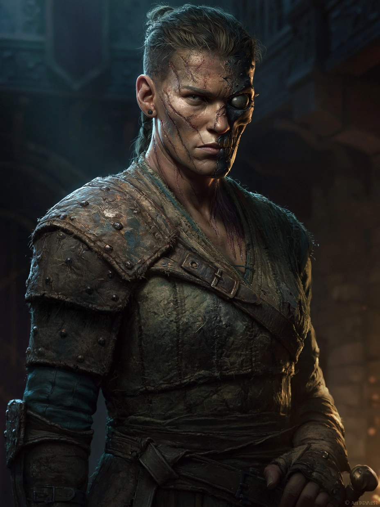

# La Hache Ebréchée

{.center}

La Hache Ébréchée est une guilde de mercenaires durement frappés par la vie, mais encore debout — rugueuse, amère, et dangereuse. Fondée par des vétérans laissés pour compte, elle s’est taillée une réputation dans les coins les plus sombres de Sasserine. Les joueurs y trouveront des combattants marqués par la guerre, des contrats désespérés, et une philosophie simple : survivre, frapper fort, et ne jamais oublier d’où l’on vient.

### Extérieur

{.center}

*“Ils ont tout perdu… sauf leurs armes. Entrez à vos risques et périls, et n’oubliez pas : ici, même les ébréchés peuvent couper net.”*

Située sur Rubble Street, La Hache Ébréchée ne paie pas de mine. Sa façade est faite de planches renforcées, taguées de marques et de symboles laissés par d’anciens membres ou rivaux déchus. Une lourde porte de fer, cabossée et rouillée, porte le symbole de la guilde : une hache grossière dont le tranchant est fendu, peinte en rouge sur fond noir.

Un petit auvent couvert de mousse protège vaguement de la pluie, et deux silhouettes massives — toujours différentes, jamais bavardes — montent la garde jour et nuit, bras croisés et yeux durs. Le message est clair : ici, on entre si on a une bonne raison… et une arme à portée de main.

### Intérieur

L’intérieur est sombre, bas de plafond, et sent le sang séché, le cuir humide et la bière éventée. Des torches à l’huile brûlent lentement dans des lanternes de fer forgé. Le mobilier est brut, parfois rafistolé à la hâte : bancs cloutés, tables branlantes, un vieux comptoir qui semble avoir servi de bouclier plus d’une fois.

Au fond, un tableau de contrats en bois gravé affiche des parchemins cornés, cloués à la hâte. Les missions vont de la protection de convois à la récupération musclée de dettes, en passant par des coups plus troubles. Le règlement de la guilde est griffonné à la craie sur une ardoise : “Pas de questions. Pas de trahisons. Pas de retour.”

Un escalier grinçant mène à une salle d’entraînement mal éclairée, où des mannequins de paille, des armes rouillées et des cibles criblées de coups témoignent de la rudesse du quotidien.

#### Morga Trenth, la Gueule de Fer

{.float-right .img-150}

[Morga Trenth](../pnj/morga-trenth.md) est la fondatrice et actuelle cheffe de la guilde. Ancienne gladiatrice du Quartier des Champions, elle a été laissée pour morte lors d’un combat truqué. Son visage est défiguré sur le côté gauche : mâchoire reforgée en fer noir, œil de verre, cicatrices profondes. Elle n’en a tiré ni honte ni faiblesse, mais un surnom redouté : la Gueule de Fer.

### Petite histoire

Après sa trahison dans l’arène, Morga a juré de ne plus jamais se battre pour les jeux des puissants. Elle a rassemblé autour d’elle d’autres exclus, gueules cassées, traîtres repenti·es et criminels fatigués. Ensemble, ils ont fondé la guilde dans un vieux fumoir abandonné. L’unique condition d’entrée : avoir connu l’échec… et l’avoir surmonté. Elle ne parle que lorsqu’il faut. Quand elle crache du sang — ce qui arrive souvent — elle rit et dit : *“C’est l’rouille qui sort.”*

### Rôle pour les joueurs

- ***Contrats bruts et sans fard.*** Ici, pas de manières - les missions sont directes, parfois sales, toujours risquées.

- ***Recrutement rude.*** Pour intégrer la guilde, un PJ doit prouver qu’il a “pris un coup et continué d’avancer”. Cela peut être un duel, une confession, ou une tâche brutale imposée par Morga.

- ***Réseau souterrain.*** Les membres de la Hache Ébréchée ont des liens dans les tripots, les marchés noirs et les coins les plus poisseux de Sasserine.

- ***Réputation du sang.*** Travailler avec eux peut faire peur… ou ouvrir des portes fermées aux “gentils héros”.

- ***Lieu de refuge.*** En cas de conflit avec la garde ou d’autres factions, c’est un abri discret mais payant — en or ou en loyauté.

### Ambiance sonore et olfactive

Le cliquetis des pièces sur le bois brut. Des voix rauques, des injures amicales, parfois des grognements d’effort dans la salle d’entraînement. L’odeur de sueur, de sang ancien, de métal oxydé, mêlée à celle du ragoût du jour (souvent suspect), plane en permanence. Un endroit où les sens s’émoussent… ou s’aiguisent pour survivre.