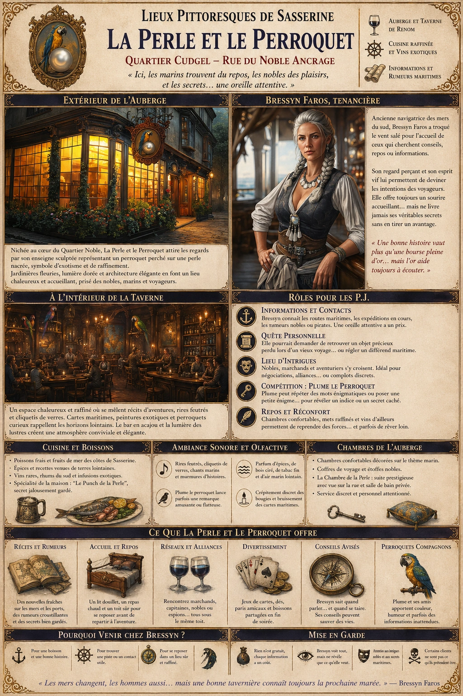
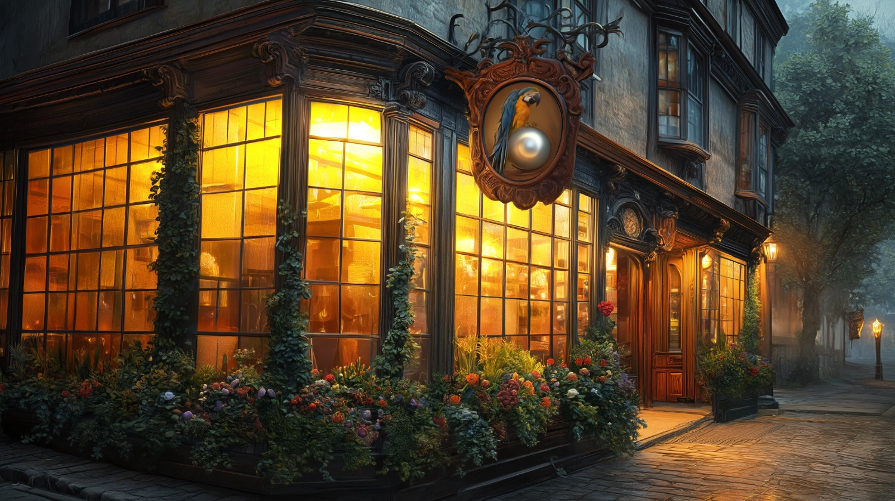
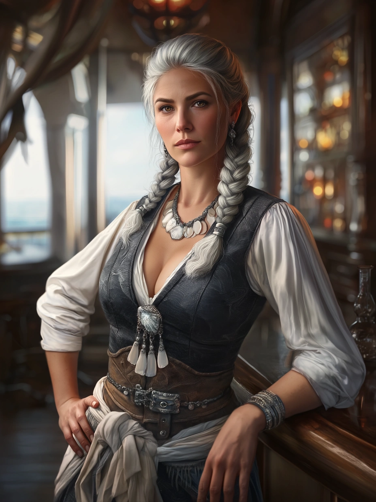

# La Perle et le Perroquet

{.center}

La Perle et le Perroquet est plus qu’une taverne ou une auberge ; c’est un carrefour où se croisent les récits de la mer et les ambitions du Quartier Noble. Les joueurs trouveront ici un havre de repos ou une porte d’entrée vers de nouvelles aventures, avec Bressyn Faros et ses secrets maritimes comme guides potentiels.

### Extérieur de l’auberge

{.center}

Nichée au cœur du Quartier Noble, La Perle et le Perroquet se distingue par son architecture élégante et son enseigne en bois finement sculptée. Elle représente un perroquet aux plumes colorées, perché sur une perle nacrée, symbole de raffinement et d’exotisme. L’entrée est bordée de jardinières débordantes de fleurs et de lierre soigneusement entretenus, et une lumière dorée émane des grandes fenêtres vitrées, attirant les passants.

### À l’intérieur

Dès qu’on pousse la porte, une chaleur accueillante enveloppe les visiteurs. La taverne, au rez-de-chaussée, est un espace spacieux mais intime, où bois poli et lustres en fer forgé se mêlent à des tentures richement décorées. Un bar en acajou trône fièrement contre l’un des murs, derrière lequel sont alignées des bouteilles venues de contrées lointaines. Des cartes maritimes et des peintures représentant des scènes exotiques ornent les murs, témoignant d’un esprit d’aventure.

De petits perroquets vivants, dressés pour ne pas perturber les clients, ajoutent une touche animée en sautillant sur des perchoirs suspendus dans la salle. Ils sont aussi réputés pour répéter quelques mots amusants ou flatteries, selon l’ambiance.

À l’étage, l’auberge offre des chambres confortables et bien aménagées, ornées de tapisseries marines et de coffres en bois sculpté. Une grande suite, appelée “La Chambre de la Perle”, est réservée aux invités prestigieux ou aux aventuriers de renom.

#### Bressyn Faros, la tenancière

{.float-right .img-150}

[Bressyn Faros](../pnj/bressyn-faros.md) est une femme aux allures de capitaine de navire, à la fois tenancière et âme de La Perle et le Perroquet. Ses cheveux poivre et sel, toujours impeccablement tressés, descendent jusqu’à ses épaules. Son regard perçant, semblable à celui d’un rapace, donne l’impression qu’elle devine les intentions des gens avant même qu’ils ne parlent. Elle porte souvent des habits marins élégants, agrémentés de bijoux en nacre et en argent, qui rappellent son passé d’exploratrice des mers du sud. Bressyn est une femme d’une grande intelligence et d’un charme pragmatique. Elle est connue pour offrir des conseils avisés aux aventuriers tout en gardant ses secrets soigneusement dissimulés.

### Petite histoire

Autrefois capitaine d’un navire marchand, Bressyn a survécu à une attaque de pirates qui a marqué sa vie à jamais. Après avoir perdu son équipage et son bateau dans une bataille désespérée, elle a dérivé pendant des jours sur un radeau de fortune avant d’être sauvée par un équipage de contrebandiers. La seule chose qu’elle a réussi à conserver de son navire est une perle massive, aujourd’hui encastrée dans une boîte en verre derrière le bar. Lorsqu’elle a choisi de quitter la mer, Bressyn a investi toutes ses économies dans La Perle et le Perroquet. Elle a décidé d’en faire un lieu où marins et nobles pouvaient se croiser dans une ambiance civilisée, tout en y apportant une touche de l’aventure maritime qui a marqué sa vie. Elle possède également un perroquet gris nommé Plume, qui parle dans un mélange de langages marins et de jurons colorés, pour le plus grand amusement (ou malaise) des clients.

### Rôle pour les joueurs

- ***Informations et contacts.*** Bressyn est une source précieuse de renseignements sur les rumeurs maritimes, les expéditions, ou les routes commerciales.

- ***Quête cachée.*** Elle pourrait confier aux joueurs une mission personnelle, comme retrouver une relique perdue de son ancien navire ou enquêter sur un capitaine rival qu’elle soupçonne d’avoir des liens avec des pirates.

- ***Un lieu pour intrigues.*** Avec la présence de nobles et d’aventuriers, La Perle et le Perroquet est le cadre parfait pour des négociations discrètes, des alliances inattendues ou des conflits subtils.

- ***Compétition.*** Plume, le perroquet, pourrait poser une énigme ou répéter des mots énigmatiques liés à un trésor ou un secret oublié.

### Ambiance

La taverne est animée, mais jamais chaotique. On y entend souvent des récits d’aventures contés à voix basse entre deux éclats de rires. Les nobles viennent pour déguster des mets raffinés et des vins rares, tandis que les aventuriers cherchent des informations ou un moment de répit. Le personnel, discret mais efficace, est habillé avec soin, mais il n’est pas rare que certains serveurs soient d’anciens marins reconvertis, encore marqués par leurs voyages.