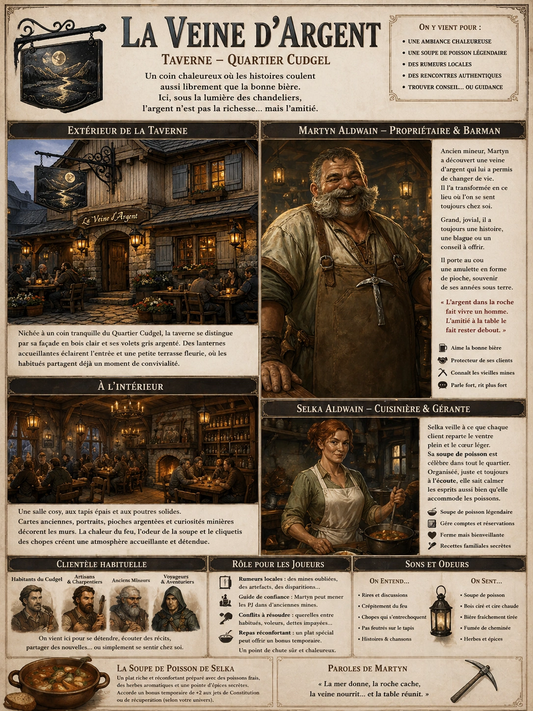
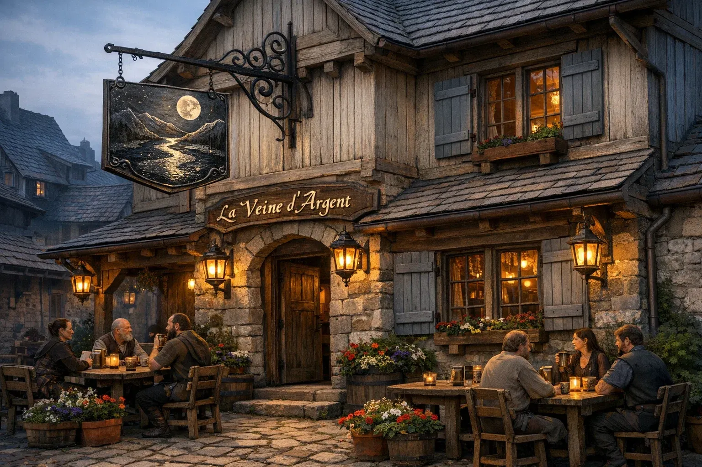
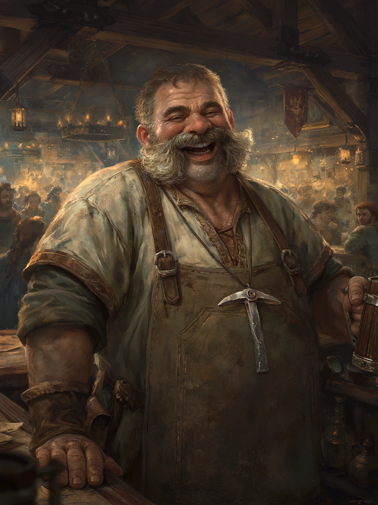

# La Veine d'Argent

{.center}

La Veine d’Argent est plus qu’une simple taverne. C’est un refuge chaleureux pour les habitants du Quartier Cudgel, un endroit où les récits du passé se mêlent au quotidien. Pour les joueurs, elle offre des interactions humaines riches et des opportunités d’aventure tout en leur permettant de goûter à l’hospitalité locale.

### Extérieur de la taverne

{.center}

Nichée à un coin tranquille du Quartier Cudgel, La Veine d’Argent se distingue par sa façade en bois clair et ses volets peints d’un gris argenté. L’enseigne, une plaque de métal finement gravée représentant une rivière scintillante sous la lumière de la lune, balance doucement au gré du vent. Des lanternes accrochées à l’entrée diffusent une lumière douce et chaleureuse, invitant les habitants du quartier à franchir le seuil.

Une petite terrasse ornée de pots de fleurs accueille quelques tables rustiques, où des habitués sirotent leur boisson tout en échangeant des histoires sur les affaires du quartier. L’ambiance est paisible, un contraste agréable avec l’agitation du reste de la ville.

### À l’intérieur

L’intérieur de La Veine d’Argent est cosy et impeccablement entretenu. Le sol est couvert de tapis épais pour amortir les pas et atténuer les bruits, et des poutres robustes soutiennent le plafond bas. Les murs sont décorés de cartes anciennes, de portraits de figures locales respectées, et d’une série de pioches miniatures argentées, clin d’œil au nom de l’établissement.

Le comptoir, sculpté dans un seul morceau de bois poli, brille sous la lumière des chandeliers. Derrière, des étagères garnies de bouteilles de toutes formes et couleurs s’élèvent jusqu’au plafond, témoins du soin apporté à la sélection des alcools. Au centre de la pièce, un foyer à l’âtre accueillant diffuse une chaleur réconfortante, autour duquel les clients se rassemblent pour discuter ou écouter des récits improvisés.

#### Personnages : Martyn et Selka Aldwain

{.float-right .img-150}

[Martyn Aldwain](../pnj/martyn-aldwain.md), propriétaire et barman, est un homme robuste et jovial dans la quarantaine. Il est connu pour sa grande moustache grisonnante et son rire sonore qui résonne souvent dans la taverne. Ancien mineur, Martyn a nommé la taverne en hommage à une veine d’argent qu’il a découverte dans sa jeunesse, un événement qui lui a permis de quitter les mines et d’ouvrir cet établissement. Il porte toujours une vieille amulette d’argent en forme de pioche, un souvenir de ses années passées sous terre.

[Selka Aldwain](../pnj/selka-aldain.md), sa femme, gère la cuisine et s’occupe des commandes spéciales. C’est une femme vive et énergique, avec des cheveux auburn attachés en chignon et un tablier toujours impeccablement blanc. Selka est célèbre pour sa soupe de poisson, un plat réconfortant qu’elle prépare avec une recette secrète transmise dans sa famille. Elle est également réputée pour son habileté à résoudre les disputes entre clients avec un mélange de fermeté et de douceur.

### Petite histoire des propriétaires

Martyn et Selka se sont rencontrés lors d’une foire locale, où Martyn tenait un stand de sculptures en pierre qu’il réalisait pendant ses pauses dans les mines. Impressionnée par son talent et sa gentillesse, Selka l’a invité à un repas… qui s’est terminé par une proposition de mariage un an plus tard. Ensemble, ils ont transformé La Veine d’Argent en un lieu incontournable du Quartier Cudgel, combinant la passion de Martyn pour les récits de mineurs et l’hospitalité chaleureuse de Selka.

### Ambiance et clientèle

La Veine d’Argent attire une clientèle variée : les habitants du Quartier Cudgel, qui viennent pour se détendre après une journée de travail ; les artisans et charpentiers, qui apprécient l’ambiance conviviale et le sens de la communauté ; les voyageurs, attirés par les rumeurs de la fameuse soupe de poisson de Selka. De temps à autre, des anciens mineurs viennent partager leurs aventures ou raconter des histoires sur des filons d’argent perdus et des créatures mystérieuses rencontrées sous terre.

### Rôle pour les joueurs

- ***Rumeurs locales.*** La taverne est un excellent lieu pour entendre des rumeurs sur des mines abandonnées ou des artefacts trouvés dans le Quartier Cudgel.

- ***Réquisition d’un guide.*** Martyn pourrait guider les joueurs dans une vieille mine s’ils le convainquent ou lui rendent un service.

- ***Conflit à résoudre.*** Une querelle entre habitués ou une attaque de voleurs dans le quartier pourrait impliquer les joueurs.

- ***Repas réconfortant.*** Selka pourrait préparer un plat spécial qui offre un bonus temporaire aux joueurs, comme une meilleure récupération ou un regain d’énergie.

### Ambiance sonore et olfactive

Le crépitement du feu dans l’âtre se mêle aux rires et discussions des clients, tandis qu’une douce odeur de soupe, de bois ciré, et de bière fraîchement tirée enveloppe les lieux.