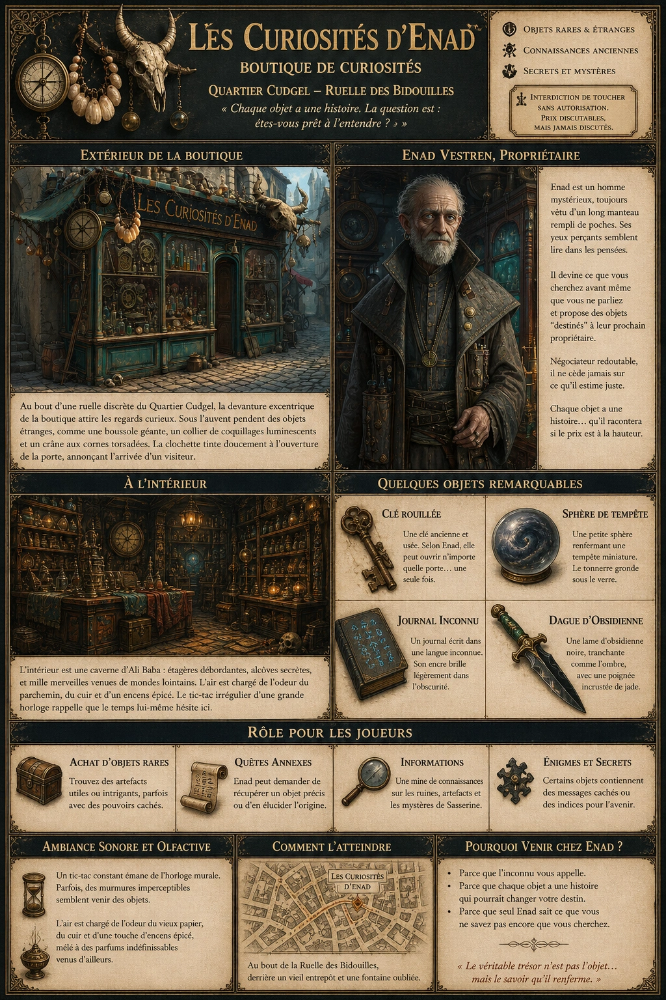
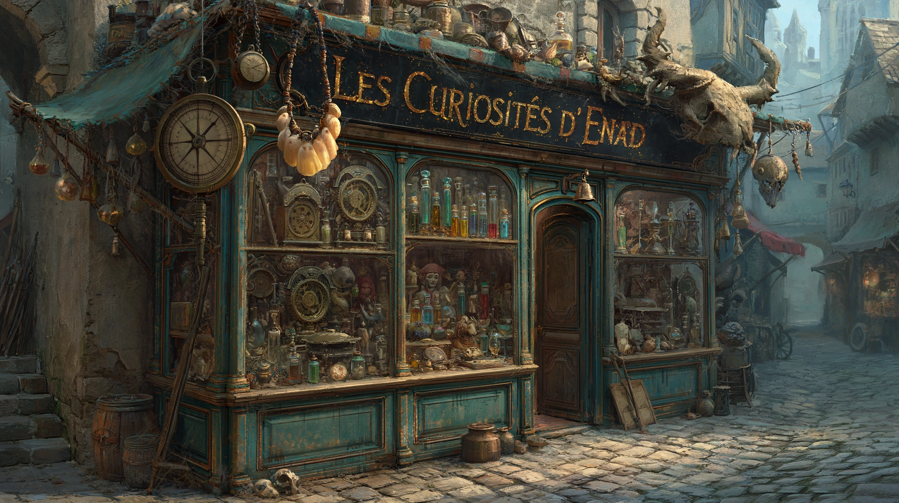
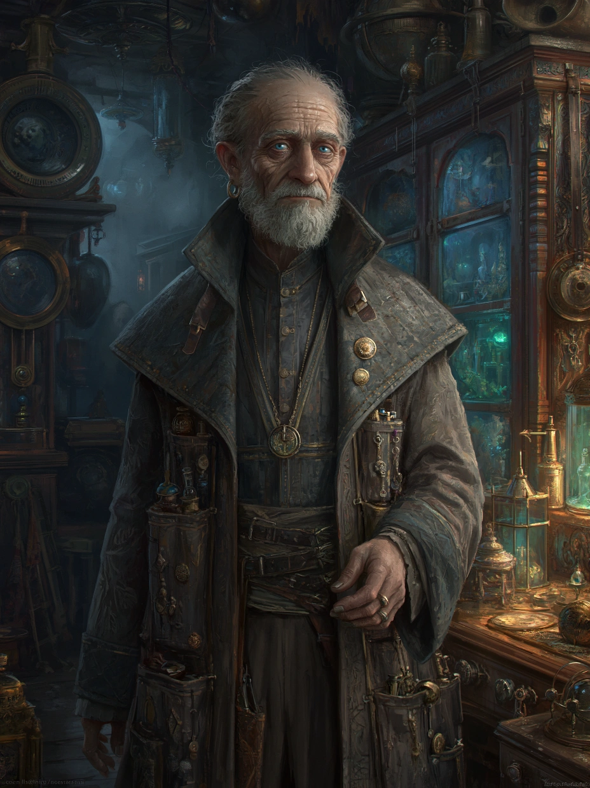

# Les Curiosité d'Enad

{.center}

Les Curiosités d’Enad est un lieu où les mystères se croisent et où chaque objet a une histoire à raconter. Pour les joueurs, c’est une invitation à plonger dans l’inconnu, à se laisser intriguer par des artefacts étranges, et à découvrir des secrets qui pourraient changer le cours de leurs aventures.

### Extérieur de la boutique

{.center}

Située au bout d’une ruelle discrète du Quartier Cudgel, Les Curiosités d’Enad attire immédiatement l’attention des passants grâce à sa devanture excentrique. De vieux objets étranges sont suspendus sous l’auvent : une boussole gigantesque, un collier de coquillages luminescents, et même un crâne de bête non identifiable avec des cornes torsadées. L’enseigne de la boutique, en lettres dorées sur un fond noir, scintille faiblement comme si elle avait été enchantée.

Les fenêtres sont remplies d’objets hétéroclites : des horloges à engrenages complexes, des fioles de verre contenant des liquides colorés, et des statuettes énigmatiques. Une clochette tinte doucement à l’ouverture de la porte, signalant l’arrivée d’un visiteur.

### À l’intérieur

L’intérieur est une caverne d’Ali Baba encombrée et mystérieuse. Les murs sont couverts d’étagères surchargées de livres poussiéreux, d’objets anciens, et de bibelots étranges. Une odeur de parchemin vieilli et de cire fondue flotte dans l’air, mêlée à un parfum indéfinissable, comme un mélange d’épices et de mer.

Au centre de la boutique, un comptoir en bois sombre est couvert de tissus colorés et de coffrets ouverts contenant des bijoux ou des petits trésors. Derrière ce comptoir se trouve une grande horloge murale qui semble avancer de façon irrégulière, comme si le temps lui-même hésitait dans cet endroit.

De petits passages étroits mènent à d’autres alcôves, chacune remplie de collections thématiques : des artefacts marins, des reliques magiques mineures, ou encore des objets de cultures lointaines. Une pancarte écrite à la main indique : *« Interdiction de toucher sans autorisation. Prix discutables, mais jamais discutés. »*

#### Personnage : Enad Vestren

{.float-right .img-150}

[Enad Vestren](../pnj/-enad-vestren.md), propriétaire et unique employé de la boutique, est un homme aux origines mystérieuses. Son visage est marqué par l’âge, avec une barbe grisonnante soigneusement taillée et des yeux bleu pâle qui semblent toujours en train de scruter les pensées de ses interlocuteurs. Enad est toujours vêtu d’un manteau long, orné de poches multiples d’où il sort régulièrement des objets inattendus. Enad parle avec une voix douce et légèrement rauque, ponctuée d’un accent indéfinissable. Il se déplace avec une agilité surprenante pour quelqu’un de son âge, apparaissant souvent soudainement derrière ses clients, ce qui peut les surprendre ou les mettre mal à l’aise.

Enad a un don pour deviner ce que recherchent ses clients avant même qu’ils n’aient parlé. Il propose souvent des objets qu’il présente comme étant “destinés” à leur prochain propriétaire, ajoutant une aura de mystère et d’intrigue à chaque transaction. Cependant, il est aussi un négociateur coriace et n’accepte jamais une offre inférieure à ce qu’il estime juste.

Enad est connu pour son habileté à évaluer rapidement la valeur (et les secrets) des objets. Il prétend parfois que chaque article de sa boutique a une histoire, qu’il se fera un plaisir de raconter si le client est prêt à payer un supplément.

### Petite histoire

Les rumeurs sur Enad abondent dans le Quartier Cudgel. Certains disent qu’il était autrefois un célèbre aventurier qui a exploré des îles oubliées et des ruines anciennes. D’autres affirment qu’il a été un marchand d’objets magiques interdits avant de chercher refuge à Sasserine. Une histoire populaire prétend qu’il a vendu son ombre à un démon en échange de la capacité de trouver des objets rares et précieux, mais cela reste une simple légende.

**Quelques objets intéressants dans la boutique :**

- Une clé rouillée qui, selon Enad, peut ouvrir n’importe quelle porte… une seule fois.
- Une petite sphère de verre contenant ce qui ressemble à une tempête en miniature.
- Un journal écrit dans une langue inconnue, dont l’encre brille légèrement dans l’obscurité.
- Une dague décorée avec une lame d’obsidienne noire et une poignée incrustée de jade.

### Rôle pour les joueurs

- ***Achat d’objets rares.*** Les joueurs peuvent trouver chez Enad des artefacts utiles ou intrigants, parfois avec des pouvoirs cachés.

- ***Quêtes annexes.*** Enad pourrait demander aux joueurs de récupérer un objet précis ou de découvrir l’origine d’un article qu’il ne parvient pas à identifier.

- ***Informations.*** Enad est une mine de connaissances, en particulier sur les ruines, les artefacts et les mystères de Sasserine.

- ***Énigmes.*** Certains objets pourraient contenir des messages cachés ou des indices pour des aventures futures.

### Ambiance sonore et olfactive

Un léger bruit de tic-tac constant émane de l’horloge murale. Parfois, des murmures imperceptibles semblent venir de certains objets. L’air est chargé de l’odeur du vieux papier, du cuir, et d’une touche d’encens épicé.