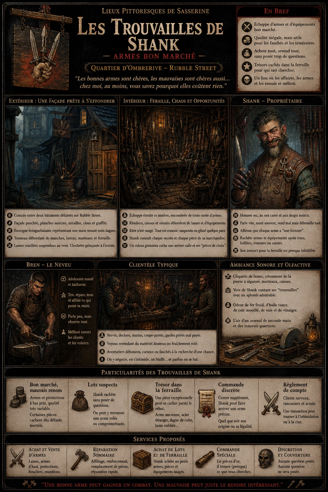
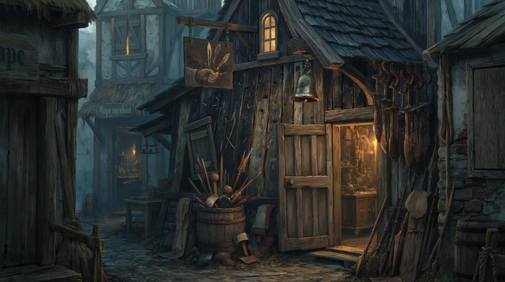
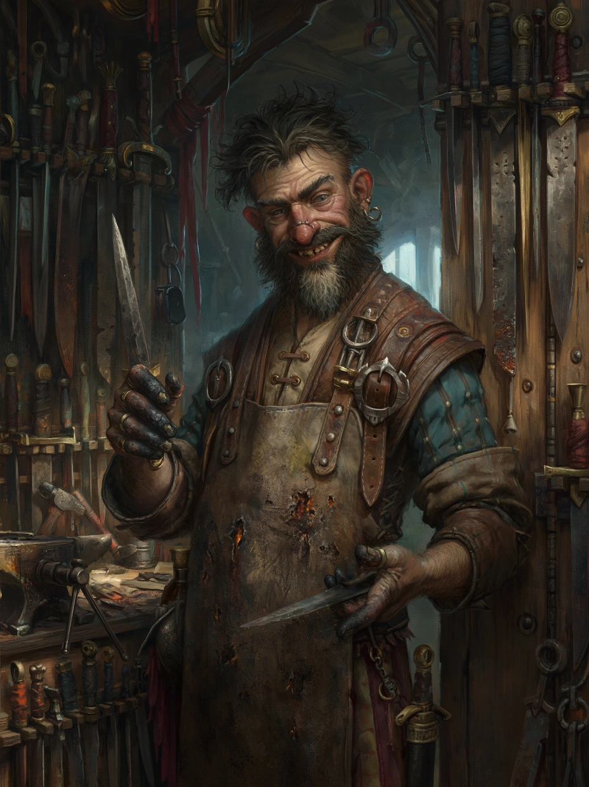

# Les Trouvailles de Shank

{.center}

Les Trouvailles de Shank sont l’un de ces commerces d’Ombrerive dont on se demande, en le voyant, s’il va s’effondrer avant la fin de la semaine ou s’il tiendra encore cinquante ans par pure malveillance. C’est une échoppe d’armes bon marché, de bric et de broc martial, de ferraille rafistolée et de lames douteuses, fréquentée par les matamores sans le sou, les coupe-jarrets prudents, les dockers qui veulent une protection rapide, et les aventuriers assez fauchés - ou assez curieux - pour fouiller dans les piles instables de son improbable marchandise.

### Extérieur des Trouvailles de Shank

{.center}

La boutique est coincée entre un marchand de cordes moisies et une masure murée dont personne ne revendique la propriété. Sa façade penche vers la ruelle comme un vieillard indiscret. Les planches noircies de son devant sont couvertes d’entailles, d’anciens clous et de traces de peinture écaillée. Une enseigne bringuebalante représente une main tenant trois dagues, mais deux ont été repeintes par-dessus, si bien qu’on dirait désormais un bouquet de couteaux mal élevés.

Devant la porte, un tonneau déborde de hampes, de manches de marteaux, de piques fendues et de fourreaux sans propriétaire. Des lames rouillées pendent à des crochets, agitées par le vent comme de petites girouettes meurtrières. Une clochette de métal terni tinte à chaque entrée, mais avec un son si grinçant qu’on croirait plutôt l’avertissement d’un piège que l’accueil d’un commerçant.

### À l’intérieur de la boutique

L’intérieur est étroit, encombré, sombre, et donne l’impression qu’un arsenal de milice ivre aurait explosé dans une remise. Les murs disparaissent sous les râteliers de sabres ébréchés, de haches rafistolées, de boucliers cabossés, de gourdins ferrés et d’arbalètes dont certaines ont l’air plus dangereuses pour l’utilisateur que pour la cible. Rien n’est présenté avec élégance ; tout est suspendu, empilé, entassé ou glissé là où il restait de la place.

Des caisses ouvertes couvrent le sol, pleines de dagues dépareillées, de pointes de lances, de poignards recourbés, de carreaux d’arbalète tordus, de casques bosselés et de brassards orphelins. Il faut parfois enjamber une pile de boucliers pour atteindre le comptoir. Pourtant, au milieu de ce chaos, Shank retrouve tout. Il sait exactement où se cache “la hache à manche court mais tête correcte”, “la rapière pas trop voilée”, ou “le lot de couteaux qui a l’air honnête de loin”.

Au fond de la boutique, un rideau graisseux masque une arrière-salle où sont entreposées les pièces “de choix”. Le terme est généreux. On y trouve surtout des armes un peu moins mauvaises que les autres, du matériel récupéré après des rixes, des faillites ou des descentes de garde, et quelques objets dont l’origine gagnerait à ne pas être précisée. Parfois, une pièce réellement intéressante se glisse au milieu du rebut : une lame de bonne facture mal identifiée, un vieux bouclier d’officier, ou une arme étrangère dont personne dans le quartier ne connaît la valeur.

#### Shank et ceux qui traînent chez lui

{.float-right .img-150}

Le propriétaire, [Shank](../pnj/shank.md), est un homme sec, nerveux, au nez cassé, à la barbe rare et aux doigts noircis par le métal, l’huile et la suie. Il a le sourire de ceux qui mentent par réflexe, mais pas forcément par méchanceté. Toujours vêtu d’un tablier de cuir mangé de brûlures, il se déplace dans son échoppe avec une aisance de rat dans les cloisons. Shank parle vite, jure souvent, flatte les clients avec insolence et prétend que chacune de ses lames a “une histoire”, ce qui est parfois vrai et souvent inquiétant.

Shank emploie aussi un neveu taciturne, [Bren](../pnj/bren.md), adolescent massif à l’air buté, qui trie les lots, redresse les clous, passe la pierre sur les tranchants et teste la solidité des manches à coups violents sur une souche à l’arrière. Bren parle peu, mais il observe les clients avec l’intensité d’un chien de garde qui essaie de deviner lequel va voler.

La clientèle des Trouvailles de Shank est presque un spectacle à elle seule. On y croise des nervis venus acheter de quoi impressionner, des gardes privés mal payés, des marins qui veulent un coutelas “suffisamment dissuasif”, des voyous cherchant à revendre discrètement une arme tachée, et parfois un aventurier débutant assez naïf pour croire avoir découvert une mine d’or. L’endroit sent l’affaire louche, la mauvaise foi et la rixe imminente, mais il reste étonnamment populaire.

### Petite histoire sur Shank

Shank jure qu’il fut autrefois armurier embarqué sur un navire de guerre, puis fournisseur d’une compagnie mercenaire, puis revendeur pour une maison noble ruinée, puis survivant d’un siège, puis receleur malgré lui. Selon les jours, il change l’ordre de ces exploits et en ajoute deux ou trois. Personne ne connaît la vérité complète.

Ce que tout le monde admet, en revanche, c’est que Shank a un instinct remarquable pour récupérer des armes là où d’autres ne voient que de la ferraille. Après une émeute, un incendie, une faillite, une saisie ou une rixe de taverne, il apparaît tôt ou tard pour racheter “au poids” des lots improbables qu’il revend ensuite pièce par pièce avec une conviction presque touchante. Il affirme qu’une arme n’a pas besoin d’être belle pour être utile. Puis il ajoute généralement : “Et les belles armes, de toute façon, finissent souvent dans les mains des morts.”

### Les particularités des Trouvailles de Shank

- ***Bon marché, mauvais renom.*** Les PJ peuvent y acheter des armes et protections pour peu cher, mais la qualité est inégale. Certaines pièces sont solides, d’autres médiocres, d’autres encore cassent au pire moment si le MJ veut pimenter la scène.
- ***Lots suspects.*** Shank rachète sans poser trop de questions. Les PJ peuvent y retrouver une arme volée, un équipement disparu, ou un objet portant encore les marques d’un ancien propriétaire influent.
- ***Trésor dans la ferraille.*** Au milieu du rebut peut se cacher une pièce exceptionnelle mal estimée : arme ancienne, acier étranger, dague de culte, ou lame portant un symbole oublié.
- ***Commande discrète.*** Contre supplément, Shank peut faire “arriver” une arme précise en quelques jours : pièce rare, modèle interdit, matériel de milice, ou armement venu d’un navire récemment accosté.
- ***Règlement de compte.*** L’échoppe attire les gens armés, nerveux et rancuniers. Une transaction peut vite tourner à l’intimidation, à la menace voilée, ou à une bagarre entre acheteurs qui convoitaient la même lame.

### Ambiance sonore et olfactive

Ici, tout cliquette, racle, tinte ou cogne. On entend le heurt des lames qu’on déplace, le crissement de la pierre à aiguiser, le choc d’un marteau sur une garde tordue, le raclement d’une caisse qu’on traîne sur le sol, et la voix nasillarde de Shank vantant une arme “presque neuve” avec un aplomb admirable. L’air sent le fer froid, l’huile rance, le cuir mouillé, la poussière, la suie et, par moments, une pointe de vinaigre utilisé pour gratter la rouille. C’est l’odeur d’un arsenal de seconde main, de la débrouille armée, et des mauvais quartiers qui préfèrent une lame médiocre à des mains vides.