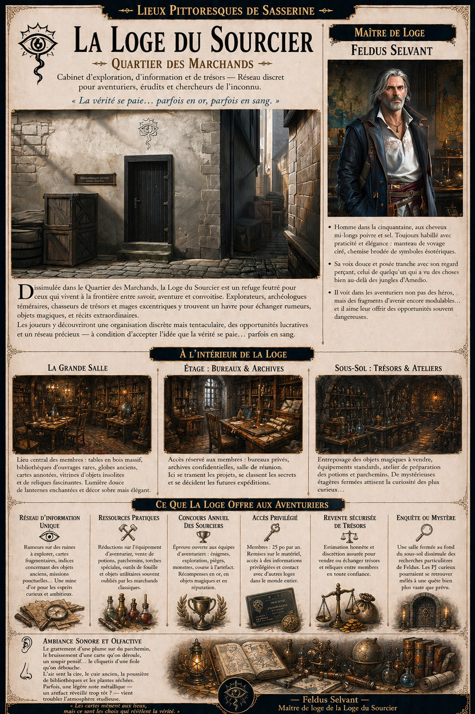
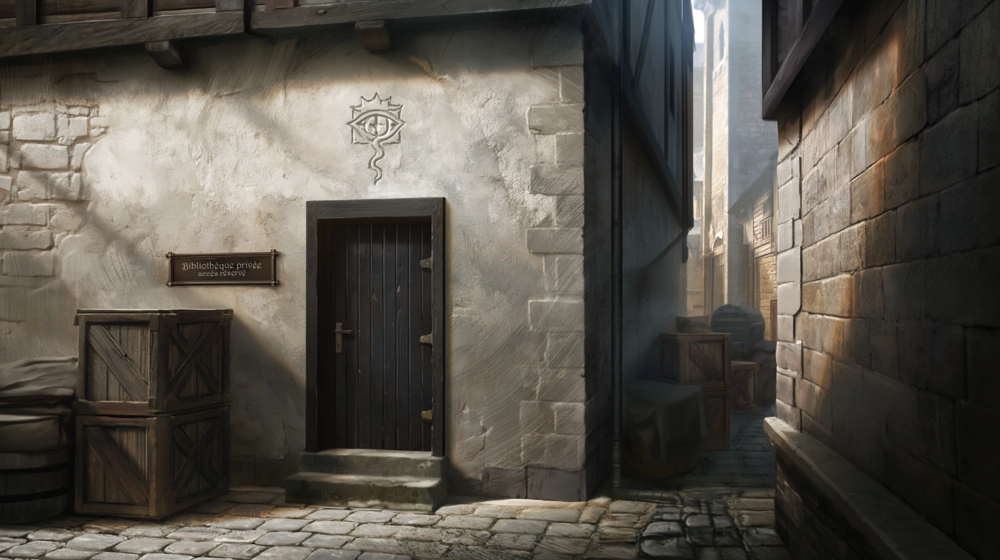

# Loge du Sourcier

{.center}

Dissimulée dans le Quartier des Marchands, la Loge du Sourcier est un refuge feutré pour ceux qui vivent à la frontière entre savoir, aventure et convoitise. Explorateurs, archéologues téméraires, chasseurs de trésors et mages excentriques y trouvent un havre pour échanger rumeurs, objets magiques, et récits extraordinaires. Les joueurs y découvriront une organisation discrète mais tentaculaire, des opportunités lucratives et un réseau précieux — à condition d’accepter l’idée que la vérité se paie… parfois en sang.

### À l'extérieur

{.center}

Nichée entre deux entrepôts de fournitures dans une ruelle bien entretenue du Quartier des Marchands, la Loge du Sourcier ne se distingue pas au premier regard. Une simple porte en bois sombre, marquée d’un symbole discret gravé dans le linteau (un œil stylisé traversé par une ligne sinueuse) indique l’entrée à ceux qui savent ce qu’ils cherchent.

Un modeste panneau annonce simplement : “Bibliothèque privée – accès réservé”. Aucun garde visible, mais ceux qui essaient de forcer l’entrée sans autorisation racontent rarement pourquoi ils ont changé d’avis.

### À l'intérieur

Dès l’entrée, le contraste est frappant : murs lambrissés, tentures sobres mais élégantes, lumière douce émanant de lanternes enchantées. Une grande salle centrale accueille les membres : tables en bois massif, bibliothèques chargées d’ouvrages rares, globes anciens, cartes aux annotations manuscrites, vitrines d’objets insolites et de reliques inertes mais fascinantes.

Des escaliers discrets mènent à l’étage — réservé aux bureaux, archives confidentielles et salle de réunion — et au sous-sol, où sont entreposés les objets magiques à vendre, les équipements standards, et l’atelier de préparation des potions et parchemins.

#### Feldus Selvant, maître de loge et esprit errant

{.float-right .img-150}

[Feldus Selvant](../pnj/feldus-selvant.md) est un homme dans la cinquantaine, aux cheveux mi-longs poivre et sel, toujours habillé de façon pratique mais élégante : bottes solides, manteau de voyage impeccablement ciré, chemise brodée de symboles ésotériques. Sa voix douce et posée tranche avec son regard perçant, celui de quelqu’un qui a vu des choses bien au-delà de la jungle d’Amedio ou des ruines d’Ur-Ghaash.

### Petite histoire

Feldus a fondé la loge de Sasserine il y a une dizaine d’années, après avoir “trouvé plus que ce qu’il cherchait” lors d’une expédition dans les ruines d’une cité volante oubliée. Depuis, il alterne entre longues absences et retours discrets, ne révélant jamais exactement ce qu’il poursuit, mais laissant derrière lui des fragments d’histoires fascinantes : une boussole qui ne pointe jamais le nord, un carnet en langue inconnue, une bague qui murmure des prénoms. Il voit dans les aventuriers non pas des héros, mais des fragments d’avenir encore modulables. Et il aime leur offrir des opportunités… souvent dangereuses.

### Particularités du lieu pour les PJ

- ***Réseau d’information unique.*** Rumeurs sur des ruines à explorer, cartes fragmentaires, indices concernant des objets anciens, missions ponctuelles… la loge est une mine d’or pour les aventuriers ambitieux.

- ***Ressources pratiques.*** Réductions sur l’équipement d’aventurier, vente de potions, parchemins, torches spéciales, outils de fouille, et objets utilitaires souvent oubliés par les marchands classiques.

- ***Concours annuel des Sourciers.*** Une épreuve ouverte aux équipes d’aventuriers — énigmes, exploration, pièges, monstres, course à l’artefact. Récompenses en or, en objets magiques… et en réputation.

- ***Accès privilégié.*** Les membres paient 25 po par an et bénéficient de remises sur le matériel, d’un accès à des informations privilégiées, et d’un contact direct avec d’autres loges dans le monde.

- ***Revente sécurisée de trésors.*** La loge propose une alternative discrète aux échoppes de vente officielles, avec estimation honnête et possibilité de troc entre membres.

- ***Enquête ou mystère.*** Une salle fermée au fond du sous-sol semble dissimuler des recherches particulières de Feldus — les PJ curieux pourraient se retrouver mêlés à une quête bien plus vaste que prévue.

### Ambiance sonore et olfactive

Le grattement d’une plume sur du parchemin, le bruissement d’une carte qu’on déroule, un soupir pensif, le cliquetis d’une fiole qu’on débouche. L’air sent la cire, le cuir ancien, la poussière de bibliothèques et les plantes séchées. Parfois, une légère note métallique - un artefact réveillé trop tôt ? - vient troubler l’atmosphère studieuse.