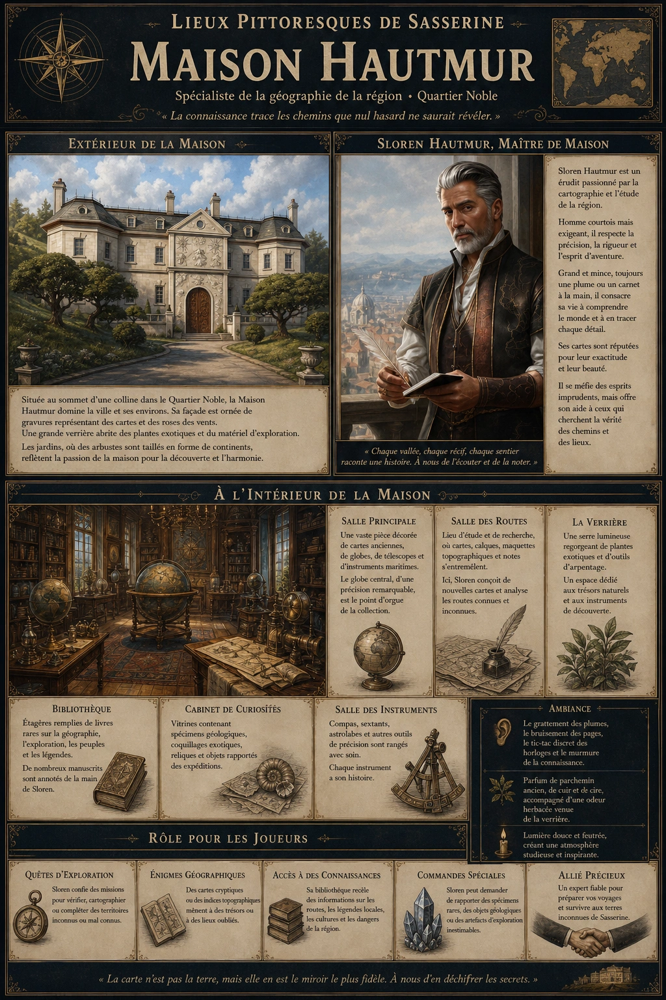
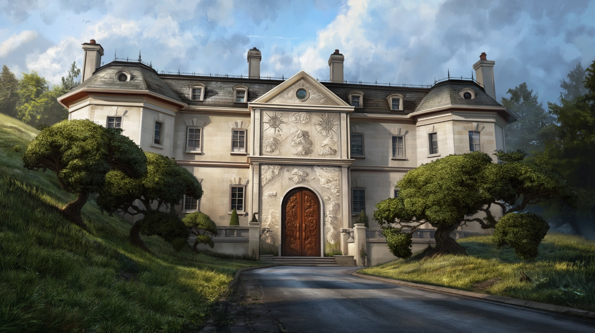
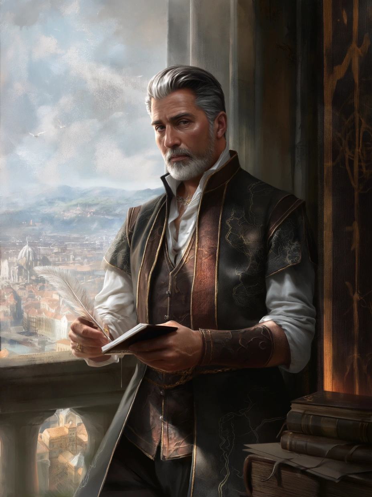

# Maison Hautmur

{.center}

La Maison Hautmur est plus qu’une demeure : c’est un sanctuaire pour les érudits et les explorateurs. Les joueurs y trouveront un allié précieux pour leurs expéditions et un lieu rempli de mystères à déchiffrer, tout en découvrant les richesses géographiques et historiques de la région de Sasserine.

### Extérieur de la maison

{.center}

La Maison Hautmur est un imposant manoir en pierre claire, situé au sommet d’une colline dans le Quartier Noble. Sa façade est ornée de gravures représentant des cartes stylisées et des roses des vents. Une large allée pavée, bordée d’arbustes taillés en forme de continents, mène à une porte en chêne massif incrustée de motifs marins et de montagnes gravées en relief.

Autour de la demeure, des jardins soigneusement entretenus s’étendent, agrémentés de fontaines qui chantent doucement et de statues représentant des explorateurs célèbres. Une grande verrière occupe l’aile droite de la maison, remplie de plantes exotiques et d’outils d’arpentage.

### À l’intérieur

En entrant, les visiteurs sont accueillis par une vaste salle décorée de cartes anciennes encadrées et suspendues aux murs. Un globe terrestre massif trône au centre, accompagné de télescopes, de sextants, et de compas exposés sur des présentoirs de bois verni.

Les pièces de la maison sont un mélange de bibliothèque et de cabinet de curiosités : des étagères chargées de livres rares côtoient des vitrines contenant des spécimens géologiques, des coquillages exotiques, et des reliques trouvées lors d’expéditions. Des chandeliers suspendus diffusent une lumière douce, créant une atmosphère studieuse et apaisante.

Une pièce adjacente, surnommée “la Salle des Routes”, est dédiée à l’étude. Son sol est couvert de cartes étalées et de parchemins annotés. Une grande table est remplie de calques, de maquettes topographiques, et de notes griffonnées à la hâte.

#### Sloren Hautmur, maître de la maison

{.float-right .img-150}

[Sloren Hautmur](../pnj/sloren-hautmur.md), maître de la maison, est un homme d’une cinquantaine d’années, grand et mince, avec une posture élégante et des yeux perçants. Ses cheveux poivre et sel sont toujours impeccablement coiffés, et il porte souvent des vêtements raffinés, ornés de broderies évoquant des cartes. Il tient généralement une plume ou un carnet à la main, prêt à noter une nouvelle idée ou un détail intéressant.

***Interactions avec Sloren.*** Sloren est un homme courtois mais exigeant, qui respecte ceux qui partagent sa passion pour la précision et la connaissance. Il se méfie des aventuriers imprudents ou des marchands trop cupides, préférant travailler avec des individus respectant l’art de la cartographie et les rigueurs du voyage. Il est aussi légèrement obsessionnel : chaque détail compte, et il peut passer des heures à discuter d’une erreur mineure sur une carte ou à débattre de la meilleure méthode pour tracer une route.

### Petite histoire

Sloren est connu comme l’expert incontesté en géographie de la région de Sasserine. Il a cartographié des territoires inexplorés, découvert des routes commerciales, et identifié des zones stratégiques pour la ville. Ses compétences lui ont valu de nombreux contrats avec des marchands, des explorateurs, et même des nobles ambitieux. Cependant, Sloren porte un secret : sa passion pour la géographie a commencé par une erreur monumentale. Jeune homme, il a mal interprété une carte, conduisant une expédition à un désastre. Après cet échec, il s’est juré de devenir le meilleur cartographe de la région et de ne plus jamais laisser une erreur coûter des vies. Cette promesse l’a rendu méticuleux, parfois à l’excès.

### Rôle pour les joueurs

- ***Quêtes d’exploration.*** Sloren pourrait demander aux joueurs de vérifier ou d’ajouter des informations à une carte incomplète.

- ***Enigmes géographiques.*** Il pourrait leur fournir une carte cryptique menant à un trésor ou à un lieu oublié.

- ***Accès à des connaissances.*** Sa bibliothèque contient des informations sur les territoires environnants, les routes commerciales, ou même des légendes locales.

- ***Commande spéciale.*** Sloren pourrait leur demander de ramener un objet rare ou un spécimen géologique lors de leurs voyages.

### Ambiance sonore et olfactive

Le grattement des plumes sur le parchemin se mêle au bruissement des pages des livres. Une légère odeur de parchemin ancien, de cuir et de cire flotte dans l’air, ponctuée par le parfum herbacé émanant de la verrière.