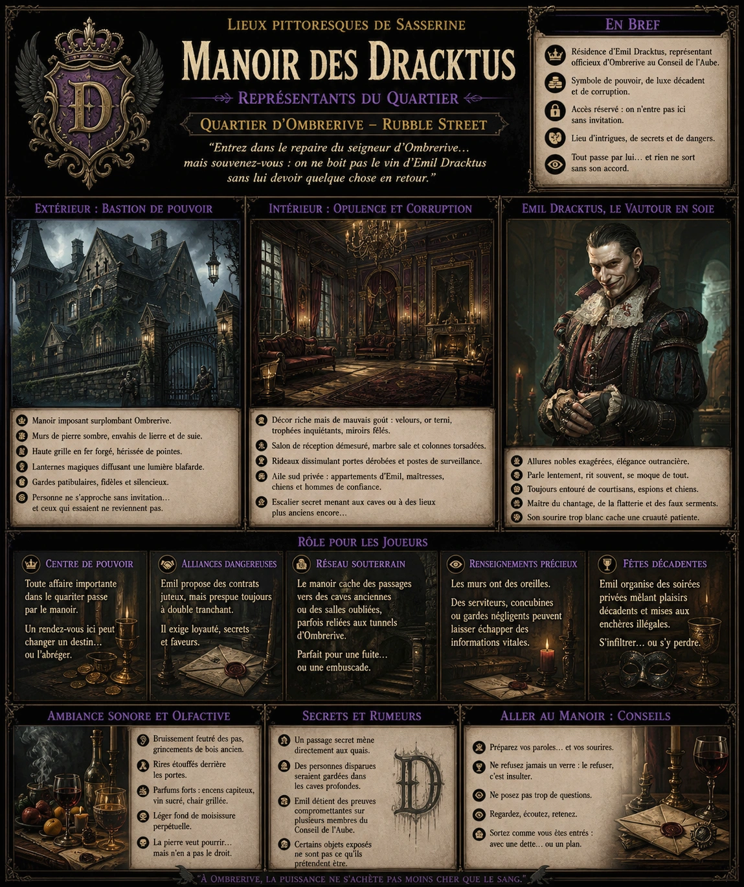
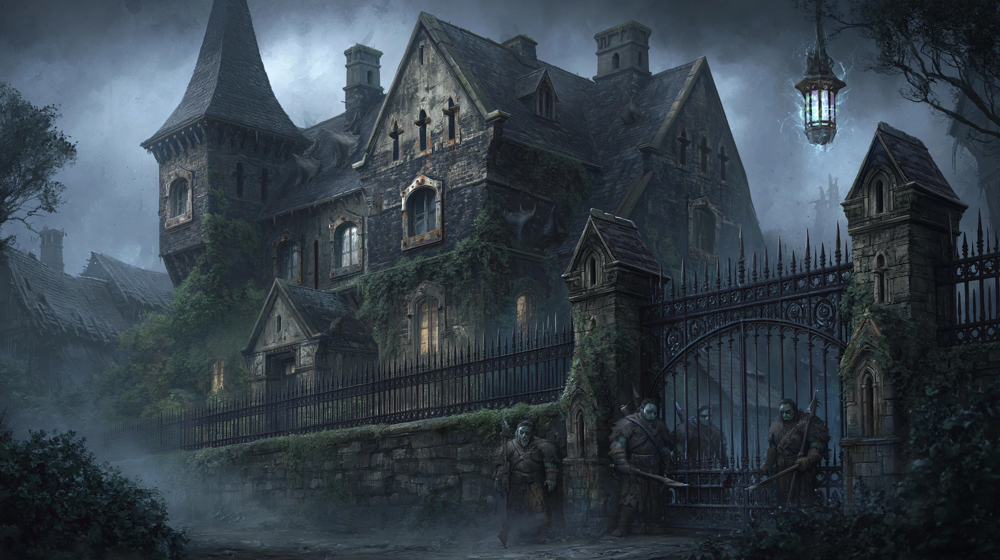
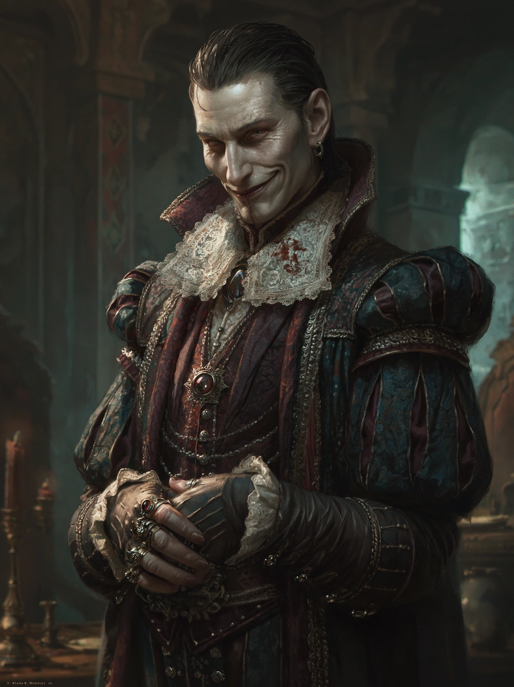

# Manoir des Dracktus

{.center}

Le Manoir des Dracktus est un bastion décadent au milieu de la crasse et de la violence d’Ombrerive. À la fois symbole de pouvoir et de corruption, il est la résidence d’Emil Dracktus, représentant officieux et peu apprécié du quartier au Conseil de l’Aube. Les joueurs y trouveront un mélange toxique d’influence, de secrets, de luxe dévoyé et d’intimidation. Un lieu où l’argent sent la poudre et où les tapis sont parfois plus tachés de sang que de vin.

### Extérieur

{.center}

*“Entrez dans le repaire du seigneur d’Ombrerive… mais souvenez-vous : on ne boit pas le vin d’Emil Dracktus sans lui devoir quelque chose en retour.”*

Au premier regard, le Manoir des Dracktus détonne violemment avec le reste d’Ombrerive. Perché sur une petite hauteur surplombant les toits branlants du quartier, il ressemble à une vieille bête accrochée à son rocher. Les murs de pierre sombre, envahis par le lierre et les traces de suie, sont ponctués de meurtrières et de vitres opaques aux montants rouillés.

Une haute grille en fer forgé, hérissée de pointes, entoure la propriété. Des lanternes magiques, alimentées par des cristaux pulsants, y diffusent une lumière blafarde, constamment filtrée par les brumes d’Ombrerive. Des gardes patibulaires, mi-brutes mi-hommes de main, montent la garde devant l’unique portail, silencieux et armés jusqu’aux dents.

Personne ne s’approche du manoir sans invitation. Et ceux qui essaient… ne reviennent pas deux fois.

### Intérieur

Le contraste entre l’extérieur défensif et l’intérieur opulent est saisissant. Le manoir est richement décoré, mais avec un goût douteux : velours râpés, or terni, trophées de chasse inquiétants (certains clairement d’origine humanoïde), sculptures provocantes, miroirs fêlés et chandeliers en forme de crocs.

La salle principale est un salon de réception démesuré, où le marbre sale et les colonnes torsadées évoquent davantage une caricature de manoir noble qu’un palais digne. Des rideaux de soie pourpre dissimulent souvent des portes dérobées ou des postes de surveillance.

L’aile sud est privée, réservée aux appartements d’Emil Dracktus, à ses maîtresses, ses chiens et ses hommes de confiance. Un escalier descend vers les caves… ou, selon la rumeur, vers quelque chose de plus ancien que le manoir lui-même.

#### Emil Dracktus, le Vautour en soie

{.float-right .img-150}

[Emil Dracktus](../pnj/emil-dracktus.md) - s’il s’agit bien de son vrai nom - est un homme aux allures nobles volontairement exagérées : longues mains gantées, cheveux gominés en arrière, collerette en dentelle (toujours tachée de vin), anneaux ostentatoires et sourire trop blanc pour être honnête. Il parle avec une lenteur affectée, ponctuant ses phrases de rires dissonants, comme s’il se moquait sans cesse du monde entier.

### Petite histoire

Nul ne sait réellement d’où vient Emil. Certains affirment qu’il était un escroc à la petite semaine qui aurait empoisonné l’ancien seigneur d’Ombrerive avant de s’installer à sa place. D’autres disent qu’il aurait été un agent d’un syndicat du crime d’une autre cité, banni après avoir trahi les siens. Une chose est sûre : il est aussi intelligent qu’il est immonde, et son ascension dans le chaos d’Ombrerive a été méthodique. On raconte qu’il entretient une “liste noire”, dans laquelle figurent toutes les personnes qui l’ont un jour humilié publiquement. Et qu’il en raye les noms un à un, lentement, méthodiquement. Une pièce du manoir — fermée à double tour — serait entièrement tapissée de portraits… tous barrés d’une ligne rouge.

### Rôle pour les joueurs

- ***Centre de pouvoir d’Ombrerive.*** Toute affaire importante dans le quartier passe, tôt ou tard, par le manoir. Un rendez-vous ici peut changer un destin… ou l’abréger.

- ***Alliances dangereuses.*** Emil peut proposer aux PJ des contrats juteux, mais presque toujours à double tranchant. Il exige loyauté, secrets et faveurs.

- ***Réseau souterrain.*** Le manoir cache des passages vers des caves anciennes ou des salles oubliées, parfois reliées à des tunnels d’Ombrerive. Parfait pour une fuite… ou une embuscade.

- ***Renseignements précieux.*** Les murs ont des oreilles. Des serviteurs discrets, des concubines fatiguées ou des gardes négligents peuvent laisser échapper des informations vitales.

- ***Fête décadente.*** Emil organise parfois des “soirées privées” mêlant plaisirs décadents et mises aux enchères illégales. Les PJ pourraient s’y infiltrer… ou s’y perdre.

### Ambiance sonore et olfactive

Le manoir résonne du bruissement feutré des pas sur les tapis, des grincements de bois ancien, et parfois, de rires étouffés derrière des portes fermées. L’air est chargé de parfums forts, presque écœurants — encens capiteux, vin sucré, chair grillée. Un léger fond de moisissure flotte en permanence, comme si la pierre elle-même voulait pourrir mais n’en avait pas le droit.