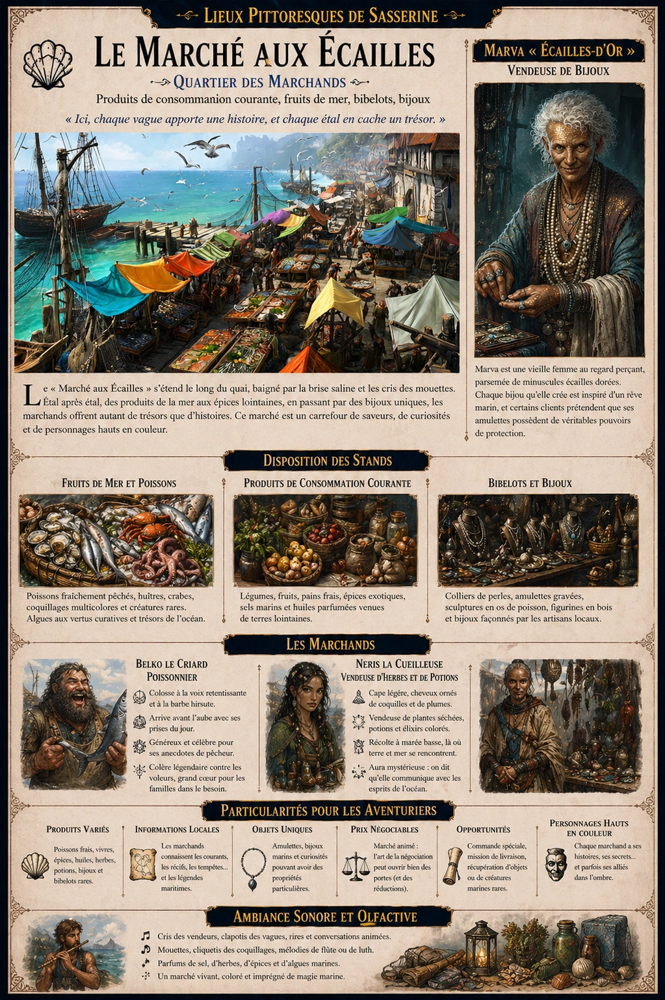
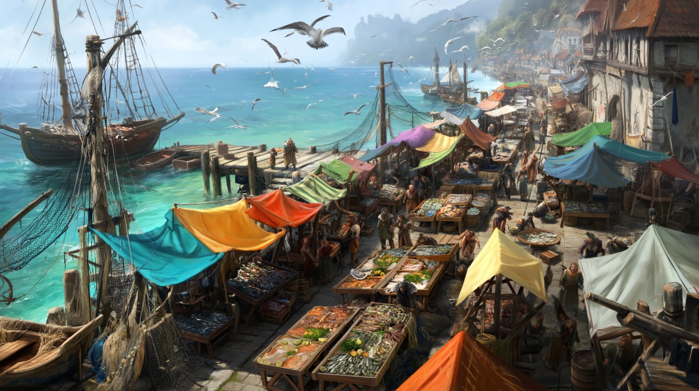
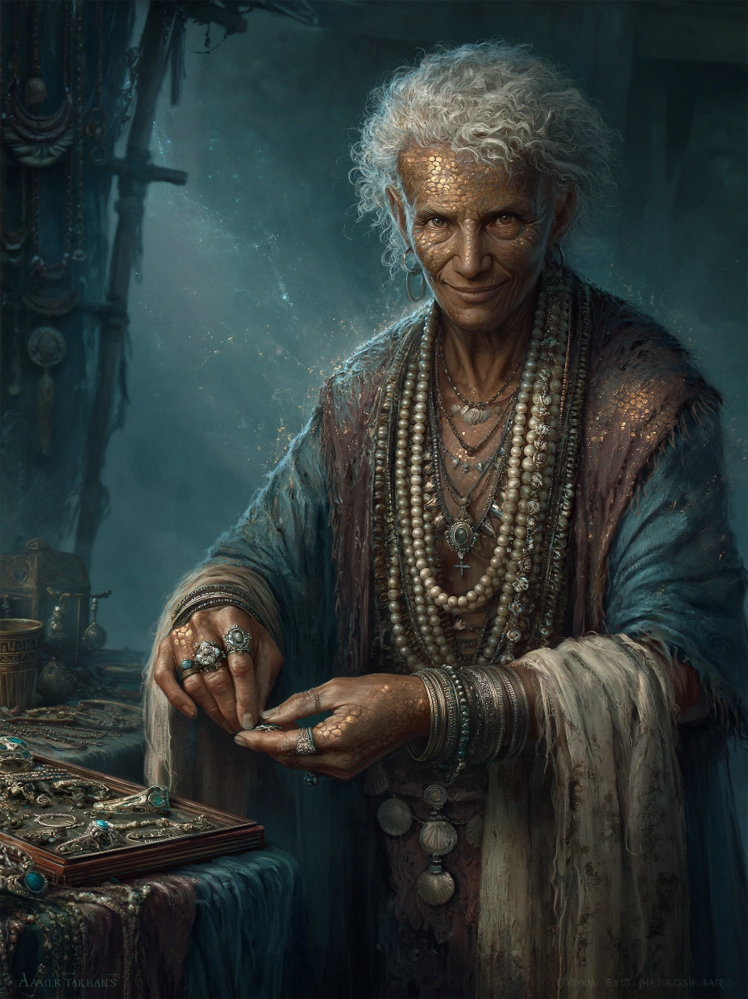

# Marché aux Ecailles

{.center}

Le « Marché aux Écailles » est un lieu plein de vie où chaque étal a son histoire et où chaque vendeur est prêt à partager un peu de sa sagesse, en échange de quelques pièces ou d’un bon échange. Ce marché ne se contente pas d’offrir des produits ; il offre un voyage, un échantillon des mystères et des richesses de la mer, que chaque joueur ressentira en déambulant parmi les trésors marins et les légendes locales.

### Arrivée au marché

{.center}

Le « Marché aux Écailles » s’étend le long d’un quai pittoresque, baigné par la brise saline de la mer et les cris des mouettes tournoyant dans le ciel. Les étals sont couverts de tentures colorées et de filets de pêche, et l’odeur du sel marin se mêle à celle des herbes aromatiques et des fruits exotiques. Les passants, de simples villageois aux aventuriers de passage, se faufilent entre les stands animés où les vendeurs crient leurs offres.

Ce marché est réputé pour ses produits marins de qualité, ses bibelots intrigants et ses bijoux, mais aussi pour ses habitants, des personnages hauts en couleur qui ajoutent au charme de l’endroit.

### Disposition des stands

Les étals se succèdent dans un désordre organisé, regroupés par type de produits :

***Fruits de mer et poissons*** : Au centre, des marchands proposent des poissons fraîchement pêchés, des paniers remplis d’huîtres, de crabes, et de coquillages multicolores. Certains stands exposent même des créatures rares, comme des poulpes aux teintes changeantes ou des algues réputées pour leurs vertus curatives.

***Produits de consommation courante*** : Sur les côtés, les étals débordent de légumes, de fruits, et de pains frais. Des épices venues de terres lointaines, des sels marins et des huiles parfumées sont disposés dans de petits sacs de toile.

***Bibelots et bijoux*** : Au bout du marché, des artisans locaux exposent leurs créations : colliers de perles, bracelets en coquillage, et amulettes gravées de symboles marins. Des sculptures en os de poisson et des figurines en bois de marins ou de créatures mythiques ajoutent une touche de mystère.

#### Les marchands

{.float-right .img-150}

[Marva « Écailles-d’Or »](../pnj/marva-ecailles-d-or.md), la vendeuse de bijoux. Marva est une vieille femme au regard perçant, souvent entourée de perles et de colliers qu’elle porte autour de son cou et de ses poignets comme une deuxième peau. Elle a les cheveux blancs et frisés, et sa peau tannée par le soleil est parsemée de minuscules écailles dorées qu’elle affirme avoir héritées de ses ancêtres, autrefois bénis par les esprits de la mer. Elle dit que chaque bijou qu’elle crée est inspiré d’un rêve marin, et certains clients prétendent que ses amulettes possèdent de véritables pouvoirs de protection. Marva aime raconter aux passants l’histoire de ses écailles dorées et jure que, lors des nuits de pleine lune, elles scintillent comme des étoiles sur l’eau. Son caractère est aussi tranchant qu’un couteau de pêcheur, mais elle a un faible pour les âmes en quête d’aventure et leur offre parfois un bijou unique en échange d’une promesse de bravoure.

[Belko le Criard](../pnj/belko-le-criard.md), le poissonnier. Belko est un colosse à la barbe hirsute et aux mains larges comme des pinces de crabe, connu pour sa voix retentissante et son amour immodéré pour la pêche. Il arrive toujours avant l’aube pour étaler ses prises du jour, avec une précision d’orfèvre. Ses clients l’adorent pour sa générosité et son talent pour choisir le meilleur morceau de poisson, mais également pour ses anecdotes de pêcheur : il jure avoir vu, au large, des créatures marines mythiques, dont une sirène qui lui aurait offert un pendentif de coquillage en échange d’un poisson.
Belko est aussi célèbre pour ses colères légendaires contre les voleurs et les enfants chapardeurs, mais son grand cœur se révèle souvent : on l’a déjà surpris à glisser un poisson ou deux aux familles qui peinent à boucler leurs fins de mois.

[Neris la Cueilleuse](../pnj/neris-la-cueilleuse.md), vendeuse d’herbes et de potions. Neris est une jeune femme mystérieuse, toujours enveloppée dans une cape légère qui semble flotter comme des algues dans le courant. Ses cheveux bruns et longs sont ornés de petites coquilles et de plumes, et ses doigts sont tachés d’herbes et de sève. Son étal est rempli de plantes séchées, de fioles de potions et d’élixirs colorés qu’elle propose aux clients cherchant des remèdes ou des breuvages aux effets secrets. Elle affirme que ses plantes sont récoltées sur les plages et dans les criques pendant la marée basse, là où la terre et la mer se rencontrent. Peu bavarde, Neris a une aura mystérieuse, mais certains disent qu’elle communique avec les esprits de l’océan et qu’elle peut guérir des maux que même les prêtres peinent à apaiser. Les pêcheurs viennent souvent lui demander une bénédiction avant de partir en mer.

### Ambiance sonore

Les cris des vendeurs, le clapotis des vagues et le bruit des mouettes forment une symphonie naturelle. Des joueurs de flûte se mêlent parfois aux marchands pour attirer les passants avec des mélodies aquatiques, ajoutant une touche de magie à l’ambiance. Des cliquetis de coquillages suspendus au-dessus des stands produisent un doux tintement au gré du vent.