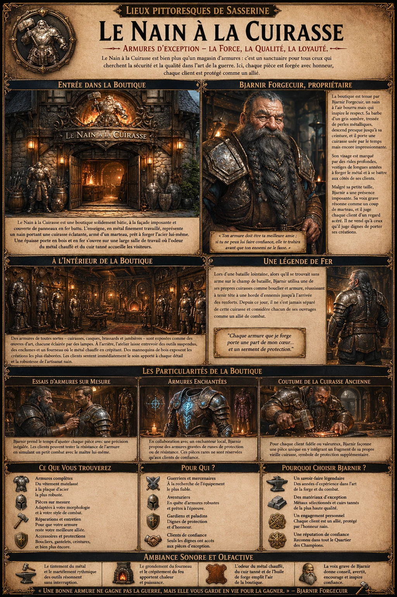
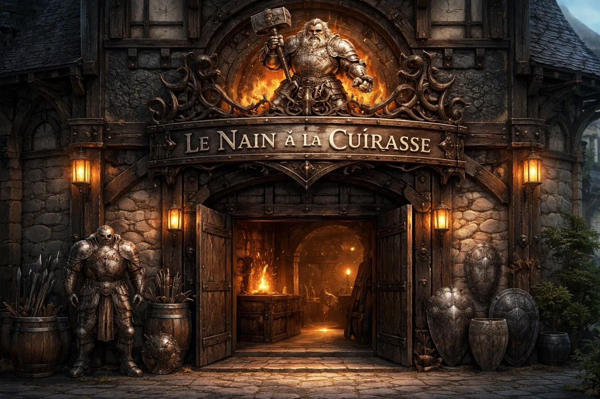
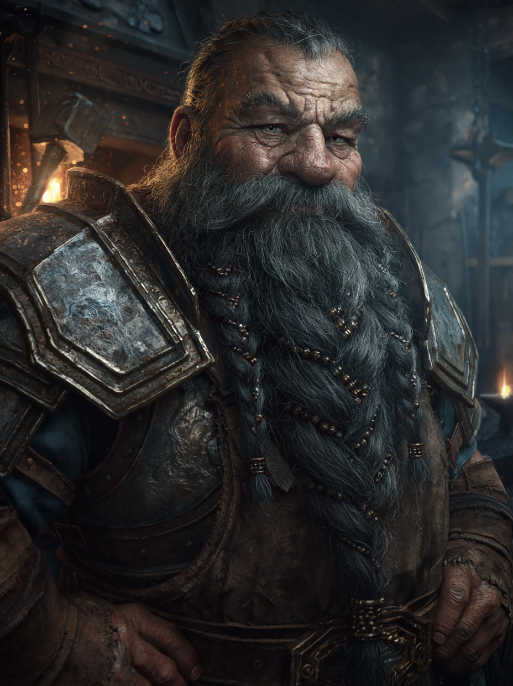

# Le Nain à la Cuirasse

{.center}

« Le Nain à la Cuirasse » est bien plus qu’un magasin d’armures ; c’est un sanctuaire pour tous ceux qui cherchent la sécurité et la qualité dans l’art de la guerre. Ici, les joueurs ressentiront non seulement la puissance des créations de Bjarnir, mais aussi son désir sincère de protéger ses clients. Bjarnir Forgecuir ne vend pas seulement des armures ; il forge des liens, des serments silencieux de loyauté entre lui et ceux qu’il équipe.

### Extérieur du Nain à la Cuirasse

{.center}

« Le Nain à la Cuirasse » est une boutique solidement bâtie, à la façade imposante et couverte de panneaux en fer battu. L’enseigne, en métal finement travaillé, représente un nain portant une cuirasse éclatante, armé d’un marteau en suspension comme prêt à forger l’acier lui-même. Une épaisse porte en bois et en fer s’ouvre sur une large salle de travail où l’odeur du métal chauffé et du cuir tanné accueille les visiteurs, leur faisant sentir qu’ici, la qualité prime.

### À l’intérieur

L’intérieur de la boutique est à la fois spacieux et encombré. Sur les murs, des armures de toutes sortes – cuirasses, casques, brassards et jambières – sont exposées comme des œuvres d’art, chacune éclairée par des lampes en cristal qui projettent une lueur dorée sur le métal poli. Des armures complètes, du plus simple vêtement matelassé aux plaques d’acier étincelantes, sont disposées en rangée, prêtes à protéger quiconque a les moyens de se les offrir. À l’arrière de la boutique, un atelier laisse entrevoir des outils suspendus, des enclumes et un fourneau où le métal chauffe en crépitant.

Des mannequins de bois exposent les créations les plus élaborées, certaines avec des motifs gravés ou des insignes personnalisés. Les clients peuvent immédiatement sentir le soin apporté à chaque détail et ressentir la robustesse et le poids de l’artisanat nain.

#### Le propriétaire

{.float-right .img-150}

La boutique est tenue par [Bjarnir Forgecuir](../pnj/bjarnir-forgecuir), un nain à l’air bourru mais qui inspire le respect. Sa barbe d’un gris sombre, tressée de petites perles métalliques, descend presque jusqu’à sa ceinture, et il porte lui-même une cuirasse usée par le temps mais encore impressionnante, comme pour rappeler son savoir-faire. Son visage est marqué par des rides profondes, vestiges de longues années passées à forger le métal et à se battre aux côtés des clients qui osaient douter de son art.

Malgré sa petite taille, Bjarnir a une présence imposante. Sa voix grave résonne comme un coup de marteau, et il scrute chaque client d’un regard acéré. On raconte qu’il peut évaluer les faiblesses d’une armure ou d’un homme d’un simple coup d’œil et qu’il refuse de vendre à quiconque qu’il juge indigne de porter ses créations.

### Une petite histoire autour de Bjarnir Forgecuir

Légendaire parmi les artisans, Bjarnir est devenu « le Nain à la Cuirasse » suite à une histoire célèbre dans la région. Lors d’une bataille lointaine, alors qu’il se trouvait sans arme sur le champ de bataille, il utilisa une de ses propres cuirasses comme bouclier et armure, réussissant à tenir tête à une horde d’ennemis jusqu’à l’arrivée des renforts. Depuis ce jour, il ne s’est jamais séparé de cette cuirasse et considère chacun de ses ouvrages comme un allié de combat. Il répète souvent aux jeunes aventuriers : « Ton armure doit être ta meilleure amie ; si tu ne peux lui faire confiance, elle te trahira avant que ton ennemi ne le fasse. »

### Particularités du Nain à la Cuirasse

- ***Essais d’armures sur mesure*** : Bjarnir Forgecuir est connu pour offrir à ses clients des essais d’armures sur mesure, prenant le temps d’ajuster chaque pièce avec une précision inégalée. Ceux qui acceptent sont souvent invités dans l’arrière-boutique, où ils peuvent tester la résistance de l’armure en simulant un petit combat avec le maître lui-même.

- ***Armures enchantées*** : Bien que rare, il propose quelques armures magiques, qu’il forge en collaboration avec un enchanteur local. Ces armures sont souvent gravées de runes de protection ou de résistance, et seuls les clients de confiance peuvent en commander une.

- ***Coutume de la Cuirasse Ancienne*** : Pour chaque client fidèle ou valeureux, Bjarnir propose la « Cuirasse Ancienne », un rituel où il façonne une pièce unique en y intégrant un fragment de sa propre vieille cuirasse, comme un symbole de protection supplémentaire.

### Ambiance sonore

Le tintement du métal, le grondement du fourneau, et le martèlement rythmique des outils résonnent en fond sonore, imprégnant le lieu d’un sentiment de force et de détermination. On entend également la voix grave de Bjarnir, qui parle avec passion de ses créations et qui, bien qu’austère, inspire confiance.