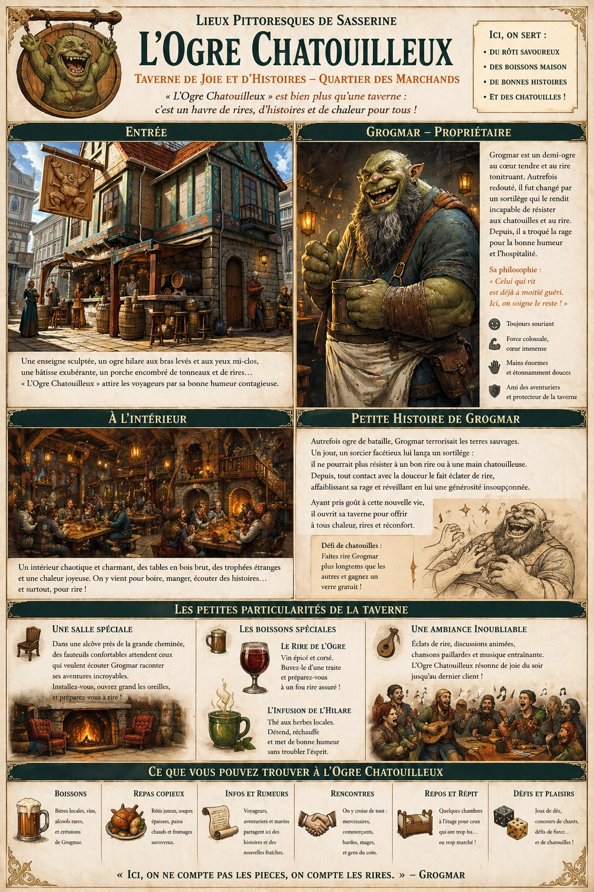
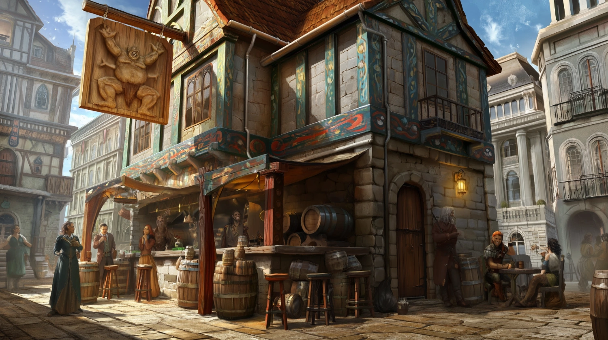
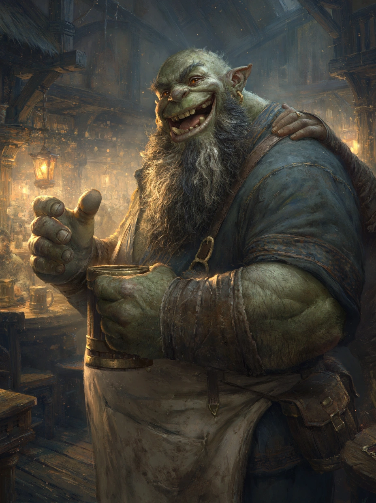

# L'Ogre Chatouilleux

{.center}

« L’Ogre Chatouilleux » est bien plus qu’une simple taverne ; c’est un havre de bonne humeur où chacun, qu’il soit aventurier, voyageur, ou villageois, trouve chaleur, histoires et rires. Les joueurs y sentiront dès les premiers instants qu’il s’agit d’un lieu unique, où même les âmes les plus sombres pourraient trouver un répit lumineux et où un demi-ogre au cœur tendre est prêt à partager son histoire, ou simplement son rire, avec tous ceux qui passent le pas de sa porte.

### Extérieur

{.center}

L’enseigne de « L’Ogre Chatouilleux » attire immanquablement l’attention des voyageurs. Sculptée dans un bois brut, elle représente un énorme ogre hilare, les bras levés et les yeux mi-clos, comme s’il était chatouillé par des mains invisibles. La bâtisse elle-même semble aussi exubérante que le nom : un bâtiment en pierre à un étage, rehaussé de poutres peintes de motifs colorés, avec un porche encombré de tonneaux et de tabourets où des habitués discutent et rient déjà.

### À l’intérieur

L’intérieur de la taverne est à la fois chaotique et charmant. De longues tables en bois brut occupent le centre de la salle, certaines légèrement bancales mais bien ancrées, prêtes à supporter le poids des chopes, des bras qui s’abattent dans les rires et des récits épiques qui vont s’y dérouler. Les murs sont tapissés de trophées étranges – des os, des boucliers cabossés, et même une vieille cape en lambeaux suspendue qui, selon la rumeur, aurait appartenu à un sorcier piqué par une fièvre de rire incontrôlable en entrant ici.

Des lampions en fer forgé diffusent une lumière tamisée, accentuant l’ambiance chaude et complice de l’endroit. L’air est empli de l’odeur du rôti, du pain frais et d’un parfum indéfinissable d’herbes, sans doute issu des potions que le propriétaire a toujours en réserve.

#### Le propriétaire

{.float-right .img-150}

La taverne est tenue par [Grogmar](../pnj/grogmar.md), le Géant Hilare, un demi-ogre au visage aussi jovial que l’enseigne de son établissement. Bien que sa stature imposante et ses bras musclés rappellent ses origines, Grogmar n’a rien d’un ogre effrayant. Au contraire, sa nature est presque comiquement chaleureuse : il sourit en permanence, et son rire tonitruant est réputé pour se faire entendre jusqu’à l’autre bout du village.

Grogmar a le teint vert pâle et des yeux d’un brun profond, pétillants de gentillesse et de malice. Son nez épaté et sa barbe hirsute, entrecoupée de quelques mèches grises, lui donnent un air farouche mais amical. Ce qui frappe surtout, ce sont ses mains énormes, capables de briser un tonneau d’une simple pression mais qui se font surprenamment délicates quand il sert un verre ou pose une main réconfortante sur l’épaule d’un client.

### Petite histoire autour de Grogmar

On raconte que Grogmar était autrefois un véritable ogre de bataille, redouté et respecté dans les terres sauvages. Mais un jour, il croisa la route d’un sorcier facétieux qui lui lança un sortilège étrange : il ne pourrait plus jamais résister à un bon rire ou à une main chatouilleuse. Depuis ce jour, tout contact avec la douceur le fait éclater d’un rire irrépressible, affaiblissant sa rage et réveillant chez lui une générosité insoupçonnée. Ayant pris goût à sa nouvelle existence paisible, il se retira des combats et ouvrit cette taverne où il offre aux autres le confort et la bonne humeur qu’il a lui-même trouvés.

### Les petites particularités de la taverne

- ***Une salle spéciale*** : Dans une alcôve, une grande cheminée diffuse une chaleur réconfortante, entourée de fauteuils rembourrés où les visiteurs peuvent s’installer pour écouter Grogmar raconter ses histoires. Il lui arrive de proposer aux aventuriers un défi de chatouilles – celui qui parvient à le faire rire le plus longtemps gagne un verre gratuit.

- ***Les boissons spéciales*** : Grogmar a mis au point plusieurs breuvages en lien avec son passé. Le « Rire de l’Ogre » est un vin épicé particulièrement corsé, censé apporter un fou rire à quiconque le boit d’une traite. Il offre aussi des boissons plus légères comme l’« Infusion de l’Hilare », un thé aromatisé aux herbes locales pour ceux qui préfèrent la sobriété mais veulent profiter de l’atmosphère festive.

### Ambiance sonore

Entre les éclats de rire de Grogmar et les discussions animées, l’ambiance sonore est particulièrement joyeuse. Un barde local vient souvent y jouer de la harpe ou du luth, et les habitués entonnent des chansons paillardes ou des ballades à la gloire de Grogmar, qui rit si fort qu’il en fait trembler les tables.