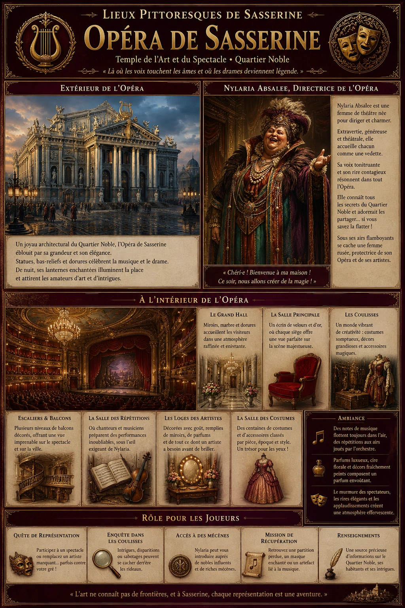
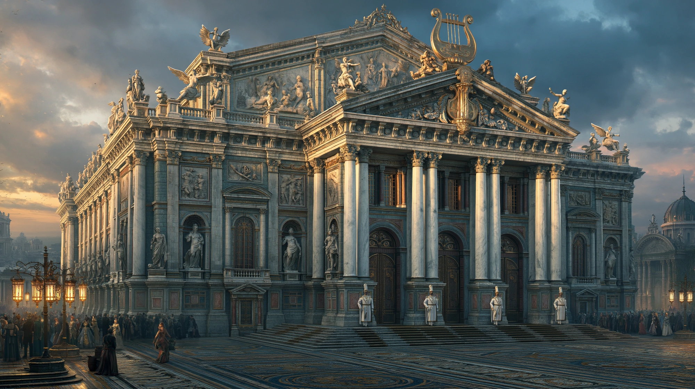
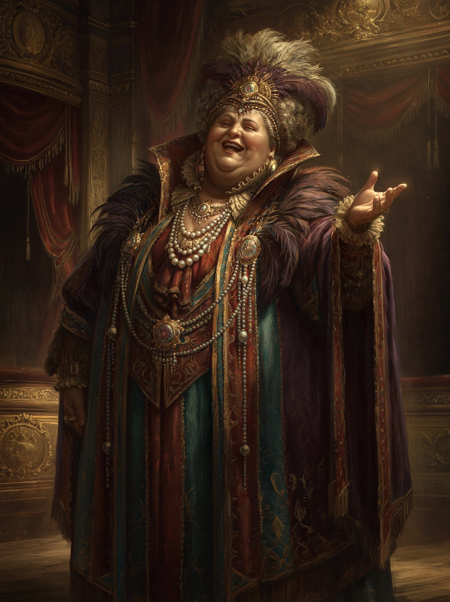

# Opéra de Sasserine

{.center}

L’Opéra de Sasserine est un lieu de drame, de beauté et d’excès, où la grandeur de l’art rencontre les intrigues du Quartier Noble. Les joueurs qui s’y aventurent découvriront un monde fascinant et haut en couleur, marqué par la présence inoubliable de Nylaria Absalee, qui pourrait bien faire de leur aventure une véritable scène théâtrale.

###  Extérieur de l’Opéra

{.center}

L’Opéra de Sasserine est un bâtiment somptueux, véritable joyau architectural du Quartier Noble. Ses façades sont ornées de statues d’artistes célèbres, de muses ailées, et de scènes gravées représentant des moments dramatiques de l’histoire de la ville. Les colonnes de marbre blanc soutiennent un fronton décoré d’une immense lyre en or qui scintille sous les rayons du soleil.

Des lanternes enchantées illuminent les alentours à la nuit tombée, baignant la place dans une lumière douce et chaleureuse. Une large esplanade pavée de mosaïques mène aux grandes portes d’entrée, toujours surveillées par des huissiers en uniforme impeccable.

### À l’intérieur

Une fois à l’intérieur, les visiteurs sont accueillis par un hall somptueux aux murs recouverts de miroirs encadrés de dorures. Le sol est fait de marbre poli, si lisse qu’il reflète les lustres de cristal suspendus au plafond. L’odeur subtile de cire, de fleurs fraîches et de parfums raffinés flotte dans l’air.

Un immense escalier en colimaçon conduit à plusieurs niveaux de balcons richement décorés, offrant une vue imprenable sur la scène. La salle principale de l’Opéra est une véritable œuvre d’art : des fresques célestes ornent le plafond, tandis que les rideaux rouges brodés d’or encadrent une scène massive. Chaque siège est recouvert de velours et équipé de coussins pour le confort des spectateurs les plus exigeants.

Les coulisses, bien que moins fastueuses, dégagent une énergie vibrante : costumes colorés, décors imposants, et accessoires magiques sont soigneusement organisés dans un chaos créatif.

#### Nylaria Absalee, la directrice de l'Opéra

{.float-right .img-150}

[Nylaria Absalee](../pnj/nyralia-absalee.md) est une femme d’une stature imposante, à la fois physiquement et dans sa personnalité. Sa silhouette généreuse est toujours mise en valeur par des robes extravagantes aux couleurs vives, souvent ornées de plumes, de perles, ou de bijoux étincelants. Elle porte des coiffures élaborées, qui défient souvent les lois de la gravité et de la mode. Nylaria a une voix tonitruante et un rire contagieux. Elle se comporte comme si chaque personne qu’elle rencontre était son plus vieil ami ou son invité d’honneur, un trait qui peut être charmant ou accablant selon l’humeur de son interlocuteur.

### Petite histoire

Nylaria est née dans une famille modeste de marchands d’épices, mais elle a toujours rêvé de grandeur. Elle a commencé sa carrière comme chanteuse d’opéra, mais son goût pour l’extravagance et son habitude de voler la vedette aux autres ont conduit à des tensions avec ses collègues. Après plusieurs scandales, elle a troqué la scène pour la direction, transformant l’Opéra de Sasserine en un lieu de spectacle aussi grandiose qu’elle-même. Elle prétend connaître personnellement toutes les personnalités influentes de la ville et ne manque jamais une occasion de rappeler ses “inestimables contributions” à la culture de Sasserine. Malgré son ego démesuré, elle est sincèrement passionnée par l’art et ne ménage aucun effort pour soutenir les artistes en herbe.

***Interactions avec Nylaria.*** Nylaria accueille les visiteurs avec une chaleur écrasante, les appelant par des surnoms affectueux dès leur arrivée, même si elle vient de les rencontrer. Elle adore bavarder, souvent plus pour entendre sa propre voix que pour écouter, mais elle est également une source d’informations sur les intrigues du Quartier Noble et les mécènes influents de la ville. Elle peut devenir une alliée précieuse, surtout si les joueurs flattent son ego ou s’impliquent dans les activités artistiques de l’Opéra.

### Rôle pour les joueurs

- ***Quête de représentation.*** Les joueurs pourraient être recrutés pour participer à un spectacle, qu’ils le veuillent ou non, pour remplacer un artiste disparu ou saboter une représentation rivale.

- ***Enquête dans les coulisses.*** Une disparition mystérieuse ou des intrigues politiques pourraient se cacher derrière les rideaux de l’Opéra.

- ***Accès à des mécènes.*** Nylaria peut introduire les joueurs à des nobles influents ou à des mécènes riches, mais toujours avec une condition attachée.

- ***Mission de récupération.*** Elle pourrait envoyer les joueurs à la recherche d’une partition perdue, d’un artefact magique lié à la musique, ou d’un ancien masque enchanté.

### Ambiance sonore et olfactive

Des notes de musique flottent toujours dans l’air, qu’il s’agisse de répétitions, de chants venant des coulisses, ou du murmure des spectateurs. L’odeur de parfums luxueux et de cires florales s’entremêle à celle des décors fraîchement peints.