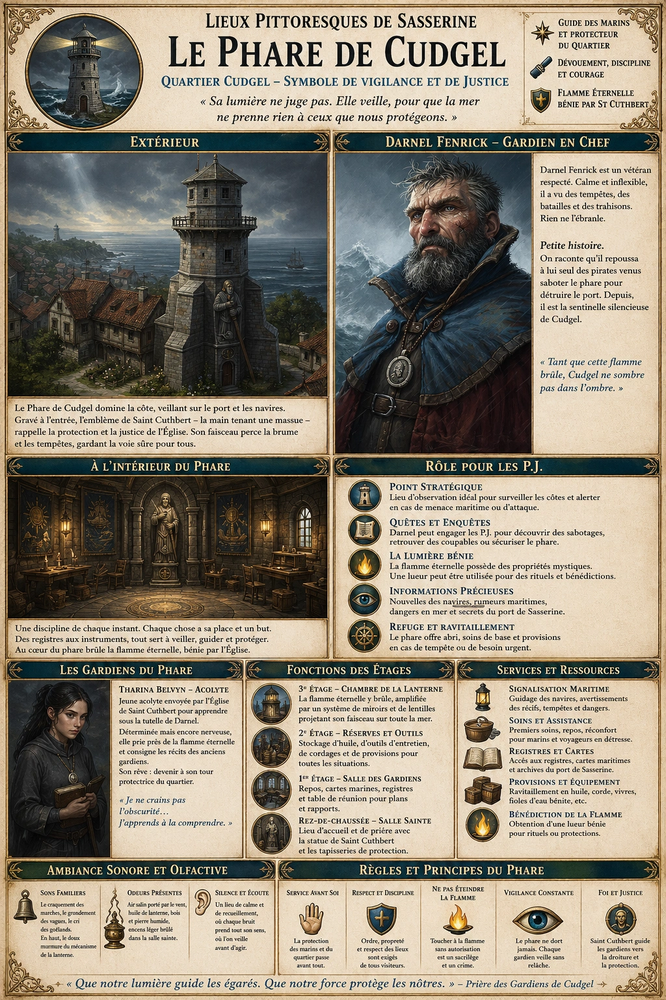
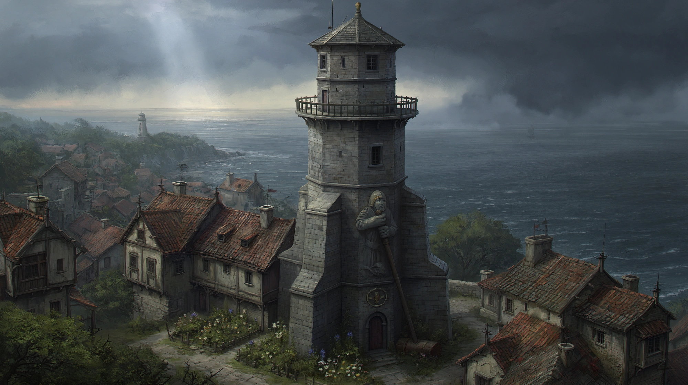
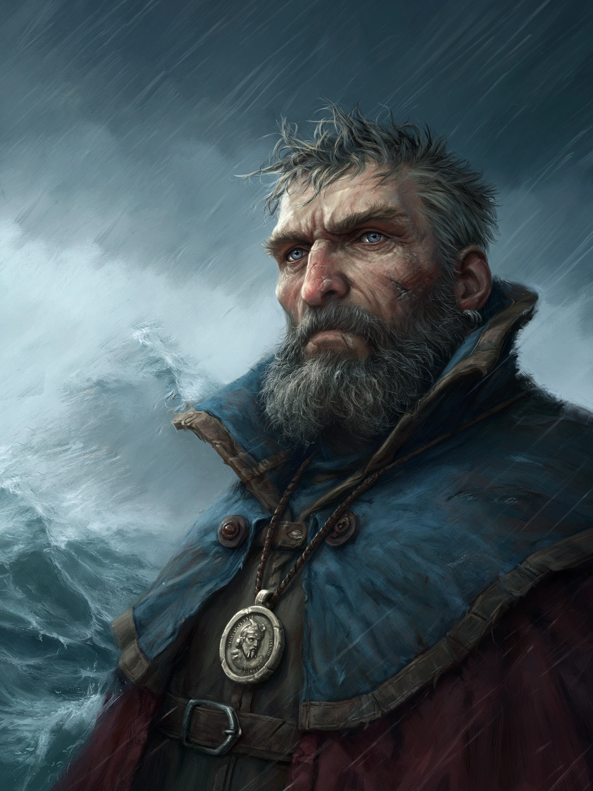

# Phare de Cudgel

{.center}

Le Phare de Cudgel est bien plus qu’un guide pour les marins : c’est un symbole de vigilance et de justice dans le Quartier Cudgel. Pour les joueurs, c’est un lieu de sérénité apparente, mais où des intrigues liées à la sécurité de la ville ou aux mystères marins pourraient émerger. Que ce soit pour chercher refuge, prêter main forte, ou percer des secrets, le phare promet d’être une étape mémorable de leurs aventures.

### Extérieur du phare

{.center}

Le Phare de Cudgel domine la côte du quartier résidentiel, son imposante silhouette de pierre grise veillant inlassablement sur la mer et la ville. Son architecture est austère mais robuste, avec des contreforts solides et une balustrade circulaire au sommet. Gravé à même la pierre au-dessus de l’entrée, l’emblème de Saint Cuthbert — une main tenant une massue — témoigne de l’influence de l’église dans le quartier. Autour du phare, un petit jardin de plantes médicinales et de fleurs simples, entretenu par les gardiens, adoucit l’austérité de l’endroit.

Par temps clair, la lumière du phare projette un éclat rassurant, visible à des kilomètres à la ronde. Lors des nuits orageuses ou brumeuses, son faisceau puissant fend les ténèbres pour guider les navires et avertir des dangers.

### À l’intérieur

En entrant dans le phare, les visiteurs sont accueillis par une grande salle circulaire où trône une statue de Saint Cuthbert. La pièce est éclairée par des lanternes suspendues et ornée de tapisseries représentant des scènes de protection et de justice, typiques de l’iconographie du culte.

Un escalier en colimaçon grimpe le long des murs jusqu’à la lanterne au sommet. Chaque étage possède une fonction précise :

***Premier étage.*** Une salle de repos pour les gardiens, meublée simplement mais proprement, avec des lits de camp et une grande table où des plans maritimes sont parfois consultés.

***Deuxième étage.*** Une pièce de stockage contenant de l’huile pour le mécanisme du phare, des outils, et des provisions d’urgence.

***Troisième étage.*** La chambre de la lanterne, où brûle une flamme éternelle bénie par l’église de Saint Cuthbert, amplifiée par un mécanisme ingénieux de miroirs et de lentilles.

L’intérieur du phare est marqué par une ambiance de discipline et de piété. Chaque objet, de la boussole murale aux registres maritimes soigneusement tenus, a sa place et son utilité.

#### Les gardiens du phare

Le phare est supervisé par deux personnages principaux, chacun jouant un rôle crucial dans sa gestion et sa défense.

{.float-right .img-150}

[Darnel Fenrick](../pnj/darnel-fenrick.md), le gardien en chef, est un vétéran de la garde locale. C’est un homme robuste, portant toujours une tenue pratique et un médaillon de Saint Cuthbert autour du cou. Sa démarche assurée et ses yeux perçants montrent qu’il a vu plus que sa part de batailles. Darnel est réputé pour son calme inébranlable même lors des tempêtes les plus féroces. Selon les rumeurs, il aurait autrefois repoussé seul un groupe de pirates tentant de saboter le phare pour attaquer le port de Sasserine. Depuis, il est une figure respectée dans le quartier.

[Tharina Belvyn](../pnj/tharina-belvyn.md), une jeune acolyte de l’église de Saint Cuthbert, a été envoyée au phare pour apprendre sous la tutelle de Darnel. Mince et nerveuse, avec de longs cheveux noirs souvent tirés en arrière, elle compense son manque d’expérience par une détermination farouche. Tharina consacre ses heures libres à prier près de la flamme éternelle ou à recopier des récits historiques sur les actes héroïques des gardiens précédents. Elle espère un jour être reconnue comme une protectrice du quartier, à l’image de Darnel. Cependant, elle lutte parfois contre ses propres peurs, particulièrement celles des dangers maritimes qu’elle n’a jamais affrontés.

### Petite histoire des gardiens

Darnel a pris Tharina sous son aile, voyant en elle une volonté qui lui rappelle sa propre jeunesse. Bien qu’il se montre parfois bourru et exigeant, il veille sur elle avec la même vigilance qu’il porte au phare. Tharina, de son côté, s’efforce de lui prouver qu’elle est digne de ses enseignements. Lorsqu’un navire marchand s’est échoué près des récifs récemment, c’est elle qui a bravé la tempête pour allumer des feux supplémentaires le long de la côte, sauvant ainsi plusieurs vies. Cet acte a commencé à changer la perception des habitants du quartier à son égard.

### Rôle du phare pour les joueurs

- ***Point stratégique.*** Le phare peut servir de lieu d’observation ou d’alerte pour surveiller les côtes et prévenir d’éventuelles attaques.

- ***Quête locale.*** Les joueurs pourraient être engagés par Darnel pour enquêter sur des sabotages suspects ou pour protéger le phare contre une menace imminente.

- ***Lumière bénie.*** La flamme éternelle peut avoir des propriétés mystiques, et les joueurs pourraient être envoyés pour récupérer une lueur de cette lumière pour un rituel ou une bénédiction.

- ***Lieu d’informations.*** Darnel et Tharina, grâce à leur rôle, ont souvent des nouvelles sur les mouvements des navires ou des rumeurs concernant la mer, utiles aux aventuriers.

### Ambiance sonore et olfactive

Le phare est empli de sons familiers : le craquement des marches en bois, le grondement lointain des vagues, et parfois le cri des goélands. Lorsqu’on atteint le sommet, on entend le bruit feutré du mécanisme tournant lentement. L’odeur de l’air salin et de l’huile de lanterne est omniprésente, mêlée à l’encens léger brûlé dans la salle de la flamme.