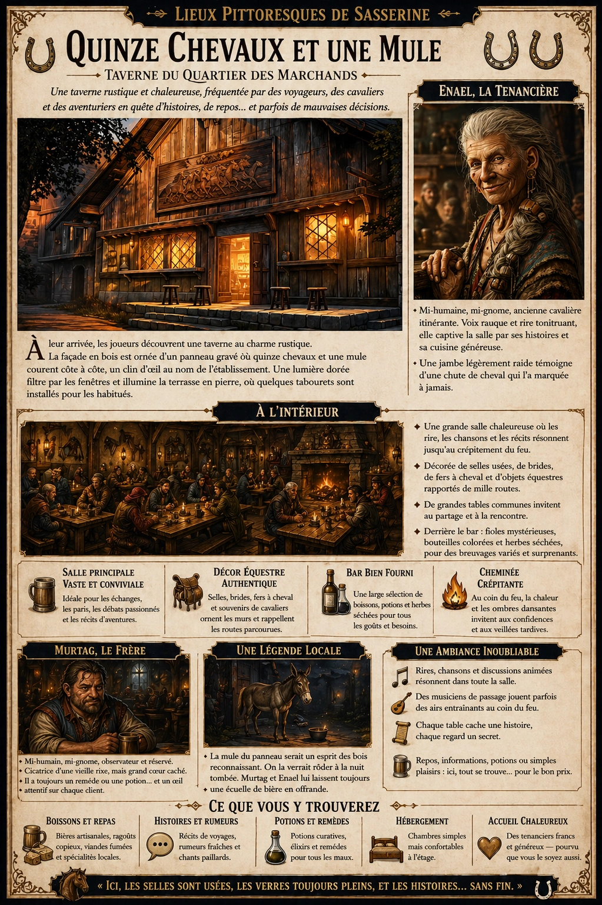
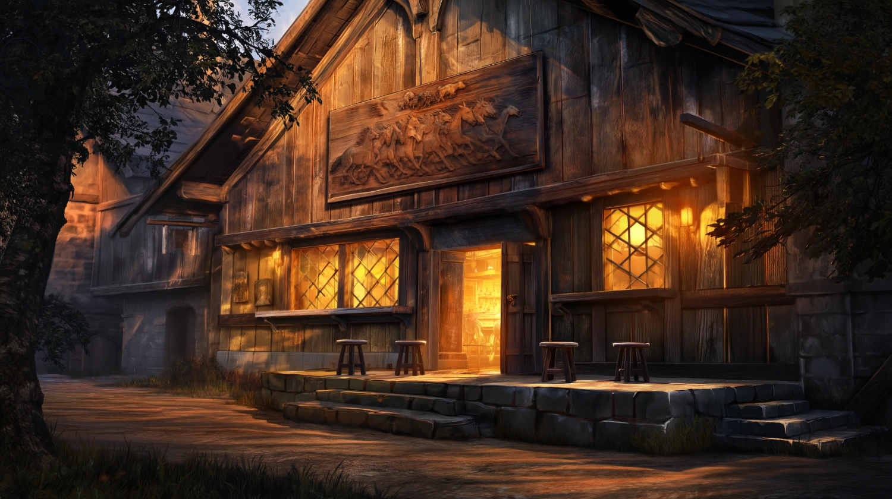
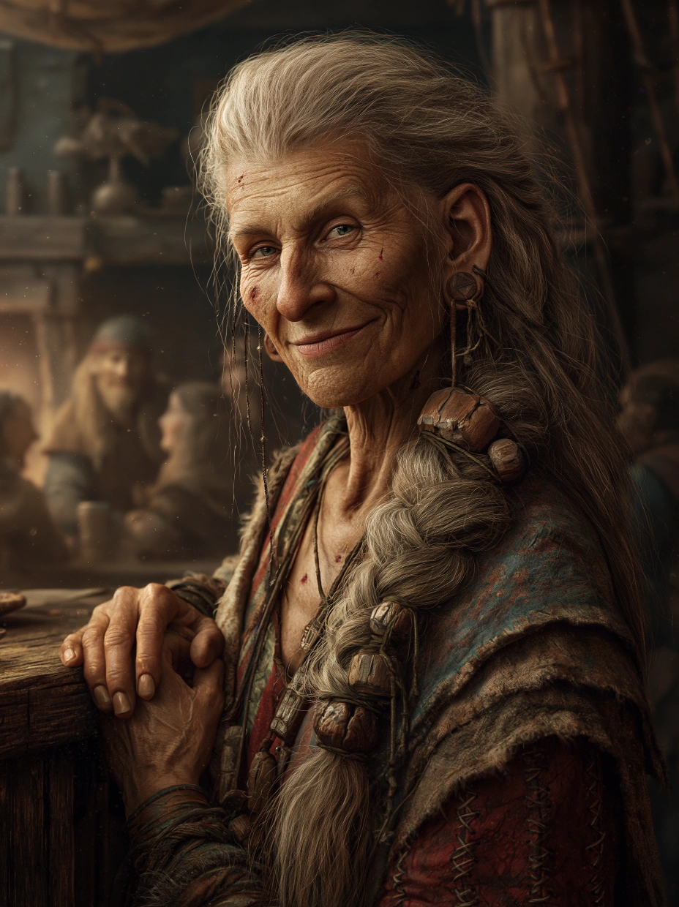

# Quinze Chevaux et une Mule

{.center}

Une taverne rustique et chaleureuse, fréquentée par des voyageurs, des cavaliers et des aventuriers en quête d'histoires, de repos... et parfois de mauvaises décisions.

### À l'extérieur

{.center}

À leur arrivée, les joueurs découvrent une taverne au charme rustique. La façade en bois est ornée d’un panneau gravé où quinze chevaux et une mule courent côte à côte, un clin d’œil au nom de l’établissement. Une lumière dorée filtre par les fenêtres et illumine la terrasse en pierre, où quelques tabourets sont installés pour les habitués.

### À l’intérieur

L’intérieur de la taverne est vaste et chaleureux, avec une grande salle principale qui dégage une atmosphère vibrante et vivante. Les murs sont décorés de vieilles brides de chevaux, de selles usées et de fers à cheval, renforçant le thème équestre du lieu.

De grandes tables communes sont disposées de manière à encourager les conversations entre voyageurs. Le bois des tables et du sol est un peu éraflé mais bien entretenu, chaque marque racontant une histoire d’ivresse ou de danse endiablée.

Dans un coin, une imposante cheminée trône, son feu crépitant projetant des ombres dansantes sur les visages des clients. Sur les étagères derrière le bar s’alignent des bouteilles colorées, des fioles mystérieuses et quelques herbes séchées suspendues, témoignant de la diversité des breuvages proposés ici.

#### Les tenanciers

La taverne est gérée par un couple singulier : **Enael** et **Murtag**, un frère et une sœur d’un âge mûr, d’origine mi-humaine, mi-gnome. Leur petite taille leur permet d’évoluer avec agilité derrière le bar, bien qu’ils compensent leur stature par des personnalités particulièrement marquantes.

{.float-right .img-150}

[Enael](../pnj/enael.md), la sœur aînée, a un air imposant malgré sa petite taille. Elle est d’une beauté singulière, avec de longs cheveux grisonnants noués en une tresse épaisse, ornée de perles de bois sculpté. Sa peau est hâlée et parsemée de petites cicatrices qu’elle porte comme des trophées. Elle a autrefois été cavalière dans une caravane itinérante, et une jambe légèrement raide rappelle une ancienne chute spectaculaire. Sa voix rauque et son rire tonitruant résonnent dans la salle, attirant les regards. Elle est connue pour sa main légère en cuisine et pour son talent de conteuse, captivant souvent les clients avec ses récits de voyages et d’aventures.

[Murtag](../pnj/murtag.md), quant à lui, est un homme robuste à la silhouette trapue, avec des yeux pétillants de malice et un sourire qui semble cacher des secrets. Son visage est marqué d’une cicatrice nette qui court de son sourcil jusqu’au coin de sa mâchoire, souvenir d’une rixe de jeunesse. Murtag est plus réservé que sa sœur, mais il observe chaque client d’un regard perçant, semblant lire en eux. On dit que, malgré son air bourru, il a un faible pour les âmes en peine et qu’il est toujours prêt à glisser une potion curative à un aventurier blessé en échange d’une histoire fascinante.

### Une petite légende autour de Murtag et Enael

Les habitués chuchotent qu’un mystérieux lien les unit aux chevaux. La taverne aurait été construite sur l’emplacement d’une ancienne étable où les cavaliers du roi autrefois abritaient leurs montures. Enael affirme même que la mule qui orne le panneau de la taverne leur a été donnée par un esprit des bois reconnaissant, et elle jure l’avoir vue vivante, rôdant près de la taverne à la tombée de la nuit. Murtag, bien que moins superstitieux, reste fidèle à cette histoire et ne manque jamais de poser une écuelle de bière à l’entrée, comme une offrande à cette “mule fantôme”.

### Atmosphère générale

Les conversations et les rires résonnent dans cette taverne où chaque table est une porte vers de nouvelles histoires et où les regards des voyageurs curieux croisent parfois ceux d’habitants au passé tout aussi mystérieux. Que les joueurs y viennent pour un moment de repos ou en quête d’information, la taverne « Quinze chevaux et une Mule » les accueille avec chaleur, et peut-être, quelques secrets à découvrir.