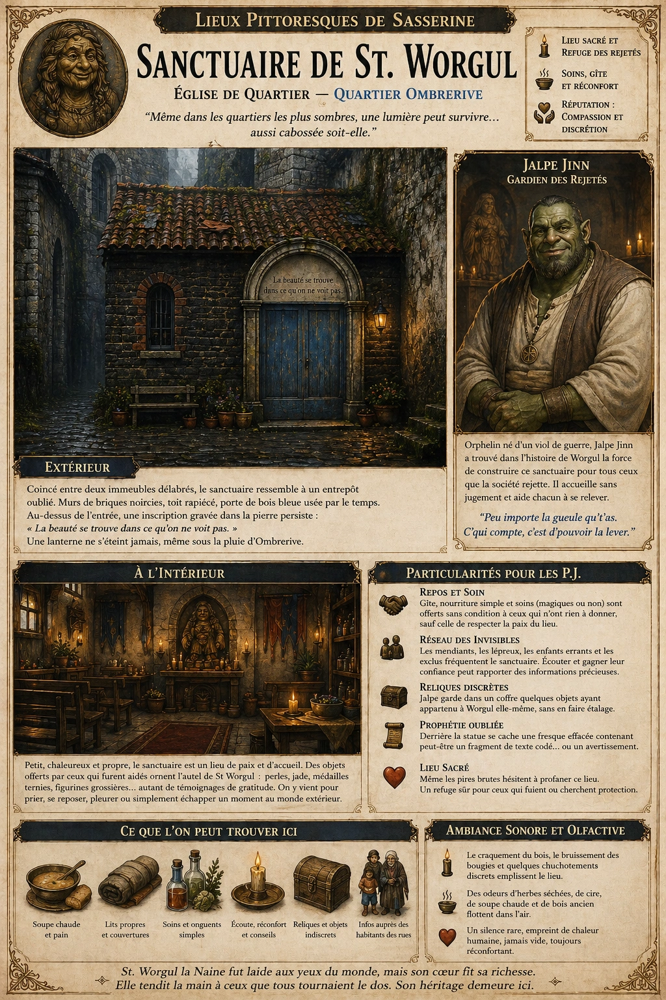
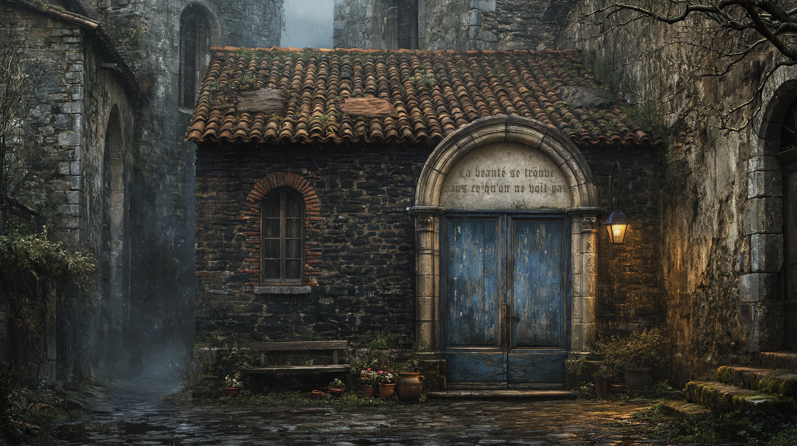
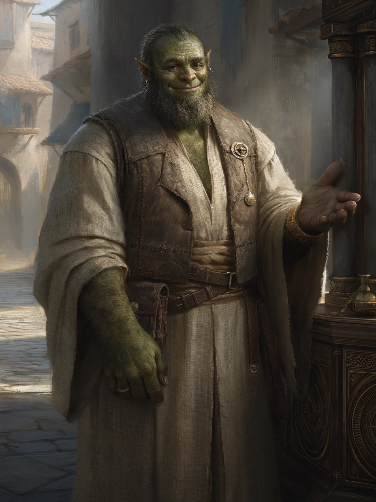

# Sanctuaire de St. Worgul

{.center}

Modeste mais lumineux, le Sanctuaire de St Worgul est un îlot de dignité dans le cloaque d’Ombrerive. Dédié à une figure historique oubliée mais inspirante — la naine Worgul, marchande légendaire à l’apparence monstrueuse mais au cœur d’or et à l’esprit tranchant — le sanctuaire attire les pauvres, les difformes, les marginaux, et tous ceux que la ville méprise. Les joueurs y trouveront un havre de paix inattendu, un gardien au sourire franc, et peut-être des révélations venues d’en bas.

### Extérieur

{.center}

*“Même dans les quartiers les plus sombres, une lumière peut survivre… aussi cabossée soit-elle.”*

À première vue, le Sanctuaire de St Worgul pourrait passer pour un entrepôt abandonné. Coincé entre deux immeubles de pierre effritée, il n’a rien de majestueux : murs de briques noircies, toit en tuiles rapiécées, et une lourde porte de bois dont la peinture bleue s’écaille. Mais au-dessus de cette porte, gravée dans un simple arc de pierre, une inscription presque effacée persiste :« La beauté se trouve dans ce qu’on ne voit pas. »

Autour, quelques pots de fleurs (souvent volées, parfois rendues), un banc réparé au fil de cuivre, et une lanterne qui ne s’éteint jamais, même sous la pluie d’Ombrerive.

### Intérieur

L’intérieur est petit, chaleureux et étonnamment propre pour le quartier. Des bancs de récupération ont été poncés à la main. Un autel de pierre trône au fond, décoré de petits objets offerts : morceaux de jade, perles abîmées, figurines grossières, ou médailles ternies — tous laissés par ceux que St Worgul a aidés, d’une façon ou d’une autre.

Une statue de Worgul la Naine, sculptée dans un bois sombre, domine la salle. Elle est laide, indéniablement : visage cabossé, dents saillantes, dos voûté… mais elle sourit. Et ce sourire semble sincère. L’expression est si humaine, si tendre, que même les durs d’Ombrerive s’y arrêtent un instant.

Le sanctuaire ne résonne pas de chants pieux ni de sermons, mais de silences confortables, de rires discrets, de marmonnements fatigués. On y entre pour se reposer, prier, pleurer, ou juste échapper au reste du monde.

#### Jalpe Jinn, le Gardien des Rejetés

{.float-right .img-150}

[Jalpe Jinn](../pnj/jalpe-jinn.md), demi-orc à la carrure impressionnante, détonne dans le rôle de prêtre. Vêtu d’une simple robe de lin et d’un gilet en cuir râpé, il porte un sourire sincère et des yeux fatigués. Il a le verbe simple, la main large, et l’accolade généreuse. Dans Ombrerive, rares sont ceux qui peuvent se vanter de n’avoir que des amis — lui en fait presque partie.

### Petite histoire

Orphelin né d’un viol de guerre, élevé par des mendiants et battu par tous les cultes qu’il a tentés de rejoindre, Jalpe a découvert la figure de Worgul dans un vieux livre de commerce. Fasciné par cette naine hideuse devenue l’une des femmes les plus prospères de l’histoire de Sasserine, il a restauré une ruine avec ses propres mains pour lui dédier un sanctuaire. Il prêche une forme douce de résilience : *“Peu importe la gueule qu’t’as. C’qui compte, c’est d’pouvoir la lever.”* Il accueille les difformes, les estropiés, les malades, les vieillards. Et parfois, quand l’un d’eux meurt, il creuse la tombe lui-même, dans un petit jardin caché derrière le sanctuaire.

### Rôle pour les joueurs

- ***Repos et soin.*** Le sanctuaire offre gîte, nourriture simple, et soins (magiques ou non) à ceux qui n’ont rien à donner en échange. Jalpe le fait sans condition… sauf celle de ne pas trahir la paix du lieu.

- ***Réseau des Invisibles.*** Les mendiants, les lépreux, les enfants errants : tous viennent ici. Les PJ peuvent obtenir des informations introuvables ailleurs en prenant le temps d’écouter.

- ***Reliques discrètes.*** Jalpe garde, dans un coffre, quelques objets ayant appartenu à Worgul elle-même — insignifiants pour certains, précieux pour d’autres.

- ***Prophétie oubliée.*** Une fresque effacée derrière la statue contiendrait un fragment de texte codé, peut-être une vieille prédiction… ou un avertissement.

- ***Lieu sacré.*** Les ennemis d’Ombrerive, même les plus brutaux, hésitent à lever la main sur ce lieu. Un PJ en fuite pourrait y trouver un répit inespéré.

### Ambiance sonore et olfactive

À l’intérieur, le bruit d’Ombrerive semble lointain. On entend le craquement du bois, le bruissement des bougies, le cliquetis d’une marmite sur le feu. Une douce odeur d’herbes sèches, de cire et de soupe flotte dans l’air. Parfois, un rire, une toux, un “merci” murmuré. Un silence rare, mais jamais vide.