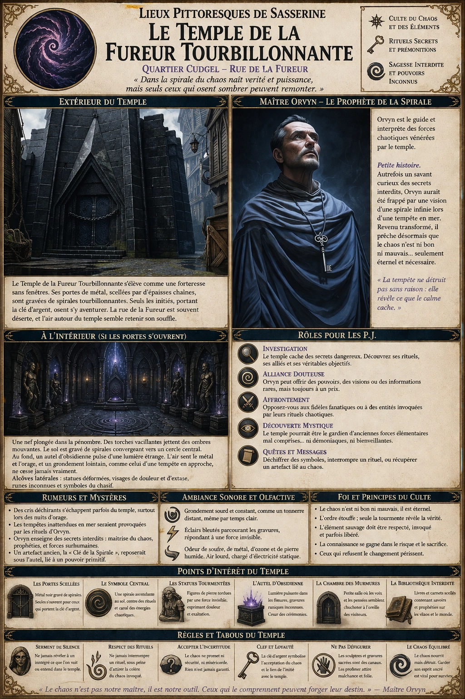
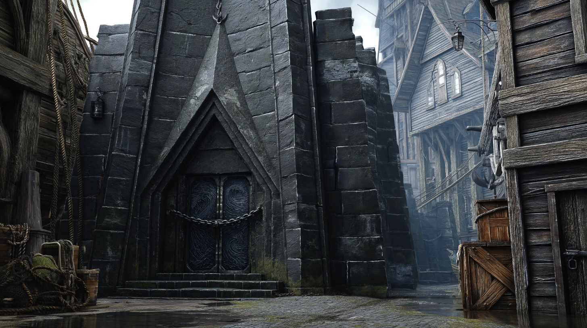
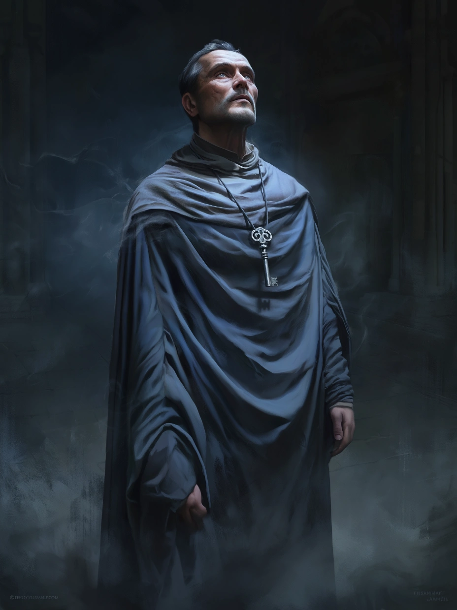

# Temple de la Fureur Tourbillonnante

{.center}

Le Temple de la Fureur Tourbillonnante est un lieu empreint de mystère et d’ambiguïté, offrant aux joueurs une expérience intrigante où la perception du bien et du mal est mise à l’épreuve. Que ce soit pour résoudre une énigme, affronter une menace ou embrasser le chaos, les joueurs trouveront dans ce temple un défi captivant et mémorable.

### Extérieur du temple

{.center}

Le Temple de la Fureur Tourbillonnante est une structure sinistre et oppressante, érigée en pierre noire usée par le temps. Son architecture anguleuse et ses murs dénués de fenêtres évoquent davantage une forteresse qu’un lieu de culte. Les chaînes qui verrouillent les imposantes portes de métal, ornées de gravures tourbillonnantes rappelant des vortex ou des tempêtes, ne font qu’amplifier l’aura de mystère.

La rue de la Fureur est souvent déserte, sauf pour les rares silhouettes encapuchonnées qui s’approchent du temple, une clé d’argent brillant à leur cou. Ces visiteurs ne s’attardent pas et semblent éviter tout contact visuel. L’air autour du temple est anormalement calme, comme si même le vent hésitait à troubler ce lieu.

### À l’intérieur (si les joueurs trouvent un moyen d’entrer)

Une fois les chaînes brisées ou la serrure déverrouillée, les portes s’ouvrent dans un silence assourdissant, révélant une grande nef plongée dans la pénombre. Des torches accrochées aux murs diffusent une lumière vacillante, projetant des ombres mouvantes qui semblent danser d’elles-mêmes.

Le sol de pierre est gravé de motifs tourbillonnants, convergeant vers un cercle central orné d’un symbole énigmatique représentant une spirale ascendante. L’air est imprégné d’une odeur métallique et d’un étrange grondement lointain, semblable à celui d’une tempête en approche.

Le long des murs, des alcôves contiennent des statues de figures humanoïdes dont les traits semblent déformés par une force invisible, leurs visages exprimant à la fois la douleur et l’extase. Au fond de la salle, un autel massif en obsidienne est dressé, couvert de gravures complexes et de runes inconnues, éclairé par une lumière pulsante émanant de fissures dans la pierre elle-même.

{.float-right .img-150}

[Maître Orvyn](../pnj/maitre-orvyn.md) “le Prophète de la Spirale”. Le temple est dirigé par Orvyn, un homme au visage émacié et à la silhouette enveloppée dans une robe de teintes orageuses, oscillant entre le bleu sombre et le gris. Ses yeux semblent toujours fixés sur un point invisible, et sa voix douce mais insistante résonne comme un murmure de tempête. Orvyn porte au cou une clé d’argent, symbole de son autorité et de son rôle central dans les rituels du temple.

### Petite histoire d’Orvyn

Autrefois simple moine voyageur, Orvyn a été transformé après une nuit passée dans un désert balayé par une tempête surnaturelle. Lorsqu’il en est revenu, il portait les marques d’un éclair en spirale sur sa poitrine et prétendait avoir été choisi par une entité qu’il appelle la Fureur Tourbillonnante. Cette force, dit-il, n’est ni bonne ni mauvaise, mais une manifestation primordiale du chaos et de l’énergie brute.

Il a fondé le temple dans un quartier dominé par St. Cuthbert, non pour défier la foi locale, mais pour offrir une alternative à ceux qui ressentent l’appel du chaos ou qui cherchent à canaliser les énergies destructrices pour des fins personnelles. Orvyn est à la fois charismatique et inquiétant, capable de convaincre même les plus sceptiques que la Fureur Tourbillonnante est une force qui mérite respect et vénération.

### Rumeurs et mystères entourant le temple

- Certains affirment avoir entendu des cris déchirants s’échapper du temple par les portes scellées, bien que ces sons ne soient jamais confirmés.

- Des pêcheurs disent que les tempêtes inattendues qui frappent parfois la côte sont liées aux rituels du temple.

- On murmure qu’Orvyn enseigne des secrets interdits, comme la manière de canaliser le pouvoir du chaos pour obtenir une force surhumaine ou prédire des événements futurs.

### Rôle du temple pour les joueurs

- ***Investigation :*** Les joueurs pourraient être chargés d’enquêter sur les activités du temple pour le compte de la garde locale, de l’église de St. Cuthbert, ou simplement par curiosité.

- ***Alliance douteuse :*** Si les joueurs cherchent des pouvoirs inhabituels ou des informations sur le chaos, Orvyn pourrait leur offrir son aide… moyennant un prix.

- ***Affrontement :*** Si les joueurs s’opposent à l’idéologie d’Orvyn, le temple pourrait devenir une scène de bataille contre ses fidèles ou une entité invoquée par ses rituels.

- ***Découverte mystique :*** En explorant le temple, les joueurs pourraient apprendre qu’il ne s’agit pas d’un lieu démoniaque, mais d’un sanctuaire dédié à des forces élémentaires incomprises, brouillant la ligne entre allié et ennemi.

### Ambiance sonore et olfactive

Le grondement sourd d’un tonnerre distant semble omniprésent dans le temple, même par temps clair. Par moments, des éclairs bleutés illuminent les gravures, comme si elles répondaient à une force invisible. L’air est lourd, chargé d’électricité statique, et porte une odeur de soufre mêlée à celle de la pierre humide.