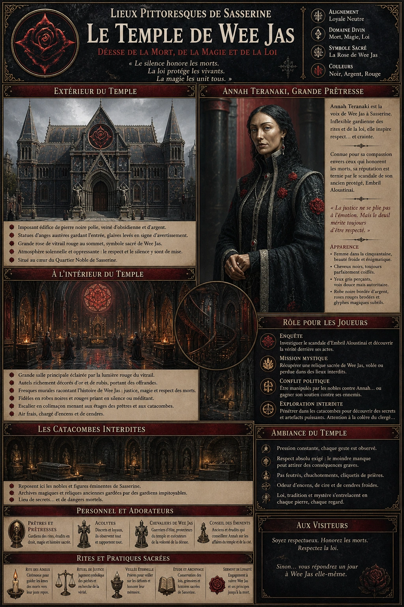
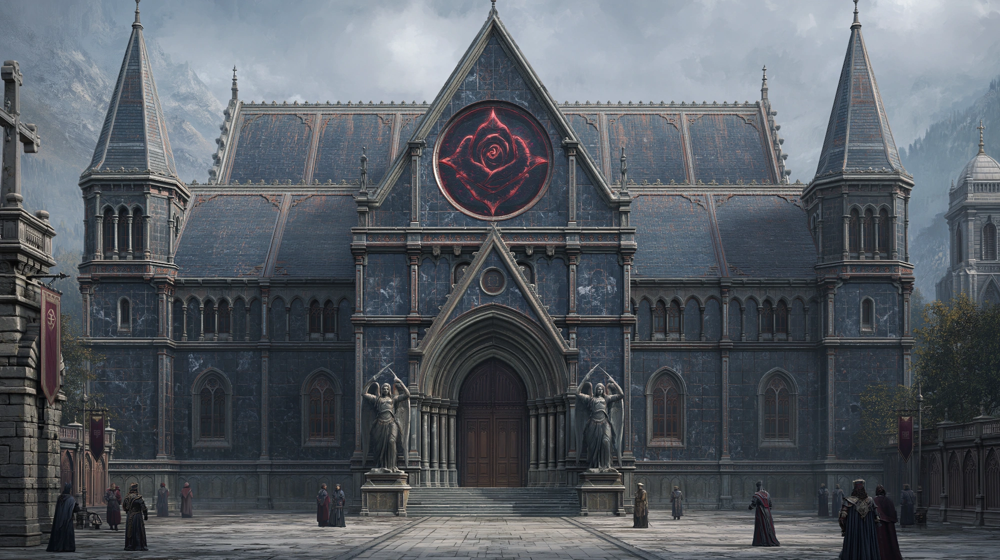
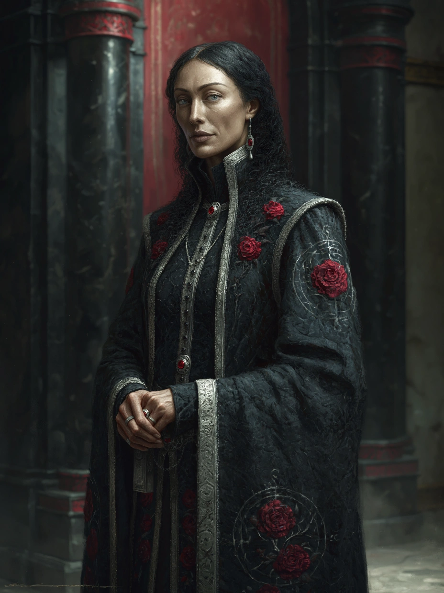

# Temple de Wee-Jas

{.center}

Le Temple de Wee Jas est un lieu où s’entrelacent respect pour les traditions, politique et mystère. Les joueurs y trouveront un espace de réflexion et de rites, mais aussi un terrain fertile pour les intrigues et les révélations qui pourraient changer le cours de leur aventure.

### Extérieur du temple

{.center}

Le Temple de Wee Jas, majestueux et imposant, domine le Quartier Noble avec sa silhouette austère mais élégante. Ses murs sont en pierre noire polie, incrustés de veines d’obsidienne et d’argent qui scintillent à la lumière du soleil. Une série de statues d’anges austères, à la beauté intimidante, garde l’entrée, portant des glaives levés comme pour avertir les visiteurs. Au sommet de l’édifice trône une grande rose stylisée en vitrail rouge, symbole de Wee Jas, la déesse de la mort, de la magie et de la loi. Un calme presque oppressant règne autour du temple, et même les nobles du quartier abaissent instinctivement la voix en passant devant.

### À l’intérieur

En entrant, les joueurs découvrent une salle principale sombre et solennelle, éclairée par une lumière rougeâtre filtrée à travers le grand vitrail. L’air y est frais et empli d’un mélange d’encens et de cendres. Le sol, en marbre noir brillant, reflète les flammes vacillantes des nombreux braseros disposés le long des murs. Des autels richement décorés d’or et de rubis sont dédiés à Wee Jas, chacun portant des offrandes soigneusement arrangées. Le long des murs, des fresques racontent l’histoire de la déesse, montrant des scènes de justice implacable, de magie et de respect des morts. Les fidèles présents, vêtus de robes noires et rouges, prient en silence ou méditent devant les autels. Un escalier en colimaçon mène à des niveaux supérieurs et inférieurs du temple. Les étages supérieurs abritent les quartiers des prêtres, tandis que les catacombes souterraines, interdites au public, contiennent les restes des nobles et des figures éminentes de Sasserine, ainsi que des archives magiques et des reliques.

#### Annah Teranaki, Grande Prêtresse de Wee Jas

{.float-right .img-150}

[Annah Teranaki](../pnj/annah-teranaki.md) est une femme dans la cinquantaine, d’une beauté froide et énigmatique. Sa chevelure d’un noir profond est toujours coiffée avec une précision presque mécanique, et ses yeux gris perçants semblent capables de sonder l’âme de ceux qu’elle regarde. Elle porte une robe noire bordée d’argent, agrémentée de broderies en forme de roses rouges et de glyphes magiques subtils. D’une voix douce mais autoritaire, Annah inspire à la fois respect et crainte. Elle est connue pour son respect strict des rites et de la loi, mais aussi pour sa compassion envers ceux qui cherchent à honorer les morts. Cependant, sa réputation a été entachée par le récent scandale impliquant son protégé Embril Aloustinai, accusé d’actes répréhensibles dans la ville voisine de Chaudron. Bien qu’Annah ait publiquement pris ses distances avec Embril, certains murmurent qu’elle aurait fermé les yeux sur ses agissements pendant trop longtemps.

### Petite histoire

Annah est originaire d’une famille noble déchue. Enfant, elle fut témoin de l’exécution publique de son père, accusé de trahison. Cet événement marqua le début de son dévouement envers Wee Jas, qu’elle perçoit comme une protectrice de la mémoire et une garante de la justice. Elle a consacré sa vie à restaurer la réputation de sa famille à travers le service de la déesse, mais le scandale d’Embril a réveillé de vieilles rancunes parmi les autres nobles, certains voyant dans cet événement une opportunité de la discréditer définitivement.

### Rôle pour les joueurs

- ***Enquête.*** Les joueurs pourraient être engagés pour enquêter sur le scandale d’Embril, cherchant à découvrir s’il a agi seul ou s’il était soutenu par des membres du clergé.

- ***Mission mystique.*** Annah pourrait demander aux joueurs de récupérer une relique volée appartenant à Wee Jas, conservée dans les catacombes d’un temple rival ou perdue dans un ancien tombeau.

- ***Conflit politique.*** Les nobles pourraient essayer d’utiliser les joueurs pour discréditer Annah, ou au contraire, elle-même pourrait chercher à gagner leur soutien pour déjouer un complot contre elle.

- ***Exploration interdite.*** Les catacombes du temple regorgent de secrets et d’artefacts magiques. Les joueurs pourraient être tentés d’y pénétrer pour y trouver des réponses ou des trésors, risquant la colère du clergé (ou pire).

### Ambiance

Le temple est un lieu de gravité et de mystère. Les visiteurs ressentent une pression subtile mais constante, comme si chaque murmure ou geste déplacé pouvait attirer l’attention de quelque chose de plus grand qu’eux. Les acolytes, bien que discrets et respectueux, observent avec vigilance, et les bruits de pas résonnent de manière presque fantomatique dans les couloirs.