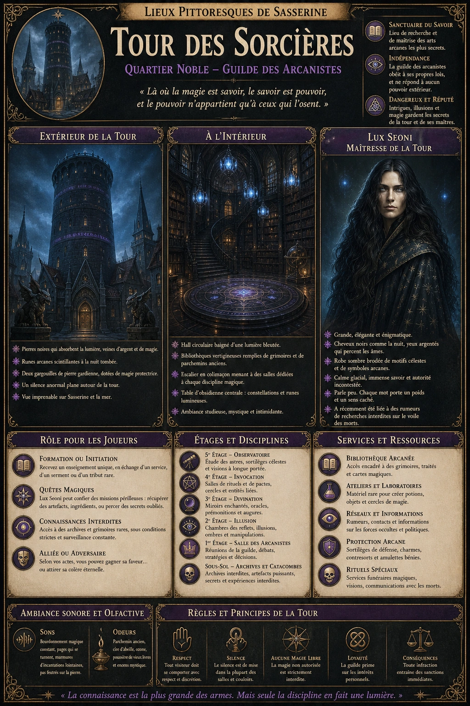
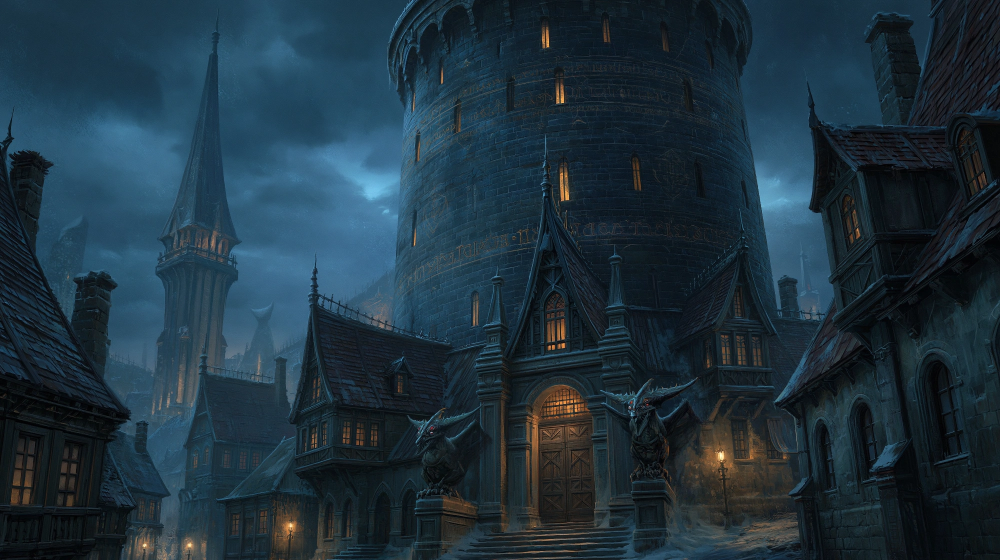

# Tour des Sorcières

{.center}

La Tour des Sorcières est un lieu où règnent la magie et le mystère, un sanctuaire pour les arcanistes et un défi pour les audacieux. Les joueurs qui s’y aventurent doivent être prêts à affronter l’intimidante Lux Seoni, à explorer des connaissances interdites, ou à s’engager dans des quêtes périlleuses pour mériter les trésors cachés de ce lieu énigmatique.

### Extérieur de la tour

{.center}

La Tour des Sorcières est un édifice imposant et sombre, dont les pierres noires semblent absorber la lumière du soleil. Haute et élancée, la tour domine les environs du Quartier Noble, offrant une vue imprenable sur la ville et la mer. Des runes énigmatiques scintillent faiblement sur ses murs à la tombée de la nuit, rappelant à tous que ce lieu est imprégné de magie.

Les visiteurs remarquent souvent un étrange silence autour de la tour : pas d’oiseaux qui chantent, pas de vent qui murmure, comme si l’air lui-même retenait son souffle en présence de cet endroit. Deux statues de gargouilles sinistres, aux yeux incrustés de gemmes, gardent l’entrée principale. On raconte qu’elles s’animent pour repousser les intrus.

### À l’intérieur

Passé l’imposante porte en fer, gravée de motifs arcanes complexes, les visiteurs pénètrent dans un hall circulaire baigné d’une lumière bleutée. Des bibliothèques s’élèvent jusqu’au plafond, remplies de grimoires anciens et de parchemins poussiéreux. Des chandeliers flottants illuminent la pièce, projetant des ombres mouvantes qui semblent danser d’elles-mêmes.

Un escalier en colimaçon, forgé dans du métal noir, serpente le long des murs, menant aux étages supérieurs. Chaque palier est une salle dédiée à une branche spécifique de la magie : invocation, divination, illusion, et autres disciplines ésotériques.

Au centre de la pièce principale se trouve une immense table circulaire en obsidienne, incrustée de constellations et de runes lumineuses. C’est ici que les membres de la guilde se réunissent pour débattre, étudier, ou organiser leurs affaires.

#### Lux Seoni, maîtresse de la Tour

{.float-right .img-150}

[Lux Seoni](../pnj/lux-seoni.md) est une femme d’une beauté froide et inquiétante. Grande, mince, et toujours vêtue de robes sombres ornées de motifs étoilés, elle dégage une aura d’autorité et de mystère. Ses cheveux noirs flottent parfois comme s’ils étaient portés par un vent invisible, et ses yeux argentés semblent capables de scruter l’âme de quiconque ose croiser son regard. Lux est connue pour son calme glacial et son immense savoir. Cependant, sa présence suffit à mettre mal à l’aise la plupart des gens, même les autres membres de la guilde. Elle parle peu, mais chaque mot qu’elle prononce semble chargé de puissance et de signification.

***Interactions avec Lux Seoni.*** Lux ne rencontre que rarement les visiteurs, sauf si leur demande présente un intérêt particulier pour la guilde ou pour elle-même. Lorsqu’elle accepte une audience, c’est dans une salle d’audience circulaire, entourée de miroirs enchantés qui reflètent des images du passé ou des visions de l’avenir. Elle parle avec une voix basse et mesurée, posant souvent plus de questions qu’elle ne donne de réponses. Ceux qui osent lui manquer de respect ressentent un froid surnaturel envahir la pièce, signe qu’ils sont en danger.

### Petite histoire

Lux est entourée de légendes. On raconte qu’elle a autrefois défendu Sasserine contre une force mystérieuse en invoquant une tempête magique qui a détruit une flotte ennemie, mais au prix de la destruction de son propre corps physique. Selon cette histoire, la Lux que l’on voit aujourd’hui ne serait qu’une projection, son véritable corps étant dissimulé quelque part dans la tour. D’autres murmures prétendent qu’elle est liée à un ancien ordre de mages qui contrôlait autrefois la magie de la région, et que sa longévité est le résultat d’un pacte avec une entité interdite.

### Rôle pour les joueurs

- ***Formation ou initiation.*** Les joueurs intéressés par la magie peuvent recevoir un entraînement spécifique, mais Lux exige un paiement sous forme de service ou d’objet rare.

- ***Quêtes magiques.*** Elle pourrait envoyer les joueurs chercher des ingrédients exotiques, explorer des ruines anciennes, ou récupérer des artefacts puissants.

- ***Accès à des connaissances.*** La Tour contient des archives inestimables sur la magie et l’histoire, mais l’accès à ces documents est strictement contrôlé.

- ***Alliée ou adversaire.*** Selon leurs actions, Lux peut devenir une alliée précieuse ou une ennemie redoutable.

### Ambiance sonore et olfactive

Un léger bourdonnement magique emplit l’air, comme une vibration subtile à la limite de l’audible. Une odeur de parchemin ancien, de cire d’abeille et d’ozone flotte dans la tour, rappelant la proximité constante de forces mystiques.