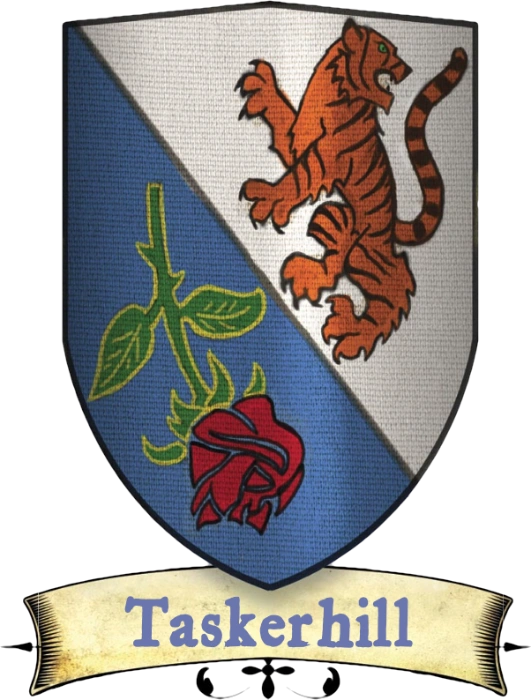

# Quartier Cudgel

[Carte interactive du Quartier Cudgel](../cartes/cudgel.html)

Le Quartier Cudgel est avant tout un quartier résidentiel. Grâce à la vigilance de la garde locale et de l'église de St.Cuthbert, c'est aussi le quartier le plus sûr de Sasserine. Les citoyens du Quartier Cudgel le savent, mais ce ne sont pas pour autant des gens insouciants ; ils restent toujours vigilants face à la menace d'une attaque venant de l'extérieur, par exemple de brutaciens ou de pirates, ou de l'intérieur, voleurs ou trafiquants par exemple.

{.float-right .img-150}

Les nobles qui représentent le Quartier Cudgel sont les **Taskerhill**. Bien qu'ils ne soient pas la plus ancienne famille noble de Sasserine, les Taskerhill sont de loin les plus riches. Leur propriété, la Scierie de la Rivière Tonnerre, leur a assuré un flux constant de profits durant des centaines d'années. Le patriarche actuel de cette noble famille est un homme nommé [Kalmadar Taskerhill](../pnj/kalmadar-taskerhill.md). Un scandale récent impliquant son frère aîné, un noble de la ville voisine de Chaudron, a malheureusement porté atteinte au nom de la famille, et la principale préoccupation de Kalmadar aujourd'hui est de réparer ces préjudices par tous les moyens possibles.

C'est pourquoi il a passé beaucoup de temps loin de chez lui, à rendre visite à la famille de son frère.

Bien que St. Cuthbert soit la religion officielle du Quartier Cudgel, un temple plus modeste a suscité beaucoup d'intérêt ces derniers temps. Il s'agit du mystérieux [Temple de la Fureur Tourbillonnante](../lieux/temple-de-la-fureur-tourbillonnante.md), située au nord du Quartier Cudgel, dans la bien nommée rue de la Fureur. Les portes d'entrée de cette église sont dotées de chaînes fermées par un cadenas, et ses murs de pierre sont dépourvus de fenêtres. Les habitants disent avoir vu des personnes entrer et sortir de l'église en utilisant des clés en argent pour déverrouiller les chaînes, mais personne n'a eu le courage d'aller plus loin. Des rumeurs d'adoration de démons, de sacrifices vivants, voire pire, entourent cette église, mais les prêtres de Saint Cuthbert restent curieusement très discrets à ce sujet. Le père [Ruphus Laro](../pnj/ruphus-laro.md) de St. Cuthbert dit seulement qu'il garde un œil sur le Temple de la Fureur Tourbillonnante, mais que celui-ci ne représente pas une menace pour la ville.

Les habitants du Quartier Cudgel sont vigilants et laconiques. Ils n'ont guère de patience ou de tolérance pour le mode de vie rude et grossier de la plupart des aventuriers. Les marchands, les aubergistes et les taverniers du Quartier Cudgel demandent souvent jusqu'à 200% de plus que les prix normaux pour les clients ressemblant à des aventuriers (c'est-à-dire qui portent ouvertement des armes ou des armures).

### Les citoyens

Si vous êtes originaire du Quartier Cudgel, il est possible que vous n'ayez jamais quitté Sasserine. Il est même possible que vous n'ayez jamais quitté le Quartier Cudgel.

Le monde extérieur est pour vous un lieu de mystère et peut-être de peur, mais ses attraits vous intriguent tout autant. Vous vénérez probablement Saint Cuthbert, ou peut-être Kord. Il existe une autre église dans votre quartier, le Temple de la Fureur Tourbillonnante, mais il y a de fortes chances que, même si vous êtes curieux de savoir ce qu'ils proposent, vous ne les ayez pas encore rencontrés... pour l'instant. Si vous êtes un rôdeur, votre ennemi juré est probablement l'humain, car vous avez appris que les hommes sont les plus doués pour la méchanceté et la traîtrise. Parmi les sept quartiers, les citoyens de Cudgel sont les moins enclins à rechercher un mode de vie aventureux. Ceux qui deviennent aventuriers sont considérés par leur famille et leurs voisins comme des brebis galeuses.

### Originaire du Quartier Cudgel

>Vous êtes toujours à l'affût des trahisons et des méfaits, comme beaucoup d'autres habitants du Quartier Cudgel. Un citoyen originaire de ce quartier bénéficie de l'avantage ci-dessous.
>
> ***Oeil soupçonneux.*** Vous bénéficiez d'un bonus de +2 aux tests de Sagesse (Intuition). De plus, si quelqu’un tente de vous faire les poches, vous bénéficiez d’un bonus de +2 au test de Sagesse (Perception) pour remarquer la tentative, et si vous réussissez ce test, vous pouvez immédiatement faire une attaque d'opportunité sur la cible qui tentait de vous faire les poches. {.blue}

### La garde du quartier

D'une certaine manière, la Garde de Cudgel est similaire à la Garde des Champions. Toutes deux sont étroitement liées à la religion officielle de leur quartier ( en l'occurrence, St. Cuthbert), toutes deux effectuent des patrouilles régulières en uniforme et toutes deux sont d'une loyauté sans faille. Cependant, la Garde de Cudgel est plus soucieuse de prévenir les activités criminelles que n'importe quelle autre Garde de Sasserine, au point qu'elle outrepasse parfois ses prérogatives. Les histoires d'emprisonnement injustifié sont légion, même si la Garde de Cudgel affirme que de tels cas sont rares. Les citoyens du Quartier Cudgel sont les moins flamboyants et les moins extravertis de tous les habitants de Sasserine, ce qui fait du quartier une attraction pour ceux qui ne sont guère intéressés par l'agitation de la vie citadine. L'activité criminelle dans le Quartier Cudgel est plus répandue à la frontière avec le Quartier Ombrerive et avec le Quartier des Marchands. La Garde de Cudgel est la plus encline à poursuivre les criminels dans d'autres quartiers ou à s'immiscer dans les affaires des autres quartiers, ce qui fait d'elle la moins appréciée des gardes des quartiers.

---

## PNJ célèbres

[Gerialar Divalean](../pnj/gerialar-divalean.md) (humain) : Abbé de la paisible Maison des Violettes, Gerialar n'admet que peu de visiteurs dans son monastère. Ceux qui l'ont visité parlent d'un lieu de sérénité, protégé de l'agitation de la ville environnante par des rideaux magiques qui occultent le son.

[Kalmadar Taskerhill](../pnj/kalmadar-taskerhill.md) (humain) : Seigneur du manoir des Taskerhill et représentant du Quartier Cudgel au Conseil de l'Aube. Kalmadar est probablement l'homme le plus riche de Sasserine.

[Ruphus Laro](../pnj/ruphus-laro.md) (humain) : Le Père Ruphus Laro a repris le flambeau de grand prêtre du temple de St. Cuthbert après la mort récente du Père Ilthan Forn. Ruphus est gentil, jeune et énergique.

[Tenkar Gritbeard](../pnj/tenkar-gritbeard.md) (nain) : Nain grégaire à la poitrine en forme de tonneau, Tenkar est le chef de la Guilde des tailleurs de pierre. Lui et ses compagnons tailleurs de pierre sont chargés de l'entretien de l'enceinte de la ville de Sasserine, ce qui en fait l'une des guildes les plus puissantes de la ville.

---

## Lieux du Quartier Cudgel

1. [Phare de Cudgel](../lieux/phare-de-cudgel.md)
2. Guilde des balayeurs de rues
3. [Guilde des charpentiers](../lieux/guilde-des-charpentiers.md)
4. La Chope de Dix-Dents (taverne)
5. [Les Curiosité d'Enad (boutique de curiosités)](../lieux/les-curiosite-d-enad.md)
6. Le Refuge des Tonneaux (taverne)
7. Le Petit Marché (marchandises diverses)
8. Au Coup de Vent de Vera (taverne)
9. Au Bon Foyer (vente de maisons)
10. Le Zinc de Bertha (taverne)
11. Éclats d'Aurore (sources de lumière magique)
12. Annexe de la Garnison de Cudgel
13. Le Refuge du Phénix (auberge)
14. [Temple de la Fureur Tourbillonnante (église)](../lieux/temple-de-la-fureur-tourbillonnante.md)
15. [La Veine d'Argent (taverne)](../lieux/la-veine-d-argent.md)
16. Conception et Construction (construction)
17. Les Embarcations d'Eva (location de bateaux)
18. Chez Tharvel - Cuirs et Peaux (cuirs et peaux de qualité)
19. La Cigogne Boiteuse (taverne)
20. La Maison des Veilleurs du Marais (guides pour les marais locaux)
21. Trois Chats Maigres (produits de base)
22. Le Crabe Noir (brasserie)
23. Le Lièvre Peint (taverne)
24. Le Chien Sacré (dresseurs de chiens)
25. Sanctuaire de Fortubo (dieu de la pierre et de la garde)
26. Sanctuaire de Garl Glittergold
27. Guilde des attrapeurs de rats
28. Annexe de la Garnison de Cudgel
29. Guilde des tailleurs de pierre
30. L'enclume Murmurante (taverne/auberge)
31. Sanctuaire de Moradin
32. Temple de St. Cuthbert (église de quartier)
33. Station des Gondoles
34. Au Poisson Gourmand (taverne)
35. Les Armes de Delthar (armes de choix)
36. Les Contes de Selder (livres bon marché)
37. Guilde des ramoneurs
38. Guilde des purificateurs (entretien du château d'eau)
39. La Râpe (taverne)
40. Le Singe Inattendu (taverne)
41. Marché de l'Ouest ( produits de base, bois d'œuvre, bétail)
42. Les Moustaches de Sesker (brasserie)
43. Annexe de la Garnison de Cudgel
44. Au Ragoût de Strige (taverne)
45. Le Dragon Brûlant (auberge)
46. Station des Gondoles
47. Salle des archives du Quartier Cudgel
48. Manoir des Taskerhill (représentant du quartier)
49. Garnison de Cudgel
50. Requin Rieur (brasserie)
51. Bière de l'Étang des Crabes (brasserie)
52. Chez Hathgak (produits de base)
53. Sanctuaire de Yondalla
54. Maison des Violettes (monastère)
55. Marchandises de Gilvery (marchandises générales)
56. Brasserie du Bûcheron (brasserie)
57. Aux Voyages d'Émeraude (guides pour la jungle d'Amedio)