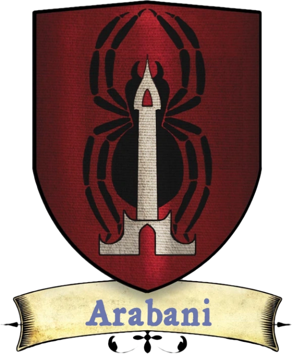

# Quartier des Marchands

[Carte interactive du Quartier des Marchands](../cartes/marchands.html)

Le cœur de Sasserine, et peut-être même son âme, se trouve dans le Quartier des Marchands. C'est le premier quartier dans lequel se rendent la plupart des visiteurs, et c'est souvent le seul qu'ils aient besoin d'explorer. Les boutiques du Quartier des Marchands vont de la simple épicerie à des commerces spécialisés comme les emporiums de potions, les vendeurs de dagues, les marchands d'animaux exotiques et les bazars d'objets magiques.

{.float-right .img-150}

Les nobles qui représentent le quartier des marchands sont les **Arabani**. Lady [Anwyn Arabani](../pnj/anwyn-arabani.md) est une noble excentrique qui éprouve une étrange fascination pour les drows et prétend même avoir des ancêtres drows (bien que sa peau relativement pâle suggère le contraire). Elle est très populaire, car elle fait tout pour que les habitants du Quartier des Marchands soient équitablement représentés au Conseil de l'Aube. Elle a de nombreux prétendants, mais n'a pas encore choisi la personne qui partagera son domaine.

### Les citoyens

Si vous êtes originaire du Quartier des Marchands, vous pouvez venir de n'importe où. Vous avez peut-être grandi à Sasserine, ou vous êtes peut-être arrivé récemment dans la ville sur le pont d'un navire en provenance de n'importe où dans le monde, auquel cas les raisons qui vous poussent à rester peuvent être aussi variées que votre pays d'origine. 

Les natifs du Quartier des Marchands sont probablement issus de familles de marchands, ou ont grandi en tant qu'enfants d'aubergistes ou de taverniers. Vous êtes probablement quelqu'un de très sociable, et l'idée de l'isolement ou de la vie en pleine nature vous plonge dans une peur nerveuse. Si vous êtes un clerc, vous vénérez peut-être le Fharlanghn, mais en réalité, ce quartier est un creuset de différentes confessions.

### Originaire du Quartier des Marchands

> Grandir avec les marchands de ce quartier vous a rendu désinvolte et vous a donné un sens aigu de la valeur des choses. Un citoyen originaire de ce quartier bénéficie de l'avantage ci-dessous.
>
> ***Langue des marchands.*** Vous avez déjà gagné pas mal d'argent et vous avez le don d'en gagner encore plus. Si votre PJ démarre au niveau 1, vous gagnez un bonus unique de 300 po à votre trésorerie de départ. De plus, chaque fois que vous vendez ou achetez un objet, vous pouvez faire un test de Charisme (Persuasion) opposé pour acheter ou vendre automatiquement un objet à un prix supérieur de 20% au prix proposé.{.blue}

### La garde du quartier

La Garde des Marchands est peut-être la plus efficace des sept gardes. La corruption apparaît ici et là, mais les dirigeants sont honnêtes et font de leur mieux pour maintenir un environnement exempt de criminalité. Il s'agit du quartier le plus animé de la ville, et les délits mineurs sont généralement ignorés, ce qui permet à la garde de se concentrer sur les problèmes plus importants. La Garnison des Marchands n'est pas la plus nombreuse des sept gardes (cet honneur revient à la Garde des Champions), mais c'est certainement celle qui est la mieux gérée.

---

## PNJ célèbres

[Alma Telvanta](../pnj/alma-telvanta.md) (humaine) : Femme exotique et intrigante, Alma dirige la prestigieuse Académie de danse de Telvanta.

[Anwyn Arabani](../pnj/anwyn-arabani.md) (femme demi-elfe) : Dame du manoir Arabani et représentante du Quartier des Marchands au Conseil de l'Aube.

[Blisker Tittertop](../pnj/blisker-tittertop.md) (gnome mâle) : Blisker est le maître de la Guilde des alchimistes ; sa marque peut être vue sur presque toutes les potions ou objets alchimiques vendus à Sasserine.

[Dhalven Miomar](../pnj/dhalven-tittertop.md) (homme) : Seigneur de la Guilde des marchands, Dhalven est un orateur doué.

[Feldus Selvant](../pnj/feldus-selvant.md) (homme) : Feldus est le gardien de la [Loge du Sourcier](../lieux/loge-du-sourcier.md), c'est un homme à la voix douce. Il s'absente souvent de Sasserine pendant des mois pour partir à l'aventure.

[Lavinia Vanderboren](../pnj/lavinia-vanderboren.md) (humaine) : Confrontée aux responsabilités de la noblesse, les parents de la jeune Lavinia ont péri dans un terrible incendie et son frère a disparu de la scène publique, la laissant seule pour s'occuper des affaires de son domaine.

[Lirali Woarali](../pnj/lirali-woarali.md) (femme demi-elfe) : Gardienne du temple de Fharlanghn, la congrégation de Lirali est peu nombreuse, mais elle semble être une femme assez amicale.

[Velkandar Toregson](../pnj/velkandar-toregson.md) (homme) : Fils aîné de la famille Toregson, Velkandar dirige la Guilde des forgerons.

---

## Lieux du Quartier des Marchands

1. [L'ogre chatouilleux (taverne)](../lieux/l-ogre-chatouilleux.md)
2. Chez Fenter (auberge)
3. Guilde des serruriers
4. Le Singe Acrobate (boutique de curiosités)
5. [Le Nain à la Cuirasse (armures de qualité)](../lieux/le-nain-a-la-cuirasse.md)
6. [Loge du Sourcier](../lieux/loge-du-sourcier.md)
7. [Marché aux Ėcailles (produits de consommation courante, fruits de mer, bibelots, bijoux)](../lieux/marche-aux-ecailles.md)
8. Station des gondoles
9. Les Bonnes Grâces de Viltashel (prêteur)
10. Guilde des boulangers
11. Temple de Fharlanghn (église de quartier)
12. Marché du Port ( produits de consommation courante, produits importés, magie mineure, nourriture, divertissements)
13. Guilde des fabricants de bougies
14. Place du marché
15. Guilde des joailliers
16. Guilde des souffleurs de verre
17. Guilde des tailleurs de gemmes
18. Sanctuaire de Zilchus (dieu de l'argent et des affaires)
19. Guilde des marchands
20. Station des gondoles
21. L'Ours Ivre (taverne/boutique d'hydromel)
22. Guilde des tisserands
23. La [cave de Glittermane (magasin de magie)](../lieux/cave-de-glittermane.md)
24. Sanctuaire de Celestian (dieu des étoiles et des voyageurs)
25. Chez Gregair (taverne/salle de jeux)
26. Guilde des cordonniers
27. Épicerie du Coin (produits de consommation courante)
28. Station des gondoles
29. Sanctuaire de Geshtai (déesse des rivières et des puits)
30. Guilde des marchands d'épices
31. Guilde des taverniers
32. Sanctuaire de Trithereon (dieu de l'individualité et de la liberté)
33. Guilde des vanniers
34. Emporium de l'Âme d'Orimander (magasin de magie/librairie)
35. Guilde des tailleurs
36. Académie de Telvanta (prestigieuse école de danse)
37. Sanctuaire de Ralishaz (dieu du malheur et de la malchance)
38. Costumes et Fantaisies (vêtements/costumes exotiques)
39. Guilde des scribes
40. La Maison de Venton (historien de Sasserine)
41. Guilde des travailleurs du cuir
42. Guilde des forgerons
43. Découverte de Sasserine (guides de la ville)
44. Sanctuaire de Bleredd (dieu du métal et des forgerons)
45. Guilde des tonneliers
46. La Rose Chantante (parfums et huiles)
47. Guilde des barbiers
48. Guilde des alchimistes
49. Guilde des bouchers
50. Guilde des dépisteurs (chercheurs d'objets perdus)
51. Station des gondoles
52. Guilde des charretiers
53. La Renarde Pimpante (maison close)
54. Guilde des charrons
55. Le Pirate Rouillé (taverne)
56. Guilde des blanchisseurs
57. Guilde des tanneurs
58. Sanctuaire de Dalt (dieu des portes, des serrures et des clés)
59. Le Gobelin Courbé (auberge)
60. La maison du Haut (expert en architecture et ingénierie)
61. Les Messagers Haut-Perchés (service de messagerie)
62. Le Coffre du Gardien (prêteur d'argent)
63. [Quinze Chevaux et une Mule (taverne)](../lieux/quinze-chevaux-et-une-mule.md)
64. Les Cages aux Merveilles (animaux exotiques)
65. Garnison des Marchands
66. Guilde des aubergistes
67. Guilde des bateliers (service de gondoles)
68. Le Génie Cramoisi (maison close)
69. [Bains de Heinvar (bains publics)](../lieux/bains-de-heinvar.md)
70. Manoir Arabani (représentant du quartier)
71. Les Exotiques de Krexin (importations exotiques)
72. Le Refuge de la Courtisane (auberge)
73. Les Trésors du Ciel (prêteur)
74. Le Boudoir des Coquines (maison close)
75. Consortium de Domaskio (marionnettes et jouets)
76. Plumes et Chuchotements (bains publics)
77. Guilde des avocats
78. Le Labyrinthe Intérieur (livres occultes)
79. Manoir Vanderboren (petite noblesse)
80. Station des gondoles