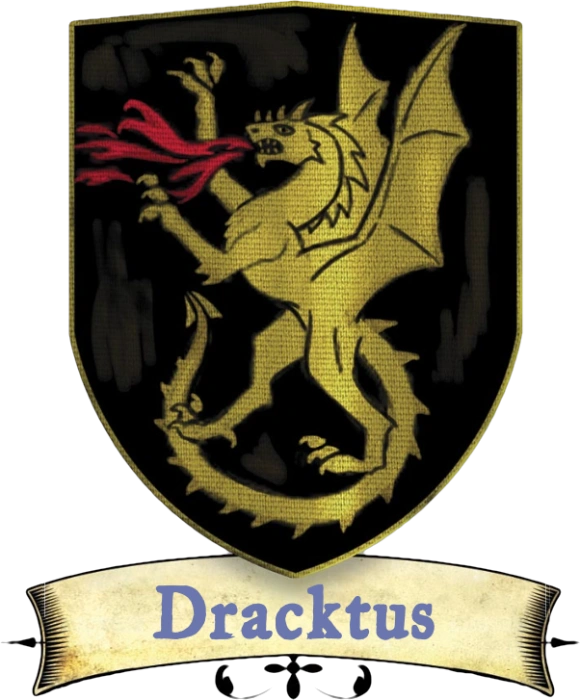

# Ombrerive

[Carte interactive de Ombrerive](../cartes/ombrerive.html)

Bien que relativement petit, Ombrerive est sans doute le plus célèbre des quartiers de Sasserine. Cette bande de terre nichée dans l'ombre du Quartier des Champions est depuis longtemps un refuge pour les voleurs, les bandits et les criminels en tout genre. En général, les seules personnes qui vivent ici sont celles qui sont suffisamment pauvres pour que leurs maisons n'attirent pas les voleurs, ou celles qui peuvent protéger leurs biens par l'esprit ou la force. La garde de la ville a pratiquement abandonné Ombrerive, et tant que rien de particulièrement destructeur ne se produit dans le quartier (comme des incendies ou des émeutes), elle le laisse généralement s'autogouverner.

{.float-right .img-150}

Les nobles qui représentent Ombrerive changent plus souvent que les autres, car le poste est traditionnellement occupé par la famille (ou même l'individu) suffisamment forte pour se protéger de ses ennemis.

Actuellement, le détenteur de ce titre est [Emil Dracktus](../pnj/emil-dracktus.md), certainement un pseudonyme. La rumeur veut que le Conseil de l'Aube préférerait avoir quelqu'un de moins grossier et de plus fiable à ce poste. Quelqu'un comme Vico Bevenin, du Comptoir d'Amedio, peut-être. Pour l'instant, personne (y compris Vico) ne s'est manifesté auprès d'Emil.

### Les citoyens

Ombrerive est le lieu où se déverse la lie de Sasserine. Si vous avez grandi ici, vous avez eu une enfance difficile et avez peut-être été contraint de tuer quelqu'un pour survivre. Vous avez certainement vu votre part de cadavres, que l'on retrouve souvent dans les ruelles ou sous les quais. Si vous n'êtes pas du genre voyou, c'est que vous avez passé beaucoup de temps à vous cacher ou que vous avez développé un talent pour le "sale boulot". Vous avez peut-être été pris sous l'aile de l'une des rares entreprises semi-légitimes qui opèrent ici, mais il est plus probable que vous soyez un véritable enfant de la rue. La foi est difficile à trouver ici, mais si vous êtes un clerc, vous vénérez probablement Olidammara, et vous savez que le dieu des voleurs est présent dans ces taudis délabrés.

### Originaire d'Ombrerive

Vous avez été élevé dans les rues et les ruelles d'Ombrerive et avez affiné plusieurs talents et astuces utiles à la survie dans ce quartier. Vous bénéficiez de l'avantage ci-dessous.

>***Enfant de l'Ombre.*** Vous connaissez assez bien le marché noir de Sasserine et n'avez pas besoin de faire de tests pour localiser l'emplacement de ses points de vente. De plus, dans d'autres villes, vous avez un don pour dénicher les marchés clandestins. Vous bénéficiez d'un bonus de +2 aux tests d'***Intelligence (Investigation)*** et de ***Charisme (Persuasion)*** effectués pour vous renseigner sur les marchés noirs d'une ville.
>
>Grandir dans les rues crasseuses d'Ombrerive vous a également donné quelques astuces pour survivre. Vous bénéficiez d'un bonus de ***+2 aux tests d'Initiative*** en milieu urbain. Vous êtes également doué pour vous battre dans des endroits confinés, comme les ruelles étroites de la ville ou les bars bondés. Les ennemis ne peuvent pas se mettre à couvert de vous s'ils sont à votre portée ; vous pouvez donc attaquer quelqu'un au coin d'une rue sans pénalité. Une créature bénéficiant d'un *abri total* de votre part conserve tous les avantages de sa couverture.

### La garde du quartier

Véritable bidonville de Sasserine, Ombrerive est le lieu où les désespérés viennent se cacher ou mourir. S'agissant du plus petit des quartiers, il est facile pour les citoyens des autres quartiers de détourner le regard des troubles qui s'y produisent couramment. Les membres des autres gardes de la ville qui se révèlent trop indisciplinés ou insubordonnés sont souvent réaffectés à Ombrerive, ce qui est plus une punition qu'autre chose. La corruption est omniprésente au sein de la garde d'Ombrerive, qui ne patrouille que sur le littoral et est connue pour être à la botte des barons du quartier. Seuls les crimes les plus flagrants (incendies criminels, agressions publiques et autres offenses très visibles) sont sanctionnés, faisant d'Ombrerive un refuge sûr pour les éléments criminels de Sasserine.

---

## PNJ célèbres

[Emil Dracktus](../pnj/emil-draktus.md) (humain) : Le répréhensible seigneur du manoir Dracktus et représentant d'Ombrerive au Conseil de l'Aube ne vaut guère mieux qu'un seigneur des brigands.

[Gregar Skeen](../pnj/gregar-skeen.md) (humain) : Maître de la Guilde des charpentiers navals, Gregar a réussi à garder le contrôle de l'entreprise familiale et de ses intérêts malgré des générations d'ennuis avec les voyous locaux.

[Jalpe Jinn](../pnj/jalpe-jinn.md) (homme demi-orque) : Jalpe Jinn est un homme assez sympathique qui s'occupe de ce sanctuaire dédié à l'une des figures historiques les plus douées de Sasserine, la naine Worgul (qui réussit dans la vie en tant que marchande malgré son apparence hideuse).

[Vico Bevenin](../pnj/vico-bevenin.md) (humain) : La raison pour laquelle l'un des hommes les plus riches de Sasserine vit à Ombrerive est un mystère pour tout le monde sauf pour lui. Vico est propriétaire du Comptoir d'Amedio, la société d'import-export la plus prospère de Sasserine.

---

## Lieux d'Ombrerive

1. [Garnison d'Ombrerive](../lieux/garnison-dombrerive.md)
2. Sanctuaire de Charmalaine (déesse des sens aiguisés et des échappées belles)
3. L'Homme Écorché (taverne)
4. La Maison Etroite (auberge)
5. [Sanctuaire de St. Worgul (église de quartier)](../lieux/sanctuaire-de-st-worgul.md)
6. Aux Bons Comptes de Brank (prêteur)
7. Maison de la Science (exposition de monstres et musée de la bizarrerie)
8. Les Divertissements de Fishlip (taverne/salle de jeux)
9. [La Hache Ebréchée (guilde de mercenaires)](../lieux/la-hache-ebrechee.md)
10. Auberge du Repos Troublé (auberge)
11. Le Marché de Neldrek ( produits de consommation courante)
12. [Manoir des Dracktus (représentants du quartier)](../lieux/manoir-des-dracktus.md)
13. Guilde des trappeurs
14. Aux Douceurs de Nelli (apothicaire)
15. Le Nid de Velours (maison close)
16. Le Perroquet Plumé (auberge/taverne)
17. Le Repère d'Alinara (salle de jeu)
18. [Comptoir d'Amedio (import/export)](../lieux/comptoir-damedio.md)
19. Guilde de la Voilerie
20. Sanctuaire de Kuroth (dieu des trésors et du vol)
21. Le Refuge des Amours perdus (maison close)
22. Station des gondoles
23. Toujours à Flot ! (bateaux et navires bon marché)
24. [Compagnie du Bouclier Noir (guilde de mercenaires)](../lieux/compagnie-du-bouclier-noir.md)
25. [Guilde des charpentiers navals](../lieux/guilde-des-charpentiers-navals.md)
26. [Les Trouvailles de Shank (armes bon marché)](../lieux/les-trouvailles-de-shank.md)
27. Distillerie de Sasserine (fabrique de rhum)
